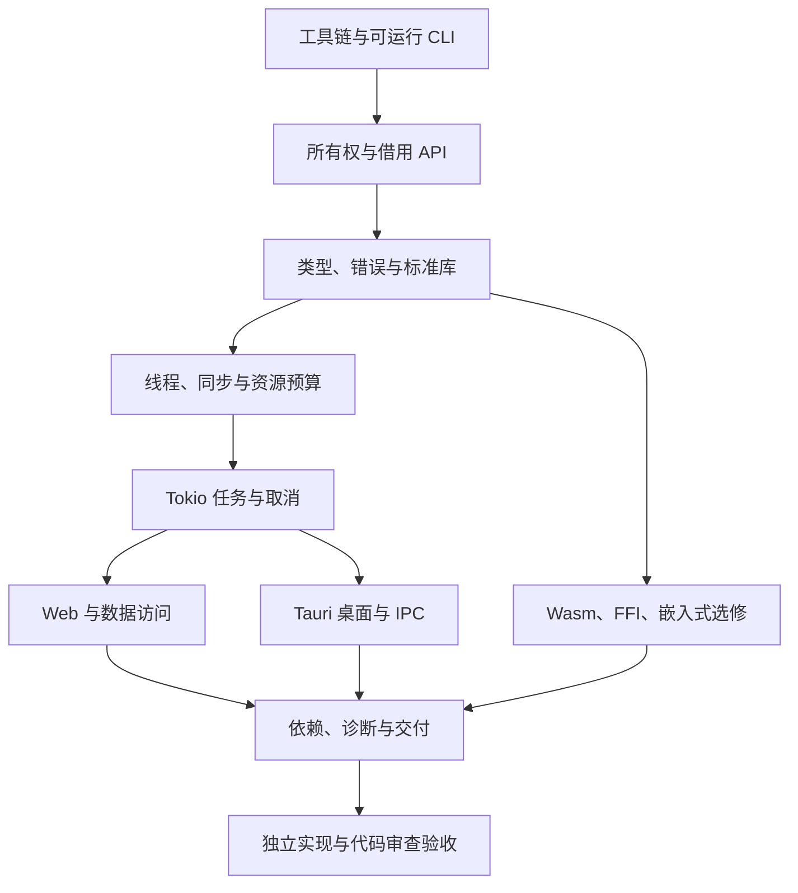

# 工程师学习路线：以可交付能力验收

[返回学习入口](README.md)

适用前提：你已经能设计后端接口、使用 Git、写自动化测试，并理解线程、网络和数据库。无需把“变量是什么”重新学一遍，但要亲自验证 Rust 中赋值、借用、释放和调度的含义。

## 最终要具备什么能力

| 能力 | 合格时可以独立完成的事 | 必须留下的证据 |
| --- | --- | --- |
| 工具链 | 解释实际编译器、依赖、feature、平台与链接问题 | 构建说明、依赖树、目标平台记录 |
| 语言 | 用所有权、借用、enum、trait 设计接口 | 有理由的签名、编译失败反例 |
| 标准库 | 正确选择集合、文本、路径、I/O、时间与同步类型 | 边界用例与资源限制 |
| 并发 | 区分线程、任务、Future，设计背压与关闭 | 取消、饱和、退出测试 |
| 框架 | 解释框架执行链和状态归属 | 小型可运行应用与时序图 |
| 工程 | 管理错误、日志、依赖、配置、版本兼容 | 测试结果、发布步骤、审查记录 |
| 诊断 | 由证据定位 CPU、分配、等待或锁竞争 | 可复现基线与一次测量后的改进 |
| 协作 | 阅读别人代码，写清不变量与取舍 | 一份能供他人评审的设计与变更说明 |

合格开发者不需要自行实现执行器、无锁队列或 ORM。需要理解这些抽象提供什么保证，以及保证何时失效。

## 一条可以调整速度的 12 周路线

下面是每周约 8–12 小时的安排建议，不是学习时长的统计结论。若全职学习，可按验收结果压缩日程；遇到所有权或取消设计仍需停下来练习。

| 周 | 知识与阅读 | 交付练习 | 进入下一阶段的条件 |
| --- | --- | --- | --- |
| 1 | [工具链](03-engineering/08-toolchain-and-compilation.md)、[Cargo](03-engineering/02-cargo.md)、基础语法 | 建一个标准库 CLI，说明 check/build/run/doc 的差异 | 能定位工具链和构建错误所属层 |
| 2 | [Go 思维迁移](06-go-to-rust/01-mental-model.md)、[所有权 API](06-go-to-rust/02-ownership-and-api.md) | 借用版文本解析、拥有数据的后台任务 | 不依赖到处 clone 修复借用错误 |
| 3 | [类型与错误](06-go-to-rust/03-types-traits-and-errors.md)、生命周期、模式 | 带错误分类的命令解析器 | enum 不变量清楚，正常输入无 panic |
| 4 | [标准库地图](07-standard-library/01-map-and-reading.md)、[日志汇总练习](07-standard-library/05-data-processing-workshop.md) | 有输出上限的日志聚合器 | 正确处理 UTF-8、EOF、文件失败 |
| 5 | [同步与时间](07-standard-library/04-time-sync-and-utilities.md)、[Go 并发迁移](06-go-to-rust/04-concurrency-and-async.md) | 有界任务队列，明确线程退出 | 能解释 Send/Sync、锁范围与回收 |
| 6 | [Tokio 原理](08-ecosystem/03-tokio-runtime.md)、[实战](08-ecosystem/04-tokio-workshop.md)、[分帧与关闭](08-ecosystem/11-tokio-io-and-shutdown.md) | 本机 TCP 请求服务，超时与优雅关闭 | 没有阻塞 worker、游离任务或无界队列 |
| 7 | [Axum/Tower](08-ecosystem/05-axum-and-tower.md)、[请求验证](08-ecosystem/12-web-testing-and-middleware.md)、[Serde/Reqwest](08-ecosystem/06-serde-and-reqwest.md) | 类型化 HTTP API 与本机上游调用 | 能画出提取、认证、业务与响应链 |
| 8 | [数据库与 RPC](08-ecosystem/07-database-and-rpc.md)、[服务工程](03-engineering/11-production-services.md) | SQLite 持久化、事务、冲突处理 | 能解释池等待、查询与提交的边界 |
| 9 | [Tauri 原理](08-ecosystem/08-tauri-architecture.md)、[实战](08-ecosystem/09-tauri-workshop.md)、[长任务协议](08-ecosystem/13-tauri-ipc-and-lifecycle.md) | 同一业务能力的桌面壳 | IPC、权限、事件清理和关闭正确 |
| 10 | [API 与状态](03-engineering/09-api-design-and-state.md)、[依赖治理](03-engineering/10-dependencies-and-supply-chain.md) | 为已有练习做审查与重构 | 每个共享状态和公共类型都有理由 |
| 11 | [性能诊断](03-engineering/12-debugging-and-profiling.md)、[发布实践](03-engineering/13-workspace-ci-and-release.md) | 记录一个实际瓶颈并交付发布包 | 结果有基线，构建条件可复现 |
| 12 | [毕业项目](04-project/04-capstone-and-rubric.md)、[审查训练](04-project/05-review-workshop.md)、[工程验证](03-engineering/14-testing-and-contracts.md) | 完成一次独立能力切片及说明 | 满足毕业检查表，能回答设计追问 |

桌面、RPC、嵌入式和 Wasm 是方向分支；后端岗位可深入 Web/数据库而将 Tauri 做到最小练习，桌面岗位反过来。所有权、标准库、任务生命周期和工程检查是共用基础。

## 每次学习的闭环

1. 先用 Go 写出你的直觉：谁共享、谁修改、谁取消、谁回收。
2. 看 Rust 签名，标出拥有的数据、借用数据、错误类型和 trait bound。
3. 在运行前预测结果；故意制作一个编译失败版本并读诊断。
4. 写可重复的成功、失败和边界用例。
5. 在 geer-agent 找到相同问题，并解释项目为什么选择当前方案。
6. 写五行学习记录：错误直觉、正确规则、运行证据、设计取舍、待核实问题。

不要求为每篇知识点修改主项目。基础练习放独立练习包，避免给学习仓库提前引入框架。若练习改变 geer-agent 的行为或架构，按 [AGENTS.md](../../AGENTS.md) 先走 OpenSpec。

## 用编译失败练习建立正确直觉

| 失败主题 | 先预测什么 | 应解释的规则 |
| --- | --- | --- |
| 使用已移动 String | 赋值后是否还有两个可用名字 | 所有权转移与 Copy 的区别 |
| 迭代 Vec 时 push | 借用指向的存储是否可能失效 | 借用范围和容器增长 |
| 返回局部值引用 | 谁能保证引用仍有效 | 引用关系不延长对象寿命 |
| Rc 跨线程 | 引用计数是否支持线程安全共享 | Send/Sync 与内部类型约束 |
| 锁跨 await | 暂停期间谁还需要这把锁 | async 任务和临界区范围 |
| enum 新增变体 | 哪些业务处理点需要更新 | 穷尽匹配保障状态覆盖 |

本仓库内运行练习测试必须通过 `scripts/test-safe.sh`；不能把 `cargo test`、`rustdoc --test` 或测试二进制直接运行当作快捷方式。

## 推荐的资料组合

主教材选 [The Book](https://doc.rust-lang.org/book/) 或 [Google Comprehensive Rust](https://google.github.io/comprehensive-rust/)，练习选 [Rustlings](https://github.com/rust-lang/rustlings)，概念查证用标准库和 Reference。异步阶段跟 [Tokio Tutorial](https://tokio.rs/tokio/tutorial)，API 审查阶段用 [Rust API Guidelines](https://rust-lang.github.io/api-guidelines/)。这是本课程建议，依据是各资料覆盖领域；不是“读完这些就自动合格”的承诺。

中文教程有助于理解，编译器和版本文档负责确认具体规则。不要同时线性刷五套教程；同一主题只有一个主讲解、一个练习入口、一个事实核对入口。资料细节与替代路线见 [教程调研](08-ecosystem/01-learning-resources.md)。
