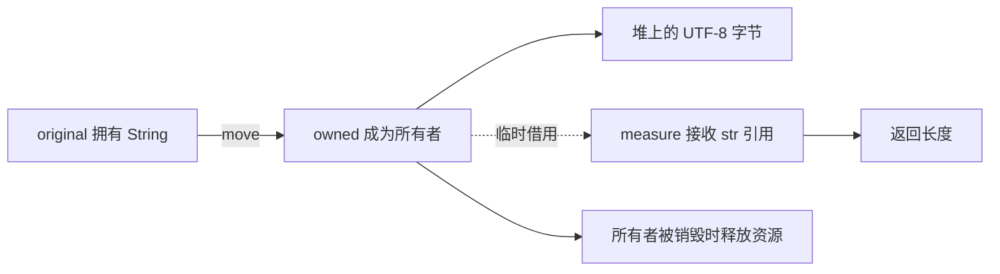

# 03 所有权、移动、借用与复制

[返回总目录](../README.md) · [上一篇](02-values-and-functions.md) · [下一篇](04-strings-and-compound-types.md)

对应原教程：所有权和借用、所有权、引用与借用。

## 先回答“谁负责这个值”

对普通拥有型值，所有者负责它的使用和最终释放。赋值或传参可能把值移动给新所有者；借用只让另一个地方临时访问。共享所有权可以通过 `Rc`/`Arc` 明确建立，后面单独学习。

```rust
fn main() {
    let original = String::from("read");
    let owned = original;
    let length = measure(&owned);
    assert_eq!(length, 4);
    assert_eq!(owned, "read");
}

fn measure(name: &str) -> usize {
    name.len()
}
```

`owned = original` 后，不能再使用原先的 `original`。`measure(&owned)` 则借用文本，函数结束后 `owned` 仍可用。



这是帮助理解 `String` 的示意图，不是所有 Rust 类型的统一内存布局。移动语义不等于“必定零字节复制”；编译器是否真的搬动字节是另一个问题。

## 故意失败一次

```rust,compile_fail,E0382
fn main() {
    let name = String::from("bash");
    let moved = name;
    println!("{name} {moved}");
}
```

编译器会指出移动发生在哪里、之后又在哪里使用。解决前先问：后面还需要拥有原值，还是只需要读它？只读优先借用；确实需要两份独立字符串时才用 `clone()`。

| 写法 | 含义 |
| --- | --- |
| `fn f(value: String)` | 函数取得拥有型字符串 |
| `fn f(value: &str)` | 借用文本，可接受字符串字面量及 `String` 的视图 |
| `fn f(value: &mut String)` | 独占借用，允许修改原字符串 |
| `let b = number`，其中 `number: u64` | `u64` 实现 `Copy`，复制后原绑定仍可用 |
| `let b = text.clone()` | 显式克隆；代价由类型决定 |

`Copy` 不是“放栈上就自动有”，而是类型实现的特征；`Clone` 也不一定深拷贝，例如 `Arc::clone` 共享同一份数据。

## 借用规则看使用范围

对同一数据，在借用重叠期间，可以有多个共享引用 `&T`，或一个独占引用 `&mut T`。独占引用可以临时再借用；再借用活动时原引用受到限制。内部可变性是通过专门类型建立的另一层规则，不是直接绕过检查。

```rust
fn main() {
    let mut output = String::from("hello");
    let view = &output;
    assert_eq!(view, "hello");
    // view 后面不再使用，借用可以在此结束。
    output.push_str(" Rust");
    assert_eq!(output, "hello Rust");
}
```

这体现 NLL：引用的借用区间经常可以到最后一次使用就结束，不必等到整个花括号结束。不要为了结束借用，到处对引用调用 `drop`；缩短使用范围通常更清楚。

## 项目里最有价值的两个例子

[Prompt::apply_tool_results](/home/lihongyu/projects/geer-agent/src/prompt/conversation.rs) 接收 `step: ModelStep`，因为要把 `step.output` 的内容转入会话；`results: &[(ToolCall, String)]` 则只借用一段结果列表。参数签名已经说明了两者的所有权策略。

[Prompt::commit_turn](/home/lihongyu/projects/geer-agent/src/prompt/conversation.rs) 使用 `std::mem::take(pending)`：把原来的 `Vec` 取出来，同时给字段放入默认的空 `Vec`。这样不会从 `&mut` 背后硬搬走字段后留下空洞。

```rust
fn main() {
    let mut pending = vec![String::from("user"), String::from("assistant")];
    let mut history = Vec::new();
    history.extend(std::mem::take(&mut pending));
    assert!(pending.is_empty());
    assert_eq!(history.len(), 2);
}
```

练习：把 `measure` 改成接收 `String`，观察调用后还能不能使用 `owned`；再改回 `&str`。不要先用 `clone` 把错误藏起来。

来源：[教程所有权](https://beatai.org/rust-course/basic/ownership/ownership)、[教程借用](https://beatai.org/rust-course/basic/ownership/borrowing)、[官方引用与借用](https://doc.rust-lang.org/book/ch04-02-references-and-borrowing.html)、[mem::take](https://doc.rust-lang.org/std/mem/fn.take.html)。
