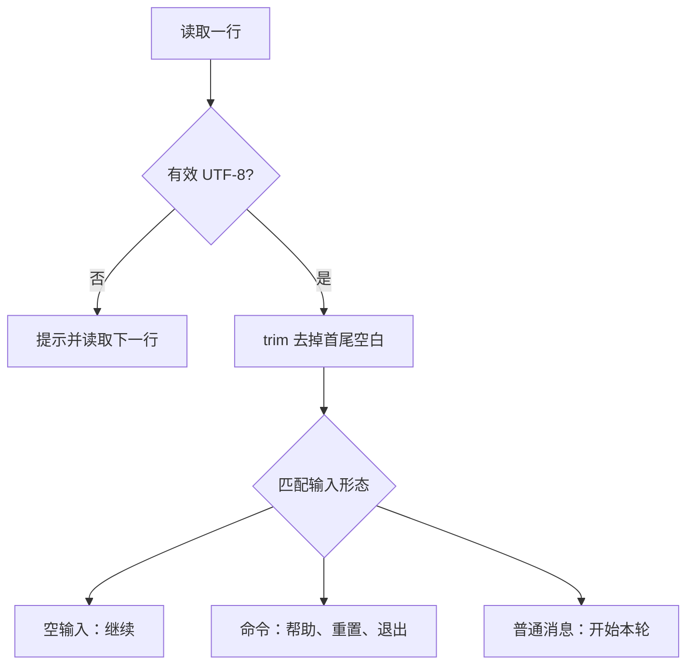

# 05 流程控制与模式匹配

[返回总目录](../README.md) · [上一篇](04-strings-and-compound-types.md) · [下一篇](06-methods-and-traits.md)

对应原教程：流程控制；模式匹配、`match` / `if let`、解构 `Option`、模式适用场景、全模式列表。

## 条件和循环都有清楚的出口

`if` 的条件必须是 `bool`，产出值时各分支类型要兼容。`for` 遍历迭代器；`while` 在条件成立时继续；`loop` 适合需要从内部决定退出的循环，并可以 `break value` 返回值。

```rust
fn main() {
    let mut attempt = 0;
    let result = loop {
        attempt += 1;
        if attempt == 3 {
            break "完成";
        }
    };
    assert_eq!(result, "完成");
}
```

本项目 [REPL 循环](/home/lihongyu/projects/geer-agent/src/repl/index.rs) 读到 EOF 或 `/exit` 时 `break`；非法 UTF-8 用 `continue` 只跳过这一行，不退出程序。

## `match` 同时检查形状并取出数据

```rust
fn classify(input: Option<&str>) -> &'static str {
    match input {
        None | Some("") => "空输入",
        Some("/exit") => "退出",
        Some(text) if text.starts_with('/') => "未知命令",
        Some(_) => "普通消息",
    }
}

fn main() {
    assert_eq!(classify(None), "空输入");
    assert_eq!(classify(Some("/reset-me")), "未知命令");
}
```

这里的 `|` 表示多个模式，`if` 是匹配守卫，`_` 忽略具体内容。分支自上而下选择；`match` 必须覆盖所有可能。守卫不是编译器确认穷尽性的万能依据，所以通常仍需兜底分支。



## 只处理一种情况时

```rust
fn nonempty(input: Option<&str>) -> usize {
    let Some(text) = input else {
        return 0;
    };
    if let Some(first) = text.chars().next() {
        usize::from(first != ' ')
    } else {
        0
    }
}

fn main() {
    assert_eq!(nonempty(None), 0);
    assert_eq!(nonempty(Some("Rust")), 1);
}
```

`if let` 对某个模式成立时执行；`let ... else` 在失败分支必须发散，例如 `return`、`break` 或 `panic!`，成功后变量可在后面继续使用。`while let Some(value) = ...` 适合一直取到没有值为止。

## 常见模式速查

| 写法 | 意义 |
| --- | --- |
| `(name, count)` | 拆元组 |
| `ToolCall { name, .. }` | 只取指定字段 |
| `Some(value)` | 拆枚举内的数据 |
| `1..=5` | 匹配闭区间 |
| `id @ 1..=5` | 匹配范围并绑定原值 |
| `[first, rest @ ..]` | 拆切片首项与其余部分 |
| `matches!(value, Some(_))` | 只需要匹配结果的布尔值 |

`let`、函数参数、`for` 里也使用模式。普通 `let` 需要不可反驳模式，即一定匹配成功；`let Some(x) = option;` 单独这样写不行。

匹配 `value` 可能移动字段，匹配 `&value` 通常得到字段引用，匹配 `&mut value` 可用于修改。[Prompt](/home/lihongyu/projects/geer-agent/src/prompt/conversation.rs) 中的 `match &mut self.state` 就是借用内部状态，不把整个状态搬出 `self`。edition 2024 对部分显式 `ref`/`mut` 组合有更严格规则，先写自然的引用模式，不照抄旧教程里的冗余标记。

练习：给 `classify` 增加 `/help`，应放在“未知命令”的守卫前面，否则会先被守卫接住。

来源：[教程模式匹配](https://beatai.org/rust-course/basic/match-pattern/intro)、[Rust Book 模式语法](https://doc.rust-lang.org/book/ch19-03-pattern-syntax.html)。
