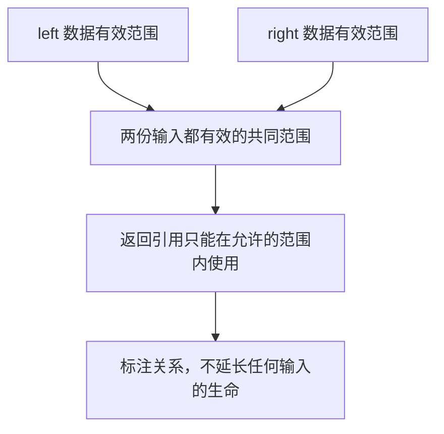

# 08 生命周期：说明引用来自哪里

[返回总目录](../README.md) · [上一篇](07-collections.md) · [下一篇](09-error-handling.md)

对应原教程：认识生命周期。进阶另见 [生命周期与 static](../02-advanced/01-lifetimes-and-static.md)。

## 生命周期不是给对象“续命”

引用只能在所指向的数据仍有效时使用。生命周期参数描述引用之间的有效范围关系，帮助编译器检查；它不会延长局部变量的生存时间，不会产生运行时的倒计时。

```rust
fn first_word(text: &str) -> &str {
    text.split_whitespace().next().unwrap_or("")
}

fn main() {
    let input = String::from("read Cargo.toml");
    let command = first_word(&input);
    assert_eq!(command, "read");
}
```

这里只有一个输入引用，省略规则能将输出引用关联到它。概念上可以理解为 `fn first_word<'a>(text: &'a str) -> &'a str`。空字符串字面量自身更长的有效期也可以缩短为需要的范围。

## 两个输入时明确关系

```rust
fn longer<'a>(left: &'a str, right: &'a str) -> &'a str {
    if left.len() >= right.len() { left } else { right }
}

fn main() {
    let left = String::from("read");
    let right = String::from("write");
    assert_eq!(longer(&left, &right), "write");
}
```

这不是要求两个原始字符串在同一时刻创建或销毁，而是存在一个它们都能被借用的共同有效范围，返回引用在该范围内有效。调用者仍然要遵守实际借用关系。



## 返回局部数据的引用为什么失败

```rust,compile_fail,E0515
fn bad_name() -> &'static str {
    let value = String::from("read");
    &value
}

fn main() {}
```

函数结束后 `value` 被释放，外面没有可借用的拥有者。把返回类型改成 `String`，直接交出 `value` 的所有权，才是这里的正确修复；添加 `'static` 不能挽救它。

## 结构体何时需要生命周期

```rust
struct RequestView<'a> { model: &'a str }

fn main() {
    let model = String::from("test-model");
    let view = RequestView { model: &model };
    assert_eq!(view.model, "test-model");
}
```

结构体保存引用，就要表达它不能比被引用数据的有效范围更长。[TraceContext<'a>](/home/lihongyu/projects/geer-agent/src/agent/mod.rs) 借用模型名、会话 ID、配置和存储，不再克隆成一份独立的长期对象。相反，`TraceRecord` 拥有 `String`，适合被存储或传递。

阅读规则：先找数据的所有者，再找引用保存到哪里、最后用到哪里，最后才考虑要不要写 `'a`。只要拥有型字段更符合需求，就不必强迫每个结构体都借用字符串。

练习：把 `RequestView` 从局部块返回，而块里的 `model` 被销毁，解释编译错误。若确实要返回记录，把字段改成拥有型 `String`。

来源：[教程生命周期](https://beatai.org/rust-course/basic/lifetime)、[Rust Book 生命周期](https://doc.rust-lang.org/book/ch10-03-lifetime-syntax.html)。
