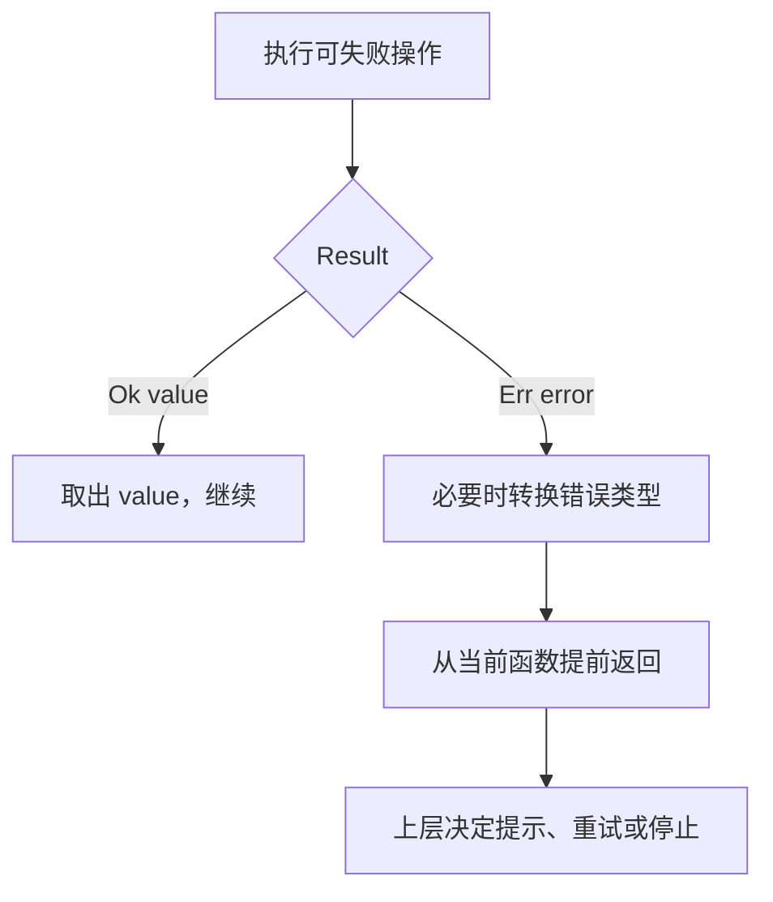

# 09 Option、Result、问号与错误边界

[返回总目录](../README.md) · [上一篇](08-lifetimes.md) · [下一篇](10-modules-and-docs.md)

对应原教程：返回值和错误处理、panic、Result 和 `?`，以及高级进阶中的错误处理。

## “没有”与“失败”是不同维度

| 类型 | 含义 | 项目例子 |
| --- | --- | --- |
| `Option<u64>` | 有配置值或没有配置值 | 可选 Token 上限 |
| `Result<T, E>` | 操作成功或失败 | 配置解析、读文件 |
| `Result<Option<T>, E>` | 成功且找到、成功但未找到、操作失败 | Trace 单条查询 |
| `Result<(), E>` | 成功但没有额外结果，或失败 | 写出一段文本 |

不要用 `None` 吞掉本应报告的异常。`.ok()` 会主动丢弃 `Result` 的错误信息，仅适用于错误本来就可以降级为“缺少”的场景。

## `?` 做的是提前返回

```rust
fn parse_limit(text: &str) -> Result<u64, String> {
    let number = text.parse::<u64>().map_err(|_| "请输入整数".to_owned())?;
    if number == 0 {
        return Err("上限必须大于 0".to_owned());
    }
    Ok(number)
}

fn main() {
    assert_eq!(parse_limit("12"), Ok(12));
    assert!(parse_limit("abc").is_err());
    assert!(parse_limit("0").is_err());
}
```

对 `Result` 使用 `?`，成功时取出内部值，失败时从当前函数返回错误；需要时通过兼容的 `From` 转换错误类型。它不会打印错误、重试、回滚文件，也不是异常捕获语法。对 `Option` 的 `?` 则在 `None` 时返回 `None`。



## 组合器按类型变化理解

| 方法 | 做什么 |
| --- | --- |
| `map` | 改成功值或 `Some` 内的值 |
| `map_err` | 改错误值 |
| `and_then` | 下一步本身也返回 `Option` / `Result`，避免嵌套 |
| `ok_or_else` | 把 `Option` 的 `None` 转为惰性创建的错误 |
| `unwrap_or_else` | 失败或缺少时计算替代值 |
| `as_ref` / `as_deref` | 借用容器内部，避免移动 |
| `transpose` | 交换 `Option` 与 `Result` 的外内层 |

`unwrap_or(expensive())` 的参数会先求值；需要时才计算用 `unwrap_or_else(|| expensive())`。`then_some(value)` 同样先计算参数，`then(|| value)` 才是惰性的。

```rust
fn optional_limit(value: Option<&str>) -> Result<Option<u64>, std::num::ParseIntError> {
    value.map(str::parse::<u64>).transpose()
}

fn main() {
    assert_eq!(optional_limit(None), Ok(None));
    assert_eq!(optional_limit(Some("30")), Ok(Some(30)));
    assert!(optional_limit(Some("bad")).is_err());
}
```

[parse_positive_u64](/home/lihongyu/projects/geer-agent/src/config/mod.rs) 就采用类似结构，并额外检查正数：外层 `None` 表示没设置，里面的 `Err` 表示设置了但不合法。

## `panic!`、`unwrap` 和自定义错误

可预期的输入错误、网络失败通常返回 `Result`。`panic!` 表示无法继续的程序状态；不要用它代替业务错误。panic 的展开/中止受配置影响，不能承诺所有 panic 都会走清理逻辑。

`unwrap` 与 `expect` 都会在失败时 panic；`expect` 多了一段解释。测试中的固定成功条件适合 `expect`，用户输入不适合。[TraceError](/home/lihongyu/projects/geer-agent/src/trace/mod.rs) 实现 `Display` 和 `Error`，让错误既能打印又能参与统一错误接口。

`Box<dyn Error>` 方便应用入口容纳多种错误，但没有自动承诺 `Send + Sync`。要跨任务/线程传递时，需检查具体边界，而不是机械替换整个项目类型。

## 读懂项目中的 `??`

流读取可能包含 `Result<Option<Result<Event, StreamError>>, TimeoutError>`。外层是等待超时，`Option` 是流是否结束，内层是本次事件是否失败。[collect_reply](/home/lihongyu/projects/geer-agent/src/provider/openai/responses.rs) 分层转换后出现连续 `?`，只是逐层解包，不是特殊运算符。

练习：解释 `Ok(None)` 与 `Err(...)` 在查数据库时的区别。前者是查询成功但不存在记录，后者连查询结果都不能可靠得到。

来源：[教程 Result](https://beatai.org/rust-course/basic/result-error/result)、[进阶错误处理](https://beatai.org/rust-course/advance/errors)、[Option::transpose](https://doc.rust-lang.org/std/option/enum.Option.html#method.transpose)。
