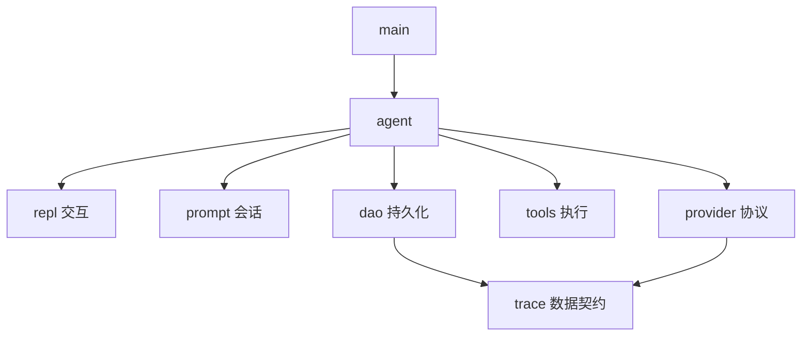

# 10 包、模块、可见性、文档与格式化输出

[返回总目录](../README.md) · [上一篇](09-error-handling.md) · [下一篇](11-cli-practice.md)

对应原教程：包和模块的全部小节、注释和文档、格式化输出。

## 三个容易混用的名字

package 是由 `Cargo.toml` 管理的项目单位，可以包含多个 target；crate 是一次编译的单元；module 是 crate 内的命名和可见性组织方式。一个源文件不会仅因存在就自动成为模块，通常需要被模块树声明引用。

本项目 package 叫 `geer-agent`，目前是 binary crate，入口为 [src/main.rs](/home/lihongyu/projects/geer-agent/src/main.rs)，没有 `src/lib.rs`。目录 `src/provider/openai/` 不是一个独立的外部包。

## `mod` 与 `use` 分别做什么

`mod tools;` 声明模块，可从 `tools.rs` 或 `tools/mod.rs` 加载；`use crate::tools::Tools;` 把已有路径引入当前作用域。`use` 不会重新编译一份模块，也不会自动公开私有内容。

| 写法 | 可访问范围 |
| --- | --- |
| 默认私有 | 当前模块及其后代模块可访问，仍受路径可见性约束 |
| `pub` | 对外公开，完整路径还必须可达 |
| `pub(crate)` | 当前 crate 内 |
| `pub(super)` | 父模块范围及其后代 |
| `pub use ...` | 重新导出，形成模块的公开入口 |

`crate::` 从当前 crate 根开始，`super::` 从父模块开始，`self::` 从当前模块开始。

## 项目的再导出

[repl/mod.rs](/home/lihongyu/projects/geer-agent/src/repl/mod.rs) 保持内部 `index` 私有，再用 `pub(crate) use index::{Session, run};` 给仓库其他模块提供稳定入口。调用者不必知道实现在哪个文件。

[tools/mod.rs](/home/lihongyu/projects/geer-agent/src/tools/mod.rs) 组织 Bash 和文件工具；Provider 需要的协议描述通过 Agent 转换，因此工具模块不必依赖 SDK 请求类型。这种依赖方向比“每个函数放单独目录”更值得学习。



图只显示主要职责连接，不是完整依赖图。完整源码地图见项目篇。

## 注释解释意图，文档解释用法

`//` 是普通注释，`///` 给后面的项写文档，`//!` 给当前模块或 crate 写文档。`cargo doc --no-deps --open` 能生成本项目文档；需要看私有项时可加 `--document-private-items`。

教程的文档测试要求示例可访问所用接口。本项目主要是二进制内部接口，不能假设在外部例子里写 `use geer_agent::...` 就能编译。笔记用独立示例与源码定位来处理这个边界。

## 输出格式同样是类型约束

```rust
#[derive(Debug)]
struct Usage { tokens: u64 }

fn main() {
    let usage = Usage { tokens: 12 };
    let line = format!("tokens={:04}, cost={:.2}", usage.tokens, 0.5);
    assert_eq!(line, "tokens=0012, cost=0.50");
    println!("{usage:?}");
}
```

`{}` 通常要求 `Display`，`{:?}` 要求 `Debug`，`{:#?}` 适合多行调试；`format!` 返回字符串，`println!` 写 stdout，`eprintln!` 写 stderr。写入可失败的输出目标时，用 `write!` / `writeln!` 并处理返回值。

不要随手打印完整配置。项目中 `TraceDatabaseConfig` 手写 `Debug` 隐藏 URL，但 `Config` 自身包含 API key，不能据此前者推断整个配置都可安全调试输出。

来源：[教程模块](https://beatai.org/rust-course/basic/crate-module/intro)、[官方可见性](https://doc.rust-lang.org/reference/visibility-and-privacy.html)、[std::fmt](https://doc.rust-lang.org/std/fmt/index.html)。
