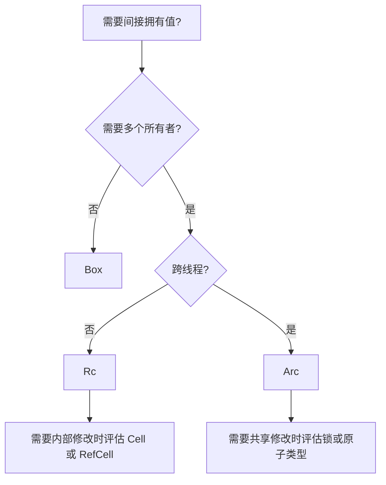

# 15 智能指针：Box、Rc、Arc、Cell 与 RefCell

[返回总目录](../README.md) · [上一篇](03-type-conversions.md) · [下一篇](05-cycles-and-self-reference.md)

对应原教程：智能指针、Box、Deref、Drop、Rc/Arc、Cell/RefCell。

## 从“谁拥有、谁修改”开始选

| 类型 | 所有权与修改方式 | 典型边界 |
| --- | --- | --- |
| `Box<T>` | 一个拥有者，间接持有 T | 递归类型、拥有型特征对象 |
| `Rc<T>` | 单线程引用计数共享 | 不跨线程的共享图 |
| `Arc<T>` | 原子引用计数共享 | 线程间共享，T 本身仍需满足约束 |
| `Cell<T>` | 通过替换/取出值实现内部可变性 | 不直接借出普通内部引用 |
| `RefCell<T>` | 单线程运行时检查借用 | 规则冲突时 `borrow` 可 panic |
| `Mutex<T>` | 互斥访问共享内容 | 多线程共享可变数据 |

`Arc` 只解决共享所有权和引用计数同步，不自动允许修改 T，也不会把 `RefCell<T>` 变成线程安全容器。



这张图只覆盖常见选择；先能用普通值和借用解决，就不必增加智能指针。

## Box、Deref 与 Drop

`Box::new(value)` 为非零大小值提供堆上的拥有型存储；零大小类型不需要实际分配。`Deref` 让某些包装类型可以像内部类型那样借用，例如 `&String` 转为 `&str`。自动解引用方便调用，不表示所有权被复制。

资源清理通常通过 `Drop` 与字段析构完成，也称 RAII。文件句柄、锁守卫等随拥有者离开作用域释放。`std::mem::drop(value)` 提前消费值；不能直接调用对象的析构方法来重复销毁它。

## Rc 克隆的是共享句柄

```rust
use std::rc::Rc;

fn main() {
    let model = Rc::new(String::from("test-model"));
    let another = Rc::clone(&model);
    assert_eq!(Rc::strong_count(&model), 2);
    assert!(Rc::ptr_eq(&model, &another));
    drop(another);
    assert_eq!(Rc::strong_count(&model), 1);
}
```

改成 `String::clone` 通常会复制文本内容；所以“看到 clone 就一定是深拷贝”不成立。

## RefCell 将借用检查推到运行时

```rust
use std::cell::RefCell;

fn main() {
    let output = RefCell::new(String::new());
    {
        let mut guard = output.borrow_mut();
        guard.push_str("完成");
        assert!(output.try_borrow().is_err());
    }
    assert_eq!(&*output.borrow(), "完成");
}
```

`Ref` / `RefMut` 守卫活着期间维持借用约束。`try_borrow` 用 `Result` 表达冲突，`borrow` 冲突时 panic。内部可变性不是“没有规则”，而是把规则交给容器实施。

## 项目对应

[TraceCapture](/home/lihongyu/projects/geer-agent/src/trace/mod.rs) 有 `Option<Arc<AtomicI32>>`，共享的是请求尝试次数；原子整数负责数值更新，Arc 负责共享存活。[Tools](/home/lihongyu/projects/geer-agent/src/tools/mod.rs) 用 `Box<dyn FnMut>` 保存可替换的授权回调。项目没有因为所有权报错而普遍引入 `Rc<RefCell<_>>`，这是值得保留的简洁性。

来源：[教程智能指针](https://beatai.org/rust-course/advance/smart-pointer/intro)、[标准库 Rc](https://doc.rust-lang.org/std/rc/struct.Rc.html)、[Arc](https://doc.rust-lang.org/std/sync/struct.Arc.html)、[RefCell](https://doc.rust-lang.org/std/cell/struct.RefCell.html)。
