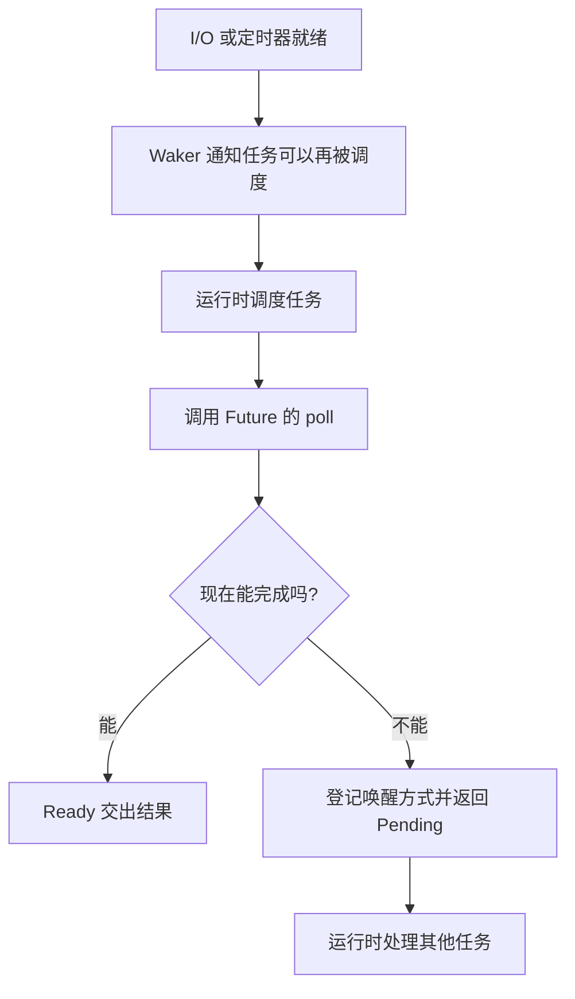

# 21 async、Future、运行时与 Pin

[返回总目录](../README.md) · [上一篇](09-macros.md) · [下一篇](11-streams-and-cancellation.md)

对应原教程：async 入门、Future 执行与调度、Pin/Unpin，以及异步疑难问题。

## 调用 async 函数先得到 Future

Future 表示一段尚未完成的计算。对 `async fn`，调用会构造 Future，函数体通常要被轮询后才开始执行。`.await` 驱动并等待它完成；等待期间若返回 Pending，当前任务可让出执行机会。它不等于自动开启线程。

下面只演示构造，故意不运行 Future：

```rust
async fn add_one(value: u32) -> u32 { value + 1 }

fn main() {
    let future = add_one(1);
    drop(future);
}
```

如果需要执行它，就要在运行时内 `.await`。本项目选择 Tokio，通常无需再引入另一个运行时。

## 一次轮询发生了什么



不是不断忙循环调用 poll 等待 I/O。Future 在返回 Pending 前要安排合适的唤醒机制；executor 决定何时再轮询。

## 当前线程运行时不表示没有其他线程

[main.rs](/home/lihongyu/projects/geer-agent/src/main.rs) 使用 `current_thread`：普通异步任务主要由当前线程驱动。但 [文件批量读取](/home/lihongyu/projects/geer-agent/src/tools/mod.rs) 会通过 `spawn_blocking` 使用阻塞线程池，所以不能说整个进程绝对只有一个线程。

`async fn` 内部直接 `std::thread::sleep` 或执行同步文件读，不会因为外层标了 async 就不阻塞。短期、简单的 CLI 输入也可能仍是同步实现；本项目的终端读行就是如此。要理解实际调度边界，而不是只看函数关键字。

## 为什么 Future 经常与 Pin 一起出现

异步状态机会保存跨 `.await` 仍需使用的局部状态，有时涉及对自身状态的引用。若对象被移到新地址，地址相关关系可能失效。`Pin<P>` 通过指针 P 表达对其所指值移动行为的约束，前提是 Pin 契约被遵守。

- `Unpin`：这个类型不依赖被固定地址，可以在相应安全接口下移动。
- `!Unpin`：需要保留固定约束；不要把固定后的内部值随意搬走。
- `Box::pin(value)`：得到 `Pin<Box<T>>`。可以移动外层指针句柄，不意味着里面的 T 被搬走。


Pin 不是“任何内容都不可修改”，也不是“对象必须永久存在”；它约束移动，并与类型是否 Unpin 有关。初学者先使用安全的 pin 工具，不手写 unsafe 投影。

## 读项目签名就能看到要求

[collect_reply](/home/lihongyu/projects/geer-agent/src/provider/openai/responses.rs) 要求 `S: Stream<...> + Unpin`，这样可对流使用这里的 `next()` 调用方式。若某个新流类型不满足 Unpin，先核对是否需要固定它，再把 `Pin<&mut S>` 或适合的包装传入；不是给原类型随便补 `impl Unpin`。

异步块里的 `?` 还可能需要明确错误类型，例如 `Ok::<_, std::io::Error>(value)`。递归 async 需要用间接存储打破无限大小的 Future；原生 trait async 已稳定，动态分派限制见 [Trait 篇](../01-basics/06-methods-and-traits.md)。

来源：[教程异步](https://beatai.org/rust-course/advance/async/intro)、[Future](https://doc.rust-lang.org/std/future/trait.Future.html)、[std::pin](https://doc.rust-lang.org/std/pin/)、[Tokio async 原理](https://tokio.rs/tokio/tutorial/async)。
