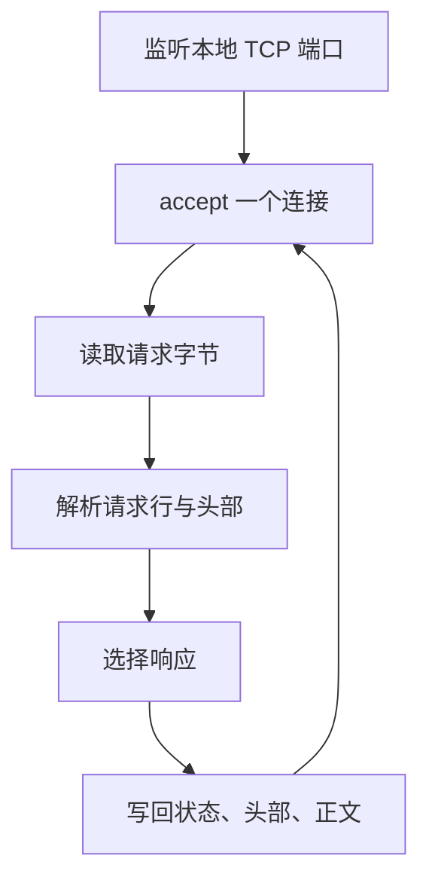

# 23 Web 服务器实战：从串行到并发，再到关闭

[返回总目录](../README.md) · [上一篇](11-streams-and-cancellation.md) · [下一篇](13-tokio-redis.md)

对应原教程：进阶实战一的单线程、多线程、优雅关闭；异步章节的 Async Web 服务器。这里整理实现步骤与验收点，不向 geer-agent 添加服务器功能。

## 单线程版本先看清数据流

`TcpListener` 负责接受连接，`TcpStream` 是读写该连接的对象。一个 `read` 调用不保证得到整份请求；一个 `write` 也不保证写完整个缓冲区。循环读取和 `write_all` 表达了更完整的 I/O 需求。

学习版服务器通常只处理少量已知请求，不能因为浏览器显示成功，就认定已实现完整 HTTP 协议、请求体限制或所有错误处理。

## 多线程版本先问“任务交给谁”

每个连接新建线程容易理解，但连接数大时线程和栈成本会增长。线程池提前建立有限 worker，主线程把任务发到队列，worker 循环取任务。任务闭包通常按所有权接收连接，处理完成后释放它。

| 子步骤 | 应检查的行为 |
| --- | --- |
| 模拟慢请求 | 一个请求慢时，其他请求是否被阻塞 |
| 创建 worker | 每个线程能反复处理多个任务 |
| 通道分发任务 | 消息持有任务，接收端有明确结束条件 |
| 共享接收器 | 取任务的锁不要包住整个耗时处理 |
| 限制资源 | 固定 worker 数量不代表队列必定有界 |

## 优雅关闭需要有顺序

先停止接受新任务，再通知或关闭任务通道，让 worker 完成已接收的任务，最后 join。保留着 sender 就可能让等待中的 worker 永不退出；在发送端还活着时直接 join 也可能卡住。

线程池的 `Drop` 可以执行清理，但不能忽略潜在失败与 panic。生产场景常需要显式 shutdown 接口和时间限制；教程展示的是理解资源归属与收尾顺序的起点。

## 异步版本改变的是等待方式

将阻塞网络 I/O 换成异步 I/O，让任务在等待连接/字节时把执行机会交还运行时。教程的异步服务器示例使用的运行时与本项目不一定相同；本仓库已有 Tokio，不需要为了复刻例子再加 async-std。

异步仍需限制连接数、缓冲区大小和耗时；它不会消除共享状态和协议解析的问题。CPU 密集计算也不会仅因放进 async 函数就更快。

## 项目里可以读到类似代码

[tests/tool_loop.rs](/home/lihongyu/projects/geer-agent/tests/tool_loop.rs) 的模拟 HTTP 服务使用 `TcpListener`，读取请求头、按 Content-Length 读取 body，再写预设的流事件。监听 `127.0.0.1:0` 让系统分配空闲端口，便于并行测试。

这是针对测试客户端的受控模拟器，不应直接作为公网服务器。阅读时重点找四件事：端口怎么传给子进程、连接怎么限时、请求体怎么攒齐、服务线程如何结束。

练习：在独立目录实现只有 `/health` 的本地服务器，测试慢连接不会让整个测试永远等待；不要改动 Agent 的业务入口。

来源：[教程 Web 实战](https://beatai.org/rust-course/advance-practice1/intro)、[教程 Async Web](https://beatai.org/rust-course/advance/async/web-server)、[Rust Book Web 实战](https://doc.rust-lang.org/book/ch21-00-final-project-a-web-server.html)。
