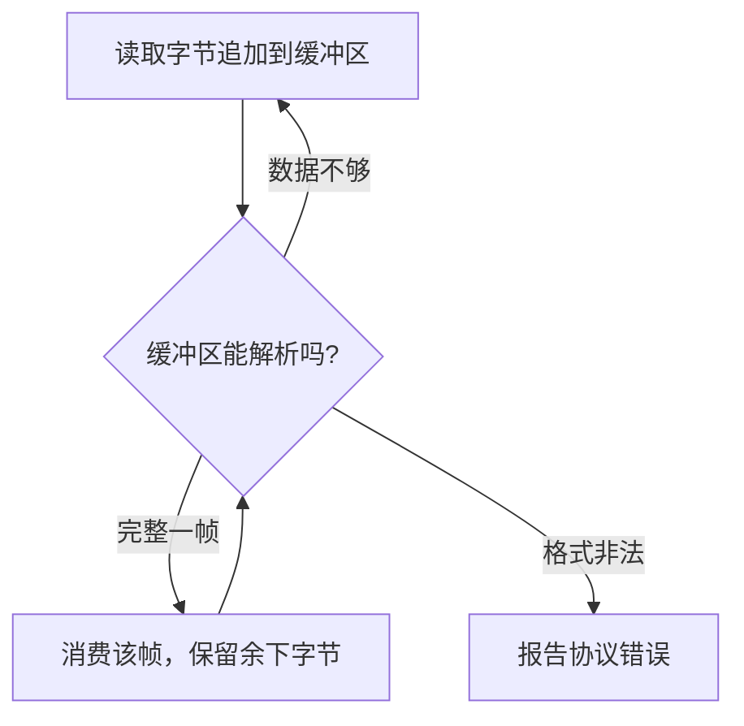

# 24 Tokio 与 mini-Redis 逐节导读

[返回总目录](../README.md) · [上一篇](12-web-server.md) · [进入工程篇](../03-engineering/01-tests.md)

对应原教程：进阶实战二的全部小节。目标是学会异步系统中的任务、消息、协议和关闭，不是为本项目增加 Redis 依赖。

## 每节要带走什么

| 教程小节 | 核心问题 | 学习后做的验证 |
| --- | --- | --- |
| Tokio 概览 | 语言 async 与运行时各负责什么 | 区分语法、调度器、I/O 驱动 |
| 使用初印象 | 客户端与服务端怎样开始通信 | 在独立工程建立一次本地请求 |
| 创建异步任务 | 连接由谁拥有 | 把连接移入任务，理解 Send / static |
| 共享状态 | 多连接怎么访问数据表 | 缩短锁的范围，不持锁等待网络 |
| 消息传递 | 一个连接资源能否由单任务管理 | 用命令消息加回复通道表达操作 |
| I/O | read/write 是不是完整消息 | 测试短读与分段输入 |
| 解析数据帧 | 协议消息如何从字节流分离 | 区分完整、不完整、非法三种状态 |
| 深入 async | Future 怎样保存状态 | 找出跨 await 仍被保存的局部变量 |
| select | 怎样同时等数据与关闭通知 | 确认输掉分支的取消是否安全 |
| Stream | 多条异步值怎样组合 | 确认 None 和每项 Err 的语义 |
| 优雅关闭 | 怎样通知并等待所有任务 | 不只发通知，还要等清理结束 |
| 异步与同步共存 | 同步 API 如何使用运行时 | 避免在已运行的异步上下文中嵌套 block_on |

## 帧解析为什么不能只看一次 read

TCP 提供字节流，不保留应用消息边界。一份消息可能分多次读到，一次读到的内容也可能包含多份消息。

同时限制缓冲区增长，并处理 EOF 时还有半帧的情况。本项目流式事件读取主要由 SDK 处理底层协议，但自己仍需处理事件的业务完成边界。

## 共享状态有两条常见路线

短时间同步修改一个普通映射，可以在很小范围内用同步锁；如果必须等待 I/O，不把同步锁守卫跨过 `.await`。需要跨 await 持有的异步互斥访问才考虑异步 Mutex，并检查是否可以改成资源由单任务拥有。

另一条路线是消息驱动：多个调用方通过有界 mpsc 发命令，一个任务独占连接，使用 oneshot 给每个调用方返回结果。这里的关键是明确资源主人和背压，不是见到并发就增加 Arc<Mutex>。

## spawn 的两个常见误解

`'static` 约束不等于让任务泄漏到程序结束；它意味着任务不能依赖可能过早失效的外部借用。`Send` 约束取决于哪些值跨 `.await` 被保存在任务里；`async move` 捕获一个 `Rc` 并不会让它变成 Send。

普通 `tokio::spawn` 即使在当前线程 runtime 中也保留其 Send 约束；局部任务有另外的 API 和执行上下文，不能仅改一个 runtime 配置就解决类型错误。

## 对照本项目

[tools::execute_batch](/home/lihongyu/projects/geer-agent/src/tools/mod.rs) 先把准备好的文件操作移动到 `spawn_blocking`；[Bash 工具](/home/lihongyu/projects/geer-agent/src/tools/bash.rs) 用两个异步任务分别排空 stdout/stderr，避免只读一边而另一边管道塞满。

项目当前没有 Redis 服务，也没有基于消息的数据库 actor；这些是教程的独立实践，不应当作为源码现状描述。

来源：[教程 mini-Redis](https://beatai.org/rust-course/advance-practice/intro)、[Tokio 官方教程](https://tokio.rs/tokio/tutorial)、[共享状态](https://tokio.rs/tokio/tutorial/shared-state)、[任务创建](https://tokio.rs/tokio/tutorial/spawning)、[帧解析](https://tokio.rs/tokio/tutorial/framing)。
