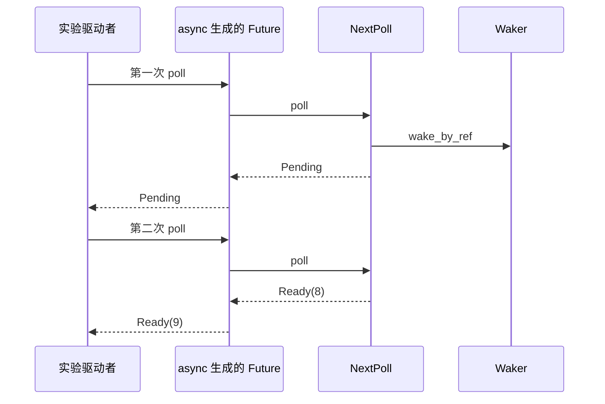

# 手动推进 Future：看清 await、唤醒与 Send

[返回总目录](../README.md) · [async 基础](10-async-future-and-pin.md) · [Tokio 原理](../08-ecosystem/03-tokio-runtime.md)

这一篇不用 Tokio，也不实现生产执行器。通过有限次数的手动 poll，观察语言生成的 Future 如何把内部 Pending 传到外层。理解之后仍使用成熟运行时。

## 可运行实验：一次 Pending，一次 Ready

```rust
use std::{
    future::Future,
    pin::{pin, Pin},
    sync::{Arc, atomic::{AtomicUsize, Ordering}},
    task::{Context, Poll, Wake, Waker},
};

#[derive(Default)]
struct WakeCounter(AtomicUsize);

impl Wake for WakeCounter {
    fn wake(self: Arc<Self>) {
        self.0.fetch_add(1, Ordering::Relaxed);
    }
}

struct NextPoll {
    requested: bool,
}

impl Future for NextPoll {
    type Output = u32;

    fn poll(self: Pin<&mut Self>, cx: &mut Context<'_>) -> Poll<u32> {
        // 只有 bool 字段，类型是 Unpin，安全接口允许取得可变引用。
        let this = self.get_mut();
        if this.requested {
            Poll::Ready(8)
        } else {
            this.requested = true;
            cx.waker().wake_by_ref();
            Poll::Pending
        }
    }
}

fn main() {
    let wakes = Arc::new(WakeCounter::default());
    let waker: Waker = Arc::clone(&wakes).into();
    let mut context = Context::from_waker(&waker);
    let mut future = pin!(async {
        let number = NextPoll { requested: false }.await;
        number + 1
    });

    assert_eq!(future.as_mut().poll(&mut context), Poll::Pending);
    assert_eq!(wakes.0.load(Ordering::Relaxed), 1);
    assert_eq!(future.as_mut().poll(&mut context), Poll::Ready(9));
}
```

这里的 Waker 只记次数，测试驱动者手动决定下一次 poll；它没有就绪队列、I/O driver 或调度线程。NextPoll 主动请求再次推进，因此 Pending 不会成为无人唤醒的等待。[Wake](https://doc.rust-lang.org/std/task/trait.Wake.html)、[Future](https://doc.rust-lang.org/std/future/trait.Future.html)。



不要将实验改成无限紧密 poll。真实执行器围绕唤醒安排就绪任务；实际资源可能仍未准备好，一次 wake 不等于一次完成。返回 Ready 后调用方应停止 poll；Future 契约不要求已完成 Future 再次被 poll 时仍返回相同值。

## Send 看的是跨暂停点留下了什么

下面故意不能编译：future 持有 Rc，并在 await 之后继续使用它。

```rust,compile_fail
use std::{future::pending, rc::Rc};

fn require_send<T: Send>(_: T) {}

fn main() {
    require_send(async {
        let local = Rc::new(String::from("thread-local"));
        pending::<()>().await;
        println!("{local}");
    });
}
```

这不是 async 拒绝所有 Rc，而是该 Future 的暂停状态需要保存 Rc。若非 Send 值在 await 前完成使用且离开作用域，后续状态可以只保存 Send 数据：

```rust
use std::{future::ready, rc::Rc};

fn require_send<T: Send>(_: T) {}

fn main() {
    require_send(async {
        let length = {
            let local = Rc::new(String::from("thread-local"));
            local.len()
        };
        ready(()).await;
        assert_eq!(length, 12);
    });
}
```

第二例只验证类型约束，require_send 接受后丢弃 Future，没有执行 async 块。这一点也是学习目标：创建 Future 与运行 Future 是两个动作。[Tokio Send 解释](https://tokio.rs/tokio/tutorial/spawning#send)。

## async move 不会替借用对象延长寿命

move 移入的是捕获的值；捕获值若是 `&T`，移入的仍是引用。后台任务通常要求 `'static`，因为任务可能比创建任务的栈帧活得更久；把外部字符串先变成拥有的 String，才能在任务内独立保有它。

```rust,compile_fail
fn require_static<T: 'static>(_: T) {}

fn main() {
    let text = String::from("borrowed");
    let borrowed = text.as_str();
    require_static(async move {
        println!("{borrowed}");
    });
}
```

`'static` bound 不表示任务必须运行到程序结束，只说明它没有不满足条件的外部短借用。完成或取消后，拥有的资源仍按正常生命周期释放。[深入 static](01-lifetimes-and-static.md)。

## 为什么常见类型是 Pin<Box<dyn Future<...>>>

| 部分 | 解决什么 | 成本或约束 |
| --- | --- | --- |
| dyn Future<Output=T> | 将不同具体 Future 隐藏在同一接口后 | 通过动态分派 poll |
| Box | 给不同大小的实现提供一个拥有的指针形态 | 通常一次堆分配 |
| Pin | 保持被固定目标所需的地址约束 | 不允许从安全 API 随意移出非 Unpin 目标 |
| + Send | 能在需要的线程边界转交状态 | 排除不满足 Send 的捕获 |
| + 'a | 标明 Future 可持有的借用边界 | 不应一律写成 static |

普通函数返回 `impl Future` 可以保留具体类型并采用静态分派；真正需要异构容器或动态接口时再装箱。Box 的堆存储和 Pin 的移动约束是两个维度；`pin!` 自身不新增堆分配，在 async 内固定的局部值使用所属 Future 的存储。[pin!](https://doc.rust-lang.org/std/pin/macro.pin.html)、[Pin](https://doc.rust-lang.org/std/pin/index.html)。

验收：给三个 Future 标出跨 await 存活的值、Send 是否成立、是否满足 static，以及丢弃时释放哪些资源。再解释为什么反复调用同一个 async fn 得到的是多个独立状态。
