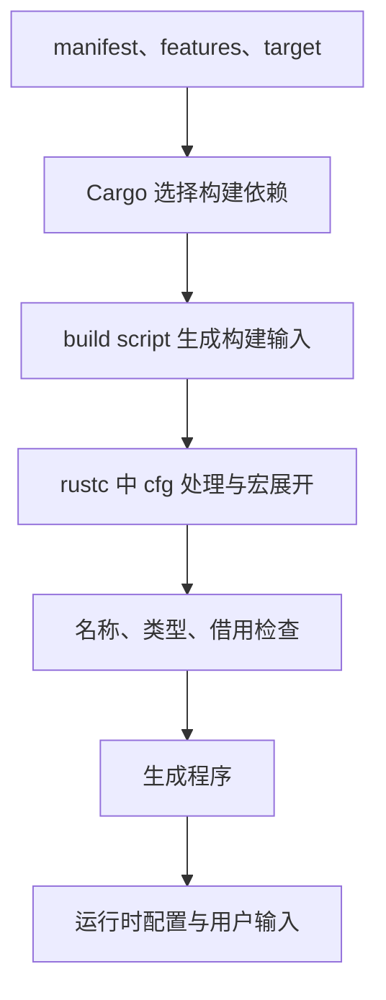

# 宏与条件编译实战：展开、求值和构建边界

[返回总目录](../README.md) · [宏基础](09-macros.md) · [工具链](../03-engineering/08-toolchain-and-compilation.md)

资深工程师不必先写 proc macro，但应能解释框架宏生成什么、条件编译移除了什么，以及为什么宏不能当文本替换理解。

## 重复模式与表达式求值次数

```rust
macro_rules! records {
    ($($key:expr => $value:expr),* $(,)?) => {{
        let result: ::std::collections::BTreeMap<::std::string::String, u64> =
            ::std::collections::BTreeMap::from([
                $( (($key).to_owned(), $value), )*
            ]);
        result
    }};
}

fn main() {
    let mut calls = 0;
    let values = records! {
        "rust" => { calls += 1; 2 },
        "go" => { calls += 1; 3 },
    };
    assert_eq!(calls, 2);
    assert_eq!(values.get("rust"), Some(&2));
    let empty = records! {};
    assert!(empty.is_empty());
}
```

expr 捕获合法表达式；星号重复允许零项；可选尾逗号改善调用形式；双层大括号使展开结果是一段有局部变量的表达式。每个输入表达式在本例展开中只出现一次，键会建立拥有 String。[macro_rules](https://doc.rust-lang.org/reference/macros-by-example.html)。

重复键会使最终映射项少于输入条目；此宏不验证业务重复，也不应作为重复条目列表使用。生产代码直接用 BTreeMap::from/collect 已足够时，不必增加这个学习宏。

## 一个容易误解的宏会重复执行副作用

```rust
macro_rules! twice {
    ($expression:expr) => { $expression + $expression };
}

fn main() {
    let mut calls = 0;
    let result = twice!({ calls += 1; calls });
    assert_eq!(calls, 2);
    assert_eq!(result, 3);
}
```

调用者可能以为先算一次再乘二，展开实际把表达式放了两处。改为普通函数可以让参数先求值一次；若在宏中绑定一次局部值，还要考虑非 Copy 类型不能简单被使用两遍。宏设计需要同时审查求值、移动、分配和早返回。

## 卫生、路径与公开宏

macro_rules 的标识符解析有自己的卫生与作用域规则，不是替换后随调用者变量乱用。公开跨 crate 宏引用自己 helper 时，通常使用 `$crate` 的路径；helper 可见性仍须符合规则。直接引用相对依赖名称也可能要求下游引入该依赖，公共宏应检查真实外部调用方式。[hygiene](https://doc.rust-lang.org/reference/macros-by-example.html#hygiene)。

本篇宏采用绝对 std 路径减少名字冲突，只在练习内使用，没有创建自定义 proc-macro crate。

## cfg 属性与 cfg! 表达式不同

```rust
#[cfg(target_os = "linux")]
fn platform_name() -> &'static str { "Linux" }

#[cfg(not(target_os = "linux"))]
fn platform_name() -> &'static str { "Other" }

fn main() {
    assert!(!platform_name().is_empty());
}
```

cfg 属性决定项是否参与后续编译；cfg! 产生一个布尔表达式，普通 if 的两边仍要满足名称和类型检查。下面即使条件恒为假也不能编译：

```rust,compile_fail
fn main() {
    if cfg!(any()) {
        let number: u64 = "not a number";
        println!("{number}");
    }
}
```

`any()` 没有条件时为假。不要用 `if cfg!(windows)` 包住 Linux 上不存在的 Windows 模块；用 cfg 属性将相关项或代码块从不适用目标中移除。[conditional compilation](https://doc.rust-lang.org/reference/conditional-compilation.html)、[cfg!](https://doc.rust-lang.org/std/macro.cfg.html)。

## Feature 是构建输入，不是运行期开关

feature 参与依赖与代码选择，通常应能叠加；运行时配置则在已构建程序中决定行为。`cfg(feature="gui")` 不表示读取环境变量就能让未编入 GUI 的程序突然拥有 GUI 能力。[Cargo features](https://doc.rust-lang.org/cargo/reference/features.html)。



这是概念依赖图；具体编译查询与展开次序比图更细。build.rs 在 host 执行，target_* 信息应来自 Cargo 的目标配置；不能用构建脚本自身的 cfg 来替代目标平台判断。

## 看懂三类常用生成机制

| 机制 | 读代码时追问 | 项目/框架例子 |
| --- | --- | --- |
| derive | 生成哪些 trait impl，字段需要哪些 bound | Serialize、Deserialize、Debug |
| 属性宏 | 改变入口/方法和执行上下文了吗 | Tokio test、Tauri command、tracing instrument |
| 编译期文件宏 | 文件何时读入、跟踪了哪些输入 | include_str/include_bytes 与配置/静态资源 |

展开检查工具只是辅助，最终仍由匹配 toolchain/feature 的编译诊断确认。不能因为展开代码很长就跳过输入、错误或资源语义。编译期嵌入的内容随程序分发，需检查实际包内容；本项目特殊 embed-env 不进入通用 all-features 检查。

验收：解释一个带副作用表达式在宏里被执行几次；说明 cfg 与 cfg! 的编译区别；从 Serde/Tauri/Tokio 中选择一个宏，列出它生成的核心契约和它没有提供的业务保证。
