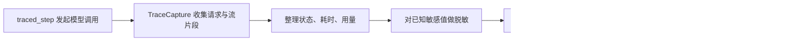

# 27 日志、可观测性与项目的数据库 Trace

[返回总目录](../README.md) · [上一篇](02-cargo.md) · [下一篇](04-practices-and-ecosystem.md)

对应原教程：日志详解、log 门面、tracing、自定义输出、监控、可观测性、分布式追踪。最后一项在本次源码快照里只有标题，相关说明属于补充。

## 先分清要记录什么

| 数据 | 回答的问题 | 示例 |
| --- | --- | --- |
| 日志 event | 刚才发生了什么 | 某工具调用失败 |
| 指标 metric | 一段时间整体怎样 | 请求次数、失败率、耗时分布 |
| span / trace | 一次操作经过了哪些步骤 | 请求 → 模型 → 工具 → 模型 |

`log` 提供日志门面，通常还需具体 logger 决定级别和输出位置。`tracing` 通过 event 和 span 描述上下文，subscriber/layer 负责收集、过滤、格式化与导出。自定义格式是在输出层完成，不该让每个业务函数手拼同一种日志格式。

异步任务可能交错执行，关联上下文比仅打印线程号更有帮助。使用 tracing 时要按它的异步用法维护 span，不把同步的进入守卫随意跨 `.await` 保存。

## 本项目的 trace 模块不是 tracing crate

[Cargo.toml](/home/lihongyu/projects/geer-agent/Cargo.toml) 没有直接声明 `tracing` 依赖。本仓库 [trace 模块](/home/lihongyu/projects/geer-agent/src/trace/mod.rs) 自己定义模型调用记录、采集器和读写 trait；运行指标与工具记录也有 JSON 文本输出。不要把同名概念混为已接入 OpenTelemetry 的分布式链路系统。

图描述模型调用记录；工具执行指标是另一条相关输出路径。

## 从三个 ID 理解关系

`session_id` 关联会话；`agent_run_id` 关联一次用户请求的工具循环；`request_id` 标识一次模型步骤记录。一个用户请求可能经过多个模型步骤，一个步骤还可能发生重试，因此 attempts 不等于 Agent turn 数。

`TraceStatus::Completed` 描述模型步骤完成，也不代表用户整个任务一定完成，或工具副作用已全部成功。

## DAO 里值得学习的 Rust 技巧

[TraceStore](/home/lihongyu/projects/geer-agent/src/dao/mod.rs) 用枚举在 SQL 与 Mongo 两类实现间转发，SQL 再支持 SQLite/Postgres/MySQL。`TraceWriter` / `TraceReader` 定义行为契约，业务层不必掌握所有后端查询类型。

| 接口形状 | 表达的行为 |
| --- | --- |
| `Result<Option<TraceRecord>, TraceError>` | 查询失败与不存在分开 |
| `Vec<Option<TraceRecord>>` | 批量查询保留输入位置和缺项 |
| `Vec<BatchWriteItem>` | 每条写入分别记录结果 |
| `TraceCursor` | 用时间戳加请求 ID 建立稳定分页次序 |

写入使用请求 ID 检查一致性，已有相同记录可以视为已成功，不同内容报告冲突。这样的幂等语义需要测试，不能只靠数据库 API 返回成功推断。

## 失败降级与数据保护

当前启动代码在 Trace 数据库连接失败时提示并关闭本次持久化；模型步骤结束后写 Trace 失败也有单独处理，不把“记录失败”自动当成“模型调用失败”。分析时要保留这两层结果。

当前脱敏逻辑对传入的已知秘密做替换，不是通用隐私识别器。请求/响应可能仍包含用户内容；学习或分享笔记只使用合成数据，不导出真实会话记录。

来源：[教程日志与监控](https://beatai.org/rust-course/logs/intro)、[log 文档](https://docs.rs/log/latest/log/)、[tracing 文档](https://docs.rs/tracing/latest/tracing/)、本仓库 trace 与 dao 源码。
