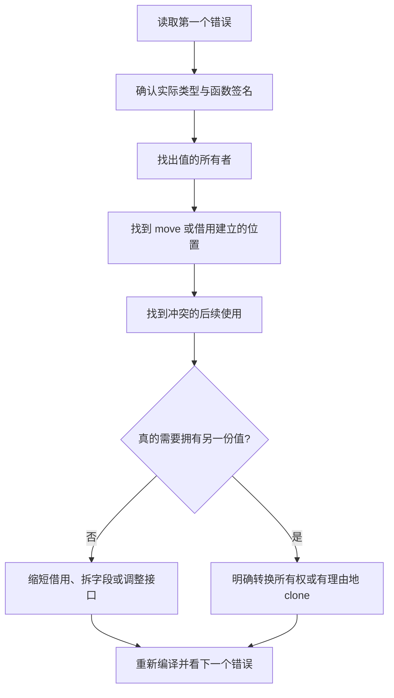

# 30 编译错误、难点与常见陷阱

[返回总目录](../README.md) · [上一篇](05-linked-lists.md) · [下一篇](07-performance.md)

对应原教程：Rust 难点攻关、对抗编译检查和全部常见陷阱条目。原文中只有标题的内容按官方规则补充。

## 按编译器指出的位置逆推原因



`rustc --explain E0382` 等命令提供离线解释。先修第一个根因，再看后续诊断，不对每个下游错误分别乱加 clone 和生命周期。

## 常见诊断速查

| 诊断 | 先问什么 | 常用修复方向 |
| --- | --- | --- |
| E0382 已移动后使用 | 前一个调用是否取得所有权 | 借用、调换处理顺序，必要时克隆 |
| E0502 共享与独占借用冲突 | 旧引用最后在哪用 | 缩短范围、让函数只借需要的字段 |
| E0499 多次独占借用 | 是否实际访问不相交部分 | `split_at_mut`、解构字段 |
| E0597 值不够长命 | 谁先销毁 | 延长拥有者范围或返回拥有值 |
| E0515 返回局部引用 | 返回数据由谁继续拥有 | 返回 String/Vec 等拥有型值 |
| E0277 trait 约束不满足 | 是否跨线程或缺少特征 | 查看调用边界，补真实能力而非随意标记 |
| E0282 类型推导不明确 | collect/parse 的目标是什么 | 标注变量类型或 turbofish |

## 对抗编译检查的各个案例

生命周期过大两节：不要让方法的 `&mut self` 借用与结构体内部借用绑得同样长；只给真正相关的输入输出加关系。循环中的生命周期：每次迭代的借用可能因返回值流出而被延长；先缩小例子，改变“返回引用还是返回索引/拥有值”的接口，再确认当前编译器行为。

闭包碰到特征对象：检查 `Box<dyn Trait>` 的默认生命周期是否要求 static；保存短期借用的回调可能需要明确 `+ 'a`，或改为拥有捕获值。

函数内外同时使用引用：调用 `&mut self` 方法意味着借用了整个 self，即使方法目前只改某个字段。把真正需要的字段作为参数，可能比为整个结构体加 RefCell 更清楚。

智能指针中的重复借用：编译器能直接区分普通结构体字段，但经过 Deref/RefMut 的访问不总能按同样方式拆分。可先拿到明确的 `&mut Inner`，再借其独立字段；仍需遵守守卫有效范围。

“类型未限制”和“幽灵数据”在原文是占位。前者先核对 impl 的泛型参数是否真正参与实现类型或 trait；后者见链表篇的 PhantomData，不把占位标题当成已有完整方案。

## 逐项对应原教程的常见陷阱

| 条目 | 核心原因与行动 |
| --- | --- |
| for 中使用外部数组/集合 | 按值遍历可能消耗集合，复用时考虑 `&values` |
| 线程相关栈溢出 | 检查递归、大型栈值与线程栈配置，不能只看总内存 |
| 算术溢出 | 先检查操作数类型和求值发生在哪一步，再用 checked/saturating 等 |
| 闭包奇怪的生命周期 | 闭包推导关系不总等于具名泛型函数；必要时使用具名函数/明确约束 |
| 可变变量不可变 | `mut binding` 不会把 `&T` 变成 `&mut T`，遮蔽也可能换掉原绑定 |
| 重构后可变借用失败 | `&mut self` 扩大了借用范围，提取函数时保留字段级边界 |
| 不勤快的迭代器 | 适配器惰性，不消费就不执行副作用 |
| 奇怪的 x..y | 范围通常左闭右开，且 Range 本身也是可消耗的迭代器 |
| 无处不在的迭代器 | 检查 `Item` 是 T、&T 还是 &&T，理解 into_iter 的所有权 |
| 主线程等不到通道结束 | 所有发送端必须真正关闭；遗留的克隆也算发送端 |
| UTF-8 性能隐患 | 反复 `chars().nth(i)` 从头扫描可能变成平方复杂度 |

## Eq、PartialEq 与切片难点

`PartialEq` 提供比较，`Eq` 额外承诺等价关系的自反性等要求，不是新加一个比较方法。浮点 NaN 不等于自身，因此通常不能直接作为需要 Eq 的键。类似地，PartialOrd 的比较可以没有结果，Ord 提供全序。

`str` 与 `[T]` 是动态大小类型，`&str` 与 `&[T]` 是可存放的引用形式；区别不是有没有“数组对象”，而是值大小和访问方式。move/Copy/Clone、NLL 的原文占位已在基础篇和生命周期篇解释。

```rust
fn main() {
    let mut values = [1, 2];
    let (left, right) = values.split_at_mut(1);
    left[0] += right[0];
    assert_eq!(values, [3, 2]);
}
```

项目实践：从 [parse_input](/home/lihongyu/projects/geer-agent/src/repl/index.rs) 或 [Prompt::commit_turn](/home/lihongyu/projects/geer-agent/src/prompt/conversation.rs) 抽一段到独立练习目录制造错误，先预测诊断，再修复；不为练习破坏主程序。

来源：[教程编译错误](https://beatai.org/rust-course/compiler/intro)、[教程陷阱](https://beatai.org/rust-course/compiler/pitfalls/index)、[官方错误索引](https://doc.rust-lang.org/error_codes/)、[Eq](https://doc.rust-lang.org/std/cmp/trait.Eq.html)。
