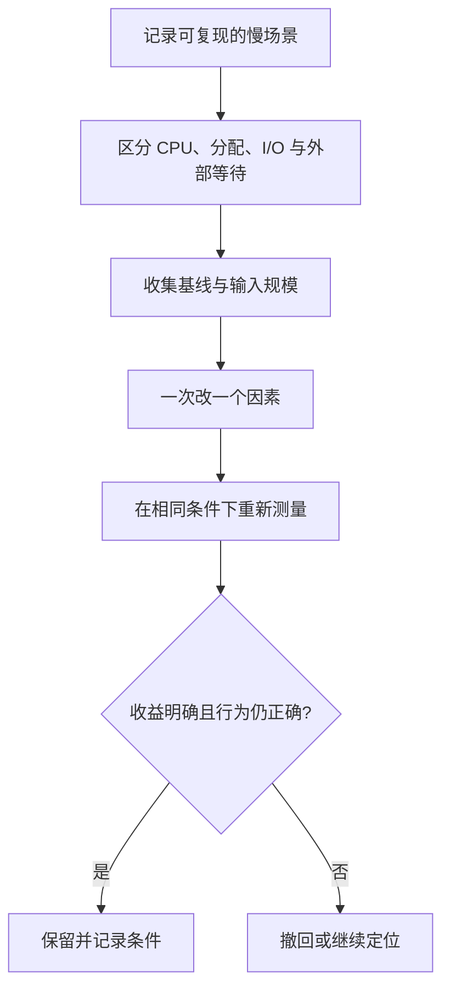

# 31 性能：先测量，再解释成本

[返回总目录](../README.md) · [上一篇](06-compiler-and-pitfalls.md) · [进入项目篇](../04-project/01-code-map.md)

对应原教程：深入内存、性能调优、编译优化及其全部子项。这一部分在源目录中大量标 TODO，有些正文只是外链，有些已经有内容；以下明确作为入门补充，不当成已完结原文摘要。

## 先分四类时间

编译耗时、程序 CPU 执行耗时、I/O 等待、外部模型服务耗时是不同问题。比如 Agent 首字延迟很长，先看请求发送、网络和模型，而不是先把一个 Vec 换成链表。



## 内存章节逐项理解

| 原教程条目 | 入门时应掌握的边界 |
| --- | --- |
| 指针和引用 | 间接访问与别名限制；指针大小不是整个数据大小 |
| 未初始化内存 | 类型有效性有要求；不为省初始化绕过安全接口 |
| 内存分配 | Vec/String 增长、临时 clone 都可能分配；先统计频率 |
| 内存布局 | 默认结构体布局不承诺按声明顺序；协议不能直接复制内存 |
| 虚拟内存 | 进程看到的地址空间与实际物理占用并非一一对应 |

不要笼统断言“栈一定快、堆一定慢”。实际访问模式、缓存命中、分配频率、数据规模都参与结果。

## 调优章节逐项理解

| 原教程条目 | 可操作的学习结论 |
| --- | --- |
| 字符串性能 | 适当预留容量，追加时考虑 push_str，注意 UTF-8 边界 |
| 深入 move | 所有权转移不保证没有字节复制，大数组的移动和 String 缓冲区移动不同 |
| 提前优化 | 先确认瓶颈，避免牺牲可读性换没有测出的收益 |
| Clone 与 Copy | 看具体类型；Rc/Arc 克隆句柄，String 通常复制文本 |
| Runtime check | 安全迭代可能让编译器消除部分检查，不手写 unsafe 下标求快 |
| CPU 缓存 | 连续数据通常更利于局部性，散布节点会增加间接访问 |
| 计算性能 | 检查算法复杂度、重复计算和输入分布，再考虑指令级优化 |
| 堆与栈 | 区分局部栈槽、堆缓冲区、递归深度；大值要看真实构建结果 |
| allocator | 先测量分配压力；更换分配器不是入门默认项 |
| 性能工具 | release 基线、profiler 与统计基准各回答不同问题 |
| Enum 内存 | 大变体可能抬高整个枚举大小；是否间接存储要综合分配成本 |

`Option<&T>`、某些非零整数等有文档化的布局优化，但不能推广为“所有 Option 都和内部值同样大”。需要布局保证时核对具体类型的官方文档。

## 编译优化章节逐项理解

LLVM 是代码生成与优化链条的一部分，不需要初学者先调一套后端参数。属性如 `inline` 是提示或受规则约束的控制，不是速度保证。提高编译速度先看依赖树、features 和大型泛型实例，再通过构建计时定位。

```bash
cargo build --timings
cargo tree -e features
cargo build --release
```

这些是可选诊断命令，本次没有执行主工程 release 构建。`.cargo/config.toml`、profile、增量编译影响的是构建过程的一部分；`cargo clean` 会丢缓存，通常不是提速起点。

## 对照项目的三个例子

[Tools::execute_batch](/home/lihongyu/projects/geer-agent/src/tools/mod.rs) 提前为结果 Vec 预留调用数量；[Bash 截断](/home/lihongyu/projects/geer-agent/src/tools/bash.rs) 为捕获字节和显示字符分别设限，限制输出带来的资源消耗；[Prompt 请求构造](/home/lihongyu/projects/geer-agent/src/prompt/conversation.rs) 有历史 clone，初学阶段先理解独立请求需要的所有权，不能看到 clone 就删除。

练习：对逐渐增大的文本比较“一次 chars 遍历”和“循环调用 chars().nth(i)”；记录输入长度及趋势。结果用于理解复杂度，不宣称代表生产服务性能。

来源：[教程性能章节](https://beatai.org/rust-course/profiling/intro)、[Rust Performance Book](https://nnethercote.github.io/perf-book/)、[Cargo timings](https://doc.rust-lang.org/cargo/reference/timings.html)、[Option 布局保证](https://doc.rust-lang.org/std/option/index.html#representation)。
