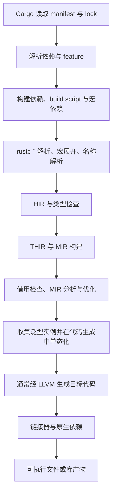

# 工具链原理：从源码到可执行文件

[返回总目录](../README.md) · [Cargo 概览](02-cargo.md) · [下一篇](09-api-design-and-state.md)

本篇的目标是能定位工程问题：工具选择、依赖解析、类型检查、代码生成、链接和运行分别发生什么。无需先成为编译器贡献者。

## 工具分工与实际选择

| 工具 | 职责 | 常见误解 |
| --- | --- | --- |
| rustup | 管 toolchain、component、target，提供代理入口 | 不是编译器或依赖解析器 |
| Cargo | 管包、依赖、target、profile，协调构建 | 不是所有代码最终编译的后端 |
| rustc | 语言检查、IR、代码生成、链接协调 | 不独立替代 Cargo 的依赖管理 |
| rustdoc | 文档与文档示例测试 | Markdown 代码围栏需要正确标记 |
| rustfmt | 自动格式化 | 不证明行为正确 |
| Clippy | 提供更多静态 lint 建议 | 建议需要结合项目语义判断 |
| rust-analyzer | 编辑器语义分析与辅助 | 其配置不一定与命令行完全一致 |

rustup 代理按显式 `+toolchain`、RUSTUP_TOOLCHAIN、目录 override/工具链文件、默认值等选择实际工具链，目录邻近性也参与。用 rustup show 观察结果，不要只看 PATH 上入口文件名。[rustup concepts](https://rust-lang.github.io/rustup/concepts/index.html)、[overrides](https://rust-lang.github.io/rustup/overrides.html)。

```bash
rustup show
rustup which rustc
rustc --version --verbose
cargo --version
rustup component list --installed
rustup target list --installed
```

本项目以本机工具链为准，不为笔记新增 rust-toolchain.toml 或改全局 default。独立团队项目是否固定工具链、支持 MSRV、跟随 stable，需要明确政策。

## 编译流程的概念地图



图是便于定位的简化图；rustc 是按查询组织的编译器，不是每个阶段仅顺序执行一次的流水线。HIR/THIR/MIR 是逐渐降低表面语法复杂度的中间表示；MIR 尤其服务于借用与控制流分析。[compiler overview](https://rustc-dev-guide.rust-lang.org/overview.html)、[MIR](https://rustc-dev-guide.rust-lang.org/mir/index.html)。

泛型允许在编译期产生具体实例，给优化器更多信息，也会影响编译耗时与代码体积；dyn 经由动态分派选择实现。内联能否发生与最终优化和调用边界有关，不由一个关键字保证。[monomorphization](https://rustc-dev-guide.rust-lang.org/backend/monomorph.html)、[codegen](https://rustc-dev-guide.rust-lang.org/backend/codegen.html)。

## check、build、test、run、doc 到底检查到哪里

| 命令 | 主要用途 | 没有证明的事 |
| --- | --- | --- |
| cargo check | 快速类型与编译分析，通常跳过最终代码生成 | 完整链接、运行结果 |
| cargo build | 编译并链接指定构建目标 | 程序实际行为与部署适配 |
| cargo run | build 后启动所选 binary | 所有失败路径正确 |
| cargo test | 构建并执行所选测试 | 未覆盖平台与 feature |
| cargo doc | 生成文档 | 所有文档示例均执行通过 |
| rustdoc --test | 检查 Markdown/Rust doc 示例 | 第三方练习工程、UI 行为 |

check 仍可能运行 build.rs 和 proc-macro，不能当作“完全不执行依赖代码”的安全操作。测试构建也有相应构建步骤。[cargo check](https://doc.rust-lang.org/cargo/commands/cargo-check.html)、[build scripts](https://doc.rust-lang.org/cargo/reference/build-scripts.html)。本仓库执行 test 和 rustdoc 测试必须经受限入口。

## Cargo target 有两种意思

构建目标包括 lib/bin/example/test/bench；目标平台是 triple，如 x86_64-unknown-linux-gnu。`--all-targets` 是扩大包内构建目标集合，不表示替你编译全部操作系统。

交叉编译有三层：目标 Rust std、目标链接器/原生库、目标运行验证。rustup target add 只解决其中一部分；build.rs 和 proc-macro 通常在 host 上运行，而生成的程序面向 target。[Cargo targets](https://doc.rust-lang.org/cargo/reference/cargo-targets.html)、[rustup cross compilation](https://rust-lang.github.io/rustup/cross-compilation.html)。

## edition、rust-version 与依赖版本

edition 是包的语言规则版本，可以在同一依赖图中混用不同 edition；rust-version 声明包的最低 Rust 版本要求；Cargo.lock 固定依赖选择。2024 edition 不能说明“所有新功能都可用”。

edition 2024 的普通顶层包隐含 resolver=3，使用 Rust-version aware 解析；virtual workspace 无 package edition 可供推断，需要显式配置 resolver。解析器偏好兼容版本不等于 MSRV 已被真实编译验证。[Edition resolver](https://doc.rust-lang.org/edition-guide/rust-2024/cargo-resolver.html)、[manifest rust-version](https://doc.rust-lang.org/cargo/reference/manifest.html#the-rust-version-field)。

## profile 与缓存的正确直觉

dev 与 release 是不同优化/调试策略。release 通常更适合性能基线，但需要保留足够符号进行诊断；LTO、codegen-units、panic 策略和 incremental 会影响编译与运行的不同方面。[profiles](https://doc.rust-lang.org/cargo/reference/profiles.html)。

Cargo 通过输入和构建状态决定复用；改变工具链、target、RUSTFLAGS、features 或 build-script 输入可能重建。不要把 cargo clean 当作每次报错的第一步，先查看错误所属层和触发重建的变化。[build cache](https://doc.rust-lang.org/cargo/reference/build-cache.html)。

```bash
cargo metadata --no-deps --format-version 1
cargo tree -d
cargo tree -e features
cargo build --locked --timings
```

构建日志 `-vv` 可揭示更多参数，但分享日志前检查是否含路径、配置或密钥。embed-env、宏和 include_str! 都可能把文件内容带入程序，本项目不要为泛化检查使用 all-features。

## 错误按层诊断

| 现象 | 首先定位 |
| --- | --- |
| command not found | PATH、代理、安装与 shell |
| 依赖不能解析 | 版本范围、registry、锁、MSRV |
| 宏展开或 build script 失败 | 构建期文件、工具与系统依赖 |
| 借用/trait/type 错误 | 函数边界与类型约束 |
| linker 找不到符号/库 | target、linker、ABI、native dependency |
| 程序启动失败 | 配置、运行环境、动态库、权限 |
| 编辑器红线但 CLI 正常 | rust-analyzer 的 feature/target/build 配置 |

验收：记录本机工具链、编译一个独立标准库 CLI，并故意制造缺模块、借用错误和缺构建期文件三类问题，分别解释出现在哪一层。跨平台链接失败只做受控演示，不修改宿主工具链配置。
