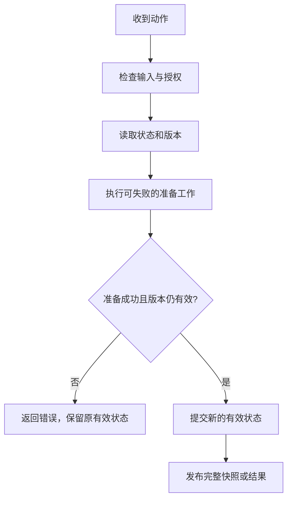

# 工程 API 与状态建模：让接口能被正确使用

[返回总目录](../README.md) · [上一篇](08-toolchain-and-compilation.md) · [下一篇](10-dependencies-and-supply-chain.md)

## 社区约定与项目约定分开

rustfmt 默认风格、snake_case、所有权命名和 trait 互操作是常见生态约定；Rust API Guidelines 是建议，不是所有 crate 必须执行的语言标准。本项目还规定中文解释注释、禁止 unsafe、增量模块和 OpenSpec 行为流程。[Style Guide](https://doc.rust-lang.org/style-guide/)、[API Guidelines](https://rust-lang.github.io/api-guidelines/)、[AGENTS.md](../../../AGENTS.md)。

代码审查首先关注输入、状态、不变量与失败路径，而不是为了“地道”更换所有写法。

## 接口五问

1. 传入值是消费、借用、共享还是复制？名字是否提示成本？
2. 什么输入可以构造这个类型，什么字段允许外部修改？
3. 调用失败时状态是否仍有效，调用者还能重试吗？
4. 输出是否泄漏具体存储、UI、数据库或机密字段？
5. 将来新增状态、参数或实现时，兼容策略是什么？

读取用借用视图，消费转换用 into_*，可能失败用 try_* 等约定提供线索，最终以实际签名为准。[naming](https://rust-lang.github.io/api-guidelines/naming.html)。

## newtype 为领域 ID 建立边界

```rust
#[derive(Debug, PartialEq, Eq, Hash)]
struct SessionId(String);

impl TryFrom<String> for SessionId {
    type Error = &'static str;
    fn try_from(value: String) -> Result<Self, Self::Error> {
        if value.is_empty() || value.len() > 64 {
            return Err("invalid session id length");
        }
        Ok(Self(value))
    }
}

impl SessionId {
    fn as_str(&self) -> &str { &self.0 }
}

fn main() {
    let id = SessionId::try_from("session-1".to_owned()).expect("示例 ID 合法");
    assert_eq!(id.as_str(), "session-1");
    assert!(SessionId::try_from(String::new()).is_err());
}
```

类型别名没有建立新类型，newtype 可以防止把 UserId 当 SessionId 传入。字段私有才有机会维护构造不变量；如果 derive Deserialize 直接写内部值，需再考虑反序列化是否绕过验证。[type safety](https://rust-lang.github.io/api-guidelines/type-safety.html)。

## enum 与 typestate 的选择

enum 适合运行期根据输入和事件变换的状态；typestate 通过不同泛型标记让特定方法只能在合法阶段调用。两者都不自动替代业务授权或外部事务。

```rust
use std::marker::PhantomData;

struct Draft;
struct Ready;
struct Job<State> {
    payload: String,
    state: PhantomData<State>,
}

impl Job<Draft> {
    fn new(payload: String) -> Self {
        Self { payload, state: PhantomData }
    }
    fn validate(self) -> Result<Job<Ready>, &'static str> {
        if self.payload.trim().is_empty() {
            return Err("empty payload");
        }
        Ok(Job { payload: self.payload, state: PhantomData })
    }
}

impl Job<Ready> {
    fn execute(self) -> usize { self.payload.len() }
}

fn main() {
    let ready = Job::new("hello".into()).validate().expect("示例输入合法");
    assert_eq!(ready.execute(), 5);
}
```

Job<Draft> 没有 execute 方法，validate 消费草稿并返回 Ready。这里失败会消费输入，是刻意选择；若调用者需要编辑后重试，错误结果应携带原草稿或验证采用借用方案。typestate 增加类型与转换复杂度，简单 UI 状态先用 enum。[PhantomData](https://doc.rust-lang.org/std/marker/struct.PhantomData.html)。

## Trait 只在真正的边界建立

适合 trait 的地方：可替换的持久化接口、可注入的外部服务、稳定的共用交互契约。不必为仅有一个本地实现的每个 struct 建 trait；本项目 provider/tools/agent/interaction 的依赖方向已经提供边界，见 [架构](../../../docs/design/architecture.md)。

返回错误保持可处理类别，别把所有内部失败都压成 String；适当实现 Debug、Display、Error、转换 trait 和 IntoIterator，让类型与生态组合。[interoperability](https://rust-lang.github.io/api-guidelines/interoperability.html)。

## 泛型进阶该理解到哪里

| 特性 | 解决的问题 | 学习边界 |
| --- | --- | --- |
| 关联类型 | 某个实现对应一种输出/错误 | 如 Iterator::Item |
| const generics | 长度等编译期参数 | 普通数组长度；不泛化为任意常量表达式都稳定 |
| HRTB `for<'a>` | 对任意合适生命周期成立的 bound | 回调接受多次短借用 |
| GAT | 关联类型再依赖生命周期/类型参数 | lending iterator 等借用输出 |
| `?Sized` | 放宽默认 Sized 要求 | 接受 str 或 dyn 后面还要通过指针使用 |
| variance | 生命周期/类型参数替换是否安全 | 借用容器与可变引用尤其要查规则 |

不要为了显示掌握这些能力而给普通 CRUD 加满泛型。它们用于表达已出现的约束。[associated items/GAT](https://doc.rust-lang.org/reference/items/associated-items.html)、[trait bounds/HRTB](https://doc.rust-lang.org/reference/trait-bounds.html)、[variance](https://doc.rust-lang.org/reference/subtyping.html)。

## 公共 API 的未来兼容

公开字段、公开 enum 变体、trait 方法和返回类型都可能形成下游依赖。`#[non_exhaustive]` 可以为外部扩展留空间，但会限制外部匹配/构造；不是所有内部类型都需要它。新增 trait 实现也可能造成下游推断变化。[future proofing](https://rust-lang.github.io/api-guidelines/future-proofing.html)、[Cargo SemVer](https://doc.rust-lang.org/cargo/reference/semver.html)。

文档说明错误、panic、取消、副作用、资源成本和最小使用例子。测试公开行为，compile_fail 示例用于“这项错误用法应该被拒绝”，不要依赖每个版本完全相同的诊断文字。

## 审查一个状态变更



这是适用于会话切换、配置更新等动作的设计模板。项目练习：阅读 SessionManager 切换 workspace，确认项目指令读取失败时是否能保留当前会话；用函数签名和状态赋值位置解释，而不是猜测。
