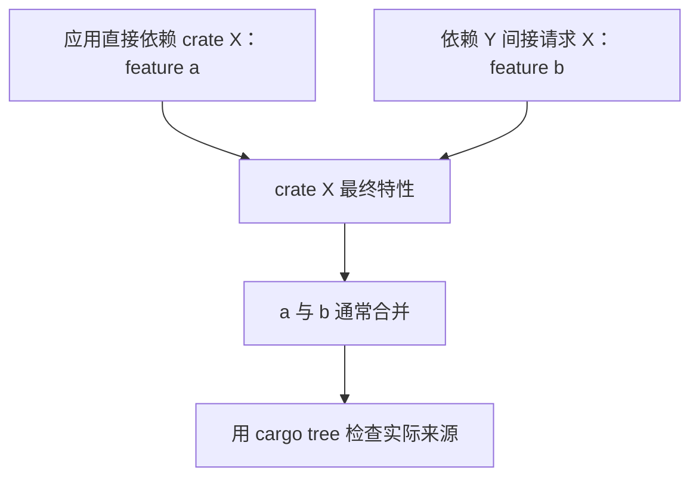

# 依赖治理：版本、Feature、构建期代码与供应链

[返回总目录](../README.md) · [上一篇](09-api-design-and-state.md) · [下一篇](11-production-services.md)

## 新依赖先回答实际问题

选 crate 前写三句话：标准库缺什么、这个依赖解决什么、它引入什么成本。成本包括传递依赖、feature、原生编译、运行环境、许可证、维护和公共 API 耦合。不要因为“框架热门”就把它加入学习项目。

本项目用 Tokio 驱动异步 I/O、Serde 描述协议、SeaORM 做关系库适配、Tauri/Axum 做可选 UI；这些都有实际用途。若只做一个同步文本 CLI，并不自动需要全部依赖。

## 版本要求与锁的关系

| Cargo.toml 写法 | 默认兼容范围概念 |
| --- | --- |
| `"1.2.3"` | `>=1.2.3, <2.0.0` |
| `"0.2.3"` | `>=0.2.3, <0.3.0` |
| `"0.0.3"` | `>=0.0.3, <0.0.4` |
| `"=1.2.3"` | 精确版本要求 |
| `git` + `rev` | 指定来源与提交，仍要管理其依赖 |

Cargo.lock 记录选择结果，而 manifest 表达允许范围；应用提交 lock，有利于固定依赖选择。库发布后的消费者根据自己的图解析，不会因库仓库提交 lock 就被锁到同一套版本。[specifying dependencies](https://doc.rust-lang.org/cargo/reference/specifying-dependencies.html)、[Cargo.toml vs Cargo.lock](https://doc.rust-lang.org/cargo/guide/cargo-toml-vs-cargo-lock.html)。

`--locked` 禁止解析变更需要的 lock 更新；`--offline` 禁止网络且依赖必须已缓存；`--frozen` 结合两者。它们不能单独保证原生工具链、构建脚本、系统库和最终二进制逐字节可复现。[cargo build options](https://doc.rust-lang.org/cargo/commands/cargo-build.html)。

## Feature 默认按并集激活

同一依赖在多条路径上请求 feature 时，通常合并启用；一处 default-features=false 不能阻止另一处启用默认 feature。resolver 2/3 调整了某些跨构建上下文的合并边界，但不是让 feature 自动互斥。[features](https://doc.rust-lang.org/cargo/reference/features.html)、[resolver](https://doc.rust-lang.org/cargo/reference/resolver.html)。



设计公开 features 时优先采用可组合的增量能力。编译期选择数据库或 TLS 的开关也要看具体 crate 的支持组合，不能根据名字假设任意组合都合法。

```bash
cargo tree -e features
cargo tree -d
cargo tree -i tokio
cargo metadata --format-version 1 --no-deps
```

本项目 embed-env 会编入配置文件；all-features 会启用它，可能要求文件存在并将密钥带入产物。学习和质量检查按明确 feature 矩阵，不以 all-features 作为通用快捷方式。

## build.rs、proc-macro 与 native dependency

build.rs 在构建阶段执行，可以读取环境、运行工具和生成文件；proc-macro 在编译过程中执行，用来转换语法。这是选择依赖时必须考虑的执行面，不只看运行时源代码。[build scripts](https://doc.rust-lang.org/cargo/reference/build-scripts.html)、[procedural macros](https://doc.rust-lang.org/reference/procedural-macros.html)。

对 build script 检查 rerun-if-changed/rerun-if-env-changed、host/target 区别、生成产物位置和网络行为。对原生依赖检查编译器、系统库、许可证与跨平台能力。用 Cargo.lock 固定版本不能替代这些检查。

## 维护与安全证据

| 证据 | 能帮助判断什么 | 不能单独证明什么 |
| --- | --- | --- |
| 官方文档、版本日志 | 当前接口与兼容变化 | 全部使用路径都稳定 |
| 发布/仓库活动 | 是否有维护迹象 | 星数或频繁提交等于质量 |
| RustSec advisory | 已公开的已知问题 | 没记录就没有漏洞 |
| 许可证与来源策略 | 是否符合分发要求 | 法律问题已全面解决 |
| unsafe 与 native 边界 | 需要额外审查哪里 | 行数越少就一定越安全 |
| 下游与测试情况 | 实际使用信号 | 完全适合你的应用 |

`cargo-audit` 检查锁中的已知公告，`cargo-deny` 可检查公告、许可证、来源和依赖策略。它们是补充工具，不替代应用的认证、路径、输入和资源验证。[RustSec](https://rustsec.org/)、[cargo-deny](https://embarkstudios.github.io/cargo-deny/)。

## 可执行的升级流程

1. 写明升级原因与预期变化，不批量混入无关重构。
2. 阅读维护方 release notes 与迁移说明。
3. 在明确版本范围内更新，检查 lock 和 feature 变化。
4. 先构建与运行相关受限测试，再执行项目质量门。
5. 检查协议、存储格式、错误与取消语义是否改变。
6. 记录实际工具链、平台、feature、验证范围与恢复方式。

不要为解决一条编译错误直接改 registry 缓存源；用正式版本、path/git 验证或 Cargo patch 并记录来源。[overriding dependencies](https://doc.rust-lang.org/cargo/reference/overriding-dependencies.html)。

## 打包前看真实内容

`cargo package --list` 查看将打入 crate 的文件；应用分发也要查看二进制、资源和默认配置。include_str!、env!、生成文件与前端打包都可能包含编译时信息。不要读取真实 .env 来写教程，也不要把会话数据当公开夹具。[publishing](https://doc.rust-lang.org/cargo/reference/publishing.html)。

验收：选择一个已经使用的 crate，列出直接/传递 feature、native 依赖、版本范围、lock 版本和升级验证方案；解释为什么仍值得保留它。
