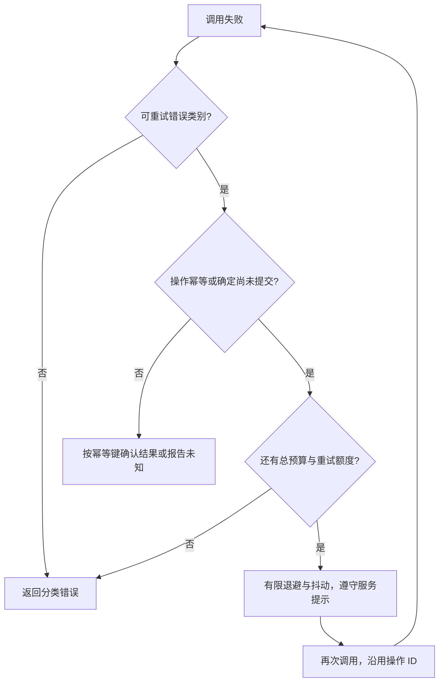

# 服务工程实践：配置、错误、观测、背压与关闭

[返回总目录](../README.md) · [上一篇](10-dependencies-and-supply-chain.md) · [下一篇](12-debugging-and-profiling.md)

这一篇提供独立服务练习的工程要求，不表示 geer-agent 已实现全部生产能力。学习项目保持最小增量；真正改变项目行为时先定义 OpenSpec 验收。

## 分离可验证核心与 I/O 边界

纯解析/验证函数接收参数并返回类型化结果，边界读取 env、文件、网络和时间。配置加载后集中验证，必要项缺失明确失败；运行期动态配置的更新要有原子替换和失败保留策略。

| 边界 | 核心应得到什么 | 错误如何呈现 |
| --- | --- | --- |
| 配置 | 已验证的 Config | 名称、问题与可修复提示，不打印密钥 |
| HTTP/IPC | 类型化输入与调用上下文 | 稳定错误码和用户可读文本 |
| 数据库 | 领域查询/写入结果 | 区分不存在、冲突、连接与协议失败 |
| 文件/子进程 | 已验证目标和资源预算 | 明确是否执行、是否截断、是否超时 |
| UI | 快照与事件 | 操作 ID、过期状态与恢复方式 |

Result 的分支应对应调用者能采取的动作。错误上下文在层间传播，通常在应用边界记录一次；重复日志容易把一次失败误计成多次。[Error](https://doc.rust-lang.org/std/error/index.html)。

## tracing 的 span 与 event

event 描述一次发生的事；span 描述一个执行上下文，事件可以与它关联；subscriber 收集、过滤并输出这些信息。tracing 不会自动创建你需要的服务指标或数据库审计。[tracing](https://docs.rs/tracing/latest/tracing/)。

在独立包使用 tracing 0.1、tracing-subscriber 0.3，可写如下函数片段：

```rust,ignore
#[tracing::instrument(skip(input), fields(input_bytes = input.len()))]
async fn process(input: String) -> Result<usize, &'static str> {
    if input.len() > 4096 {
        tracing::warn!(code = "input_too_large", "request rejected");
        return Err("input too large");
    }
    Ok(input.len())
}
```

不要让宏默认 Debug 记录敏感参数；用 skip 和脱敏字段。异步代码不要把 `span.enter()` 的 guard 跨 await 持有，应用 Instrument 或 instrument 宏关联 Future，避免执行上下文串到其他任务。[Instrument](https://docs.rs/tracing/latest/tracing/trait.Instrument.html)。

本项目的 trace 模块是会话/模型调用记录，和 tracing crate 的结构化日志不同，见 [原日志篇](03-logging-and-tracing.md)。

## 指标从用户体验和资源开始

| 类别 | 例子 | 设计要点 |
| --- | --- | --- |
| 请求 | 次数、错误类别、并发数 | 路由模板作标签，不用完整 URL |
| 延迟 | 排队、连接、首字、全程、数据库 | histogram 分布比单均值更有价值 |
| 队列 | 长度、拒绝、等待时间 | 配合真正容量上限 |
| 资源 | 内存、分配、线程、连接、输出字节 | 关注峰值与长时间趋势 |
| 生命周期 | 取消、关闭耗时、未完成工作 | 将异常退出纳入验收 |

用户 ID、请求 ID、会话 UUID 等高基数值适合日志上下文，通常不宜作为无界指标标签。观测字段需要脱敏、采样、保留期和数量限制，这些是设计，不是自动启用一个 crate 就完成。

## 资源预算是一张表

```text
入口：请求字节、认证、接入速率
队列：最多排队数、每项字节、等待期限
执行：最多在途任务、CPU/阻塞池、总 deadline
外部资源：HTTP 连接、数据库连接、重试次数
输出：单次和累计字节、慢客户端处理
关闭：停止入口、排空策略、最后期限
```

设置 channel(256) 只回答一个维度。超大消息、启动后的独立任务、缓存和日志仍可能突破内存预算。[Tokio mpsc 背压](https://docs.rs/tokio/latest/tokio/sync/mpsc/index.html)。

## 重试的决策流程



重试策略在合适的一层集中管理，避免 SDK、HTTP middleware 和业务层同时重试，放大流量。流式输出已展示部分正文后再次提交同一请求，可能导致重复内容；geer-agent 的 Responses 重试正需要处理这个边界。

## 状态提交与事件发布

先完成可失败的准备，再提交有效状态；发布事件时明确它描述已提交结果还是进行中阶段。跨数据库与消息系统的一致性问题需要幂等、outbox 或其他适合的方案，Rust 类型系统不能自动提供分布式事务。

恢复连接时先发完整快照，再用 revision 接受后续消息。快照注册与事件订阅的原子性、旧请求的处理、慢端断开都是可测试问题。项目 [EventHub](../../../src/ui/app/events.rs) 可以作为单进程案例。

## 故障测试与资源隔离

| 测试层 | 主要问题 | 注入方式 |
| --- | --- | --- |
| 纯单元 | 解析、范围、状态变化 | 值与内存 reader |
| 协议集成 | HTTP/IPC/流解析 | 有限本机端口、短读短写 |
| 生命周期 | 取消、队列关闭、回收 | 明确关闭信号与最终状态 |
| 资源 | 饱和、输出过大、超时 | 有上界的工作和分配 |
| 跨平台 | 路径、进程、窗口和链接 | 真实目标系统手工/自动验收 |

本仓库全部测试使用 make test/frontend-test/check 或 scripts/test-safe.sh，确认实际 cgroup 与 PrivateTmp；入口失败就停止，不绕过。进程/线程数量、输出、时间与临时文件都有上限；测试隔离和业务限额不能互相替代。

## 服务交付的最小说明

记录启动参数、配置来源、日志与指标、数据位置、版本/迁移、停止方式、退出码、资源额度、已验证的平台和回退步骤。健康检查区分“进程还活着”和“当前可以接受工作”，定义是否依赖外部数据库或模型，而不是照搬一个 always 200 路由。

验收：让服务在上游慢、数据库池满、客户端断开和关闭保存失败时给出可解释结果；每个场景都有有限、可复现的验证步骤。
