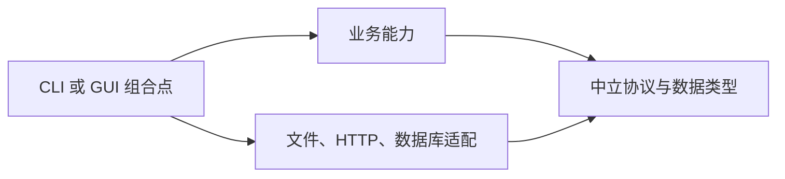

# 工程组织与交付：Workspace、检查矩阵和发布

[返回总目录](../README.md) · [上一篇](12-debugging-and-profiling.md) · [下一篇：验证方法](14-testing-and-contracts.md) · [社区实践](15-community-and-open-source.md)

## 从单 crate 开始，按真正的边界拆分

package 是 Cargo 的包单位，crate 是编译单位，module 是 crate 内组织；一个 package 可以有 lib 和多个 bin。Workspace 让多个 package 共用 lock、输出目录和部分配置，不等于每个 Rust 项目都必须先拆十个 crate。[workspaces](https://doc.rust-lang.org/cargo/reference/workspaces.html)。

适合拆包的理由：可复用库、明确依赖边界、不同分发形态、独立测试或原生平台适配。仅为模仿 Go 的目录层级而拆包，可能增加公共 API、配置和编译成本。本项目仍是单 binary crate，学习增量遵循既有模块。

## 独立多包工程的最小示例

只用于新的练习 workspace，不要复制到 geer-agent 根 manifest：

```toml
[workspace]
members = ["crates/core", "crates/cli"]
resolver = "3"

[workspace.package]
edition = "2024"
version = "0.1.0"

[workspace.dependencies]
serde = { version = "1", features = ["derive"] }
```

成员中通过 edition.workspace/version.workspace 和依赖的 workspace=true 显式继承。virtual workspace 没有 package edition，因此 resolver 显式写明；依赖声明集中不等于成员自动获得全部依赖。

## 依赖方向用编译结构维持



图表示一类工程组织选择，不要求本项目增加新的架构层。当前仓库具体方向：provider 不引用 tools/agent/ui；tools 不引用 provider/agent/ui；interaction 不依赖具体 Agent；ui::run 是组合点。读 [项目架构](../../../docs/design/architecture.md) 比先创造抽象层更有价值。

## 质量检查按风险和矩阵安排

| 检查 | 回答的问题 | 本项目入口 |
| --- | --- | --- |
| 格式 | 是否保持统一可读风格 | make fmt / fmt-check |
| 单元与集成 | 行为与失败路径是否正确 | make test |
| 隔离安全 | 测试资源与临时文件是否被约束 | make test-safety |
| Rust lint | 是否引入可疑写法 | make clippy |
| 前端 | 类型、状态和交互是否一致 | make frontend-check / frontend-test |
| 可选 Web | UI 构建与接口约束是否匹配 | make web-test |
| 文档 | 链接、独立例子、图是否一致 | 文档验证入口 |
| 平台运行 | 目标系统实际能否启动 | 对应目标系统验收 |

收工 make check 顺序执行 fmt → test-safety → test → clippy；Shell/PATH/清理修改按 AGENTS 要求先单项再完整。不要并行叠加多个完整测试额度，也不添加 -D warnings 改变本学习项目门槛。

## Feature 矩阵要是实际支持组合

本项目默认终端，gui 和 web 为可选图形功能，desktop-gui 依赖 gui；embed-env 是会编入配置的特殊构建。用明确组合验证终端、gui,web 和目标平台，不盲目 all-features。

CI 应重复本地入口并验证隔离可用。本仓库当前没有 CI，不能把下面原则描述为已落地：运行器需要 systemd/cgroup 和 PrivateTmp 或严格等效隔离；入口失败不能偷偷降级裸测试；缓存按 OS/工具链/target/lock/feature 区分。

nextest 提供每测试进程模型、过滤和 CI 支持，但其进程隔离不等于系统资源隔离，doctest 也要单独处理。未来采用时仍包在受限入口并配置 worker/线程上限。[nextest](https://nexte.st/)。

## MSRV 和 stable 的验证政策

公共库明确最低支持 Rust 版本，并在该版本实际构建适用 feature；应用可以选择固定交付工具链。rust-version 是声明，解析器的兼容偏好不能代替最低版本测试。nightly 功能单独说明必要性，不为普通业务习惯性加入 nightly。[MSRV](https://doc.rust-lang.org/cargo/reference/rust-version.html)。

## 发布不能只看 cargo build 成功

| 交付项 | 至少检查什么 |
| --- | --- |
| binary | 目标 triple、profile、动态依赖与启动 |
| 静态资源 | 与后端版本匹配，缺文件时明确失败 |
| 配置 | 默认值、必需项、密钥注入、数据位置 |
| 数据 | migration 顺序、兼容范围、恢复方案 |
| GUI | WebView、平台系统库、窗口行为、签名 |
| 记录 | 版本、构建条件、测试证据、已知限制 |

Linux gnu、musl、Windows msvc 和 macOS 的链接/运行条件不同；Rust 编译出目标格式不等于目标主机验证通过。[platform support](https://doc.rust-lang.org/rustc/platform-support.html)。

本项目 Make build/release 准备 GUI/Web 静态资源，Windows 另交付 GUI 专用程序；Tauri bundle 当前关闭。程序构建、安装包与签名各自需要证据，不混称“跨平台发布已完成”。

## 一份可供评审的交付说明

1. 用户触发条件与最终行为，含一个具体前后例子。
2. 为什么选择当前所有权、并发和依赖边界。
3. 数据/协议/平台兼容影响。
4. 实际执行的检查、环境和结果。
5. 未验证范围与恢复步骤。

验收：为毕业项目提供能由另一位工程师复现的构建、测试、启动和停止步骤，并明确公开包是否包含任何本机路径、密钥或真实用户数据。
