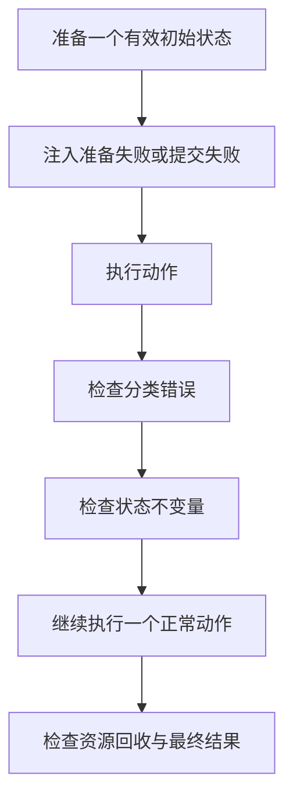

# Rust 验证方法：行为、类型约束、属性与失败路径

[返回总目录](../README.md) · [基础测试](01-tests.md) · [诊断工具](12-debugging-and-profiling.md)

借用检查保证某些程序不能构造出来，测试验证能构造出的程序是否符合业务规则。资深工程师应同时会读类型约束、设计故障用例和解释每项验证的范围。

## 按契约选择验证层次

| 问题 | 首选证据 | 典型例子 |
| --- | --- | --- |
| 状态与算法逻辑 | 模块单元测试或有限函数实验 | 计数、排序、配置验证 |
| 外部公共接口 | integration test / 请求契约测试 | HTTP 错误码、CLI 输出和退出码 |
| 正确用法是否可编译 | doctest | 用户最小调用方法 |
| 错误用法应被拒绝 | compile_fail；必要时 trybuild | 错误 typestate、宏参数 |
| 多种输入都满足规律 | 属性测试 | 编解码往返、排序、状态转换 |
| 意外输入与内存模型 | fuzz / Miri / Loom 的适用子集 | 解析、unsafe 包装、并发交错 |
| 平台与运行条件 | 实际平台验收 | WebView、链接、打包与退出 |

模块内测试可以读私有实现，tests 下的集成测试作为独立 crate 使用外部接口。本项目为 binary crate，不能在集成测试中直接 use main.rs 的私有模块；遵循当前进程测试和公开行为边界，不为测试随意推翻组织。[Book 测试组织](https://doc.rust-lang.org/book/ch11-03-test-organization.html)。

## 属性测试先写规律，再选工具

以“按第一次出现顺序去重”为例，规律是：输出无重复、没有外来值、保留每一种输入值、顺序与第一次出现位置相同。不能只验证长度变小，也不能把输出排序后再比较并声称保留顺序。

下面用标准库穷举长度 0–4、取值 0–2 的 121 份输入，展示测试设计。它不依赖随机抽样，也不声称覆盖全部 u8 长序列。

```rust
use std::collections::HashSet;

fn stable_unique(input: &[u8]) -> Vec<u8> {
    let mut seen = HashSet::new();
    input.iter().copied().filter(|value| seen.insert(*value)).collect()
}

fn check(input: &[u8]) {
    let output = stable_unique(input);
    let distinct: HashSet<u8> = output.iter().copied().collect();
    assert_eq!(distinct.len(), output.len());
    assert!(output.iter().all(|value| input.contains(value)));
    assert!(input.iter().all(|value| output.contains(value)));
    let positions: Vec<usize> = output.iter().map(|value| {
        input.iter().position(|candidate| candidate == value).expect("value comes from input")
    }).collect();
    assert!(positions.windows(2).all(|pair| pair[0] < pair[1]));
}

fn main() {
    let mut checked = 0;
    for length in 0..=4_u32 {
        for mut encoded in 0..3_u32.pow(length) {
            let input: Vec<u8> = (0..length).map(|_| {
                let digit = (encoded % 3) as u8;
                encoded /= 3;
                digit
            }).collect();
            check(&input);
            checked += 1;
        }
    }
    assert_eq!(checked, 121);
}
```

规模更大时使用 proptest：定义有限输入策略、断言属性、在失败后缩减反例并保存回归输入。限制集合长度和 case 数量，避免生成无界资源。生成策略若不断过滤几乎全部输入，会拖慢验证；应直接构造有效输入。[Proptest](https://docs.rs/proptest/latest/proptest/)、[Proptest Book](https://proptest-rs.github.io/proptest/)。

一条好属性应对多种可能实现成立。要检查 dedup 的公开顺序，就从输入中找首次位置；不要把同一个去重算法复制一份当 oracle。

## compile_fail 与 trybuild 分工

compile_fail 适合本课程“这段错误用法应不能编译”的反例；它不能只证明报了任意错误就算意图正确。例如漏写 import 也会导致编译失败，应先确认被拒绝原因确实是想展示的借用或 trait 约束。

对自定义宏/公共 API 的诊断质量，trybuild 比较相邻 stderr 快照，能更细致地钉住输出。编译器更新可能改变诊断，应区分语义回归与表述更新；不要在普通应用中为了所有权入门就搭完整 UI-test 平台。[trybuild](https://docs.rs/trybuild/latest/trybuild/)。

## 异步测试需要控制事件，而不是猜时间

| 容易不稳定的写法 | 更好的证据 |
| --- | --- |
| sleep 100ms 后假设任务已开始 | started oneshot / Barrier 明确同步 |
| 固定端口猜空闲 | 本机地址绑定端口 0，读取实际端口 |
| 断言多个 spawn 的完成顺序 | 注入顺序，或仅断言契约要求的顺序 |
| 等网络偶发超时 | 用 Pending Future / 受控本机服务触发 |
| 异常后只看 Err | 还确认任务、锁、进程和临时文件已回收 |
| 仅客户端限时 | 服务端和客户端均有有限等待与整体上限 |

Tokio test-util 支持暂停/推进测试时间，但不能控制所有系统 I/O、CPU 调度和跨线程竞态。故障要与真实机制匹配；单线程时间模拟不能证明所有并发交错。[Tokio testing](https://tokio.rs/tokio/topics/testing)。

## 状态转换要验收“失败后仍可用”



例如加载工作区失败后，当前会话与已加载指令应仍一致；取消后下一条请求仍能运行；保存失败后 UI 应显示真实未保存状态。单纯 assert Err 看不到这些后续行为。

事务提交、远程副作用或进程杀死等情况下，不能要求一切失败都还原成原状态；测试应验证设计中的“已确认成功/失败/结果未知”及恢复路径。

## 注入外部能力不必都建 trait

时间、随机数、文件读写或上游调用可通过已有接口、参数/闭包、小型 trait 或本机假服务注入。选择最小的真实替换边界；别为了测试把每个结构体都拆成实现与 trait。

Mock 应模拟关键失败、顺序和副作用边界，但不替代真实数据库/HTTP 库的契约。自制 mock 永远立即成功时，无法暴露背压、超时和取消问题。

## 本仓库的执行纪律

```bash
make test-safety
make test
make clippy
scripts/test-safe.sh python3 doc/learn-rust/verify.py --examples
```

按当前修改风险选择入口，不是每次笔记修改都运行完整业务测试。涉及 Shell/PATH/清理时必须按 [AGENTS.md](../../../AGENTS.md) 的单项到完整顺序；所有测试和练习执行都必须有实际有效的资源限制和私有临时目录。

多测试进程、随机 case、线程数、编译并行和临时文件共同消耗预算。nextest 的每测试进程模型不替代 cgroup，Miri/Loom/fuzz 也不豁免资源和执行期限。[nextest](https://nexte.st/)、[Miri](https://github.com/rust-lang/miri)、[Loom](https://docs.rs/loom/latest/loom/)。

验收：为毕业任务各选一个行为用例、编译失败约束、属性和故障后的继续使用用例；解释哪项业务风险尚未被这些证据覆盖。
