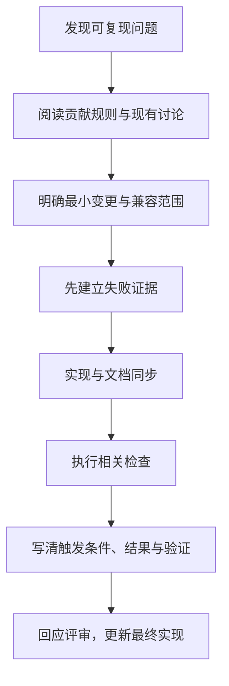

# Rust 社区实践：读 crate、提问题与完成可审查贡献

[返回总目录](../README.md) · [API 规范](09-api-design-and-state.md) · [依赖治理](10-dependencies-and-supply-chain.md)

合格开发者还需要能读别人的 crate、核对版本规则、提出可复现问题，并让自己的修改易于审查。下面是本教程建议的学习流程；上游仓库的 CONTRIBUTING、测试矩阵和讨论习惯优先。

## 先区分四种“规范”

| 来源 | 约束对象 | 如何使用 |
| --- | --- | --- |
| Rust 语言规则与稳定 API 契约 | 程序和实现 | 用 Reference/std/编译器核对 |
| rustfmt 与 Clippy | 格式和静态建议 | 保持一致，并检查建议是否适合语义 |
| Rust API Guidelines | 公共库接口设计 | 按命名、互操作、文档、兼容性做审查 |
| 具体仓库政策 | 贡献工作流与质量门 | 阅读 CONTRIBUTING、AGENTS、CI 和模板 |

禁止 unsafe、中文注释和 OpenSpec 是 geer-agent 的项目要求，不能当成整个 Rust 社区的统一规定。Clippy 有不同 lint 分组，restriction/pedantic 的每项也不是对所有代码自动适用的语言规则。[Style Guide](https://doc.rust-lang.org/style-guide/)、[Clippy lint 列表](https://rust-lang.github.io/rust-clippy/master/index.html)。

## 按这个顺序读一个新 crate

1. 在与 lock 对应的文档中看 crate-level 概述、feature 与最小例子。
2. 顺着实际要用的方法阅读签名：拥有/借用、错误、Send/Sync、取消、panic 与资源成本。
3. 看维护方 examples 与行为测试，确认例子使用的是哪个版本。
4. 从一个公开 API 找实现和核心数据结构，不从整个仓库第一行通读。
5. 核对 README 的维护说明、release notes、已知限制和项目实际平台。
6. 在独立有限练习中复现一个正常和一个失败场景，再决定是否引入。

docs.rs 默认 latest 可能与项目不同，trait 的 auto traits 也要结合泛型参数看。不能看到 Arc 类型名字就假设所有组合都 Send/Sync，不能看到 async 就忽略同步阻塞路径。

## 写出别人能够复现的问题

```text
问题：实际发生什么，对应哪个公开 API
预期：来自哪项文档/协议，而不只是个人猜测
环境：rustc、edition、crate 版本、features、OS/target
最小输入：公开且有限，不含密钥或真实会话
最小代码：一项可运行能力，说明启动和停止
证据：准确错误、trace、资源与失败后的状态
已核对：相同版本文档、已有 issue、明确排除的条件
```

最小复现保留触发原因，删除与问题无关的 UI、数据库与网络依赖。对于任务取消，必须保留拥有关系和 await 位置；错误地缩短到没有暂停点会把原因删掉。引用编译诊断时保留错误编号和相关签名，避免贴几千行未整理日志。

## 社区入口与讨论范围

Rust Users Forum 面向使用与学习问题；Internals 面向语言、标准库与编译器本身的发展；Zulip 等入口按官方社区页定位。发布与周报用于发现变化，最终技术规则仍核对官方版本文档。[社区入口](https://rust-lang.org/community/)。

讨论以事实、复现和具体约束为中心；遵守对应社区行为准则。提出“为什么不能支持这个语法”前，先理解现有不变量和已有讨论，避免将语言设计问题误报为普通 crate bug。

## 一次小贡献的完整闭环



练习可以只在自己的副本中完成，不要求实际向任何社区发布。选择文档错误、边界修复或小型性能证据比先建立新框架更适合开始；性能修改还应提供基线与相同条件的测量。

不要为了“更地道”捎带无关改名、目录重排和抽象替换。公共 API 变化要明确 SemVer/feature/MSRV 影响；兼容性与“代码能编译”是不同问题。[Cargo SemVer](https://doc.rust-lang.org/cargo/reference/semver.html)。

## Rust RFC 和应用设计记录不同

Rust RFC 为重要的语言、工具或标准库变更提供设计讨论路径；普通修复和文档改进通常走正常贡献流程。RFC 被接受不等于功能已经实现或稳定；应用选型仍以实际稳定版本与 feature gate 为准。[RFC Book](https://rust-lang.github.io/rfcs/introduction.html)。

geer-agent 的 OpenSpec 管理本仓库行为增量，两者不是同一套流程。学习 Rust RFC 可以理解技术取舍，不要求给每个业务 struct 写一份 RFC。

## 若将来发布公共 crate

| 交付信息 | 给下游什么帮助 |
| --- | --- |
| crate-level 文档与完整例子 | 判断用途与第一步怎么开始 |
| 错误、panic、取消、副作用说明 | 正确处理失败与状态 |
| feature 和平台说明 | 避免编译/运行条件误判 |
| MSRV、版本策略和变更说明 | 规划升级和兼容验证 |
| package 内容与许可证元数据 | 了解实际发布文件和使用条件 |
| 行为测试与复现指引 | 审查并反馈问题 |

先检查 `cargo package --list` 和打包内容，再在有限隔离里做实际 package 验证；本次文档工作不执行任何发布。公共文档示例最好可以自动编译，ignore 的上下文与验证范围必须说清。[Cargo publishing](https://doc.rust-lang.org/cargo/reference/publishing.html)、[API documentation](https://rust-lang.github.io/api-guidelines/documentation.html)。

验收：选一个当前项目使用的 crate，写一页 API 阅读记录；完成一个有限复现和一份可供他人评审的修复说明。即使没有提交到上游，这份证据也能检验独立阅读与协作能力。
