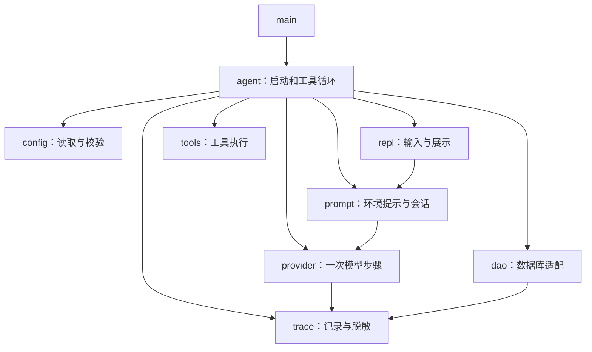

# 32 geer-agent 源码地图与阅读顺序

[返回总目录](../README.md) · [下一篇](02-reading-a-request.md)

以下依据 2026-09-26 检查的提交 `4f6a0a2`。这是当前代码导读；模块注释或治理文件里的早期项目状态不一定同步更新。

## 从最短文件开始，不要先陷进 SDK 类型

| 顺序 | 文件 | 先找哪个入口 | 能学到的 Rust |
| --- | --- | --- | --- |
| 1 | [main.rs](/home/lihongyu/projects/geer-agent/src/main.rs) | `main` | mod、async 入口、Result |
| 2 | [config/mod.rs](/home/lihongyu/projects/geer-agent/src/config/mod.rs) | `Config::load` / `from_values` | Option、枚举、组合器、校验 |
| 3 | [repl/index.rs](/home/lihongyu/projects/geer-agent/src/repl/index.rs) | `parse_input` / `run` | match、BufRead、闭包、trait |
| 4 | [provider/mod.rs](/home/lihongyu/projects/geer-agent/src/provider/mod.rs) | `ChatProvider` / `ModelStep` | 泛型、数据契约、异步方法 |
| 5 | [prompt/conversation.rs](/home/lihongyu/projects/geer-agent/src/prompt/conversation.rs) | `Prompt` 的一组方法 | 状态枚举、移动、mem::take |
| 6 | [agent/mod.rs](/home/lihongyu/projects/geer-agent/src/agent/mod.rs) | `run_tool_loop_with_budget` | 编排、控制流、预算、生命周期 |
| 7 | [tools/mod.rs](/home/lihongyu/projects/geer-agent/src/tools/mod.rs) | `execute_batch` | Box 闭包、并发分组、所有权转交 |
| 8 | [provider/openai/responses.rs](/home/lihongyu/projects/geer-agent/src/provider/openai/responses.rs) | `collect_reply` | Stream、timeout、多层错误 |
| 9 | [trace/mod.rs](/home/lihongyu/projects/geer-agent/src/trace/mod.rs) | `TraceCapture` / `TraceRecord` | Serde、BTreeMap、Arc 原子计数 |
| 10 | [dao/mod.rs](/home/lihongyu/projects/geer-agent/src/dao/mod.rs) | `TraceStore` 的 trait 实现 | 枚举分派、批量结果、幂等 |

每看一个函数先写四句话：接收什么、拥有还是借用、修改什么、失败怎么返回。暂时不懂的外部类型先按角色标注，如“SDK 消息类型”，不必立刻展开所有字段。

## 当前模块的主要连接



这是主要依赖/调用关系的简图。`agent` 把工具说明转换成 `ToolSpec`，因此 provider 不引用工具执行模块，tools 也不引用模型协议模块。

## 三组容易混淆的类型

`tools::Spec` 是工具自己的说明，`provider::ToolSpec` 是供模型步骤使用的描述，SDK 又有各协议的请求类型。转换层让工具不用认识所有 SDK 协议。

`ToolCall` 是模型请求“想调用哪个工具”，`ToolOutput` 是工具执行后的状态与文本，`ModelStep` 是一次模型步骤的综合结果。Rust 的不同结构体使这些职责不容易混在一起。

`Prompt` 管会话内容，`TraceRecord` 管调用记录，`AgentMetrics` 管一次 run 的指标。清空对话、删除数据库记录、重置运行指标是不同操作；当前 `/reset` 不是清空数据库命令。

## 从函数签名练习阅读

项目摘录，需结合原文件中的类型和 trait；不是独立程序：

```rust,ignore
async fn run_tool_loop_with_budget<P, F>(
    chat: &mut P,
    tools: &mut Tools,
    prompt: &mut Prompt,
    on_delta: &mut F,
    budget: AgentBudget,
    model: &str,
    trace: Option<&TraceContext<'_>>,
) -> Result<AgentMetrics, Box<dyn Error>>
where
    P: ChatProvider,
    F: FnMut(&str) -> io::Result<()>,
```

P 是具体 Provider 类型；四个 `&mut` 表示函数要独占访问这些可变组件。budget 按值传入，其类型实现 Copy；model 只借用。trace 可有可无，且仅借用短期上下文。成功产生指标，失败统一交给上层错误处理。

## 看代码时保留现状的边界

本项目是学习型应用。终端输入有同步部分，工具权限有自己的实现范围，Trace 不是完整分布式追踪，数据库测试也分本地与外部后端。能跑通一个场景不代表所有生产约束都已实现；这些界限能帮助理解为什么当前结构保持简洁。

下一步按 [一次请求流程](02-reading-a-request.md) 跟踪值的流向，再做 [分阶段练习](03-exercises.md)。
