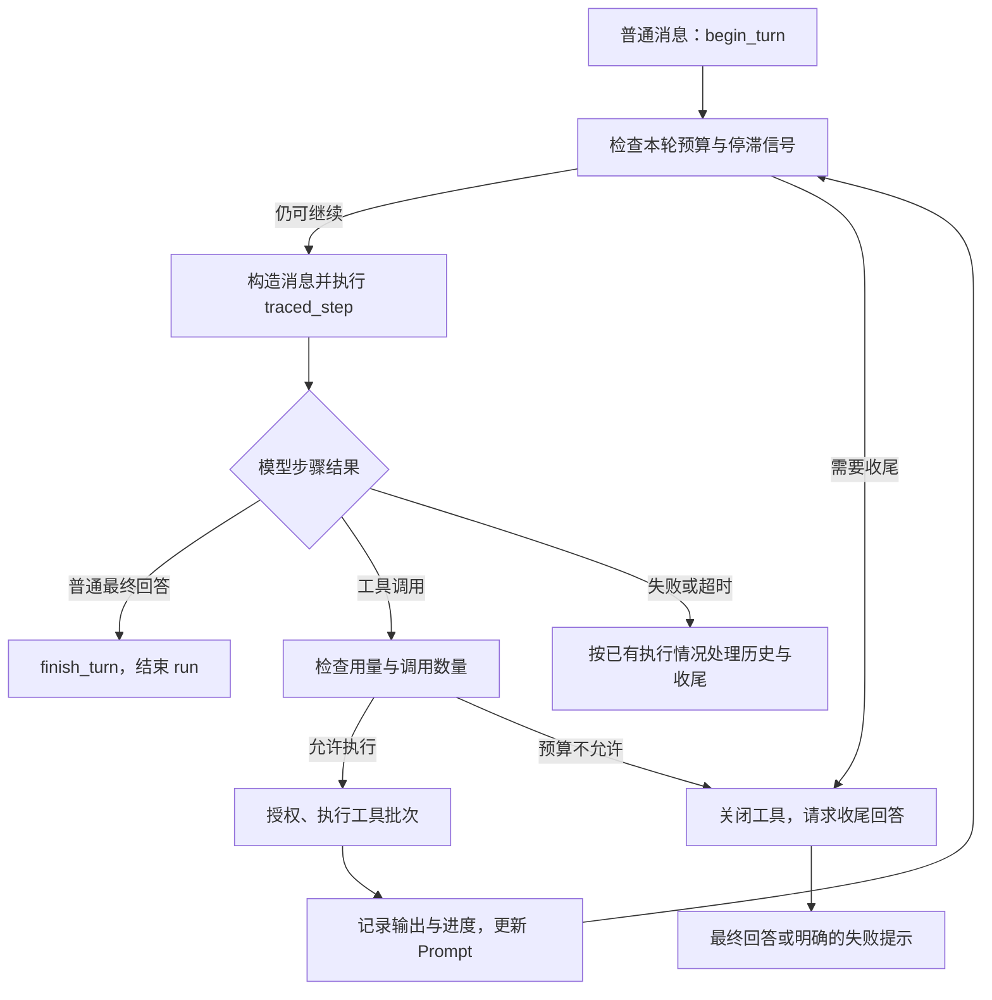
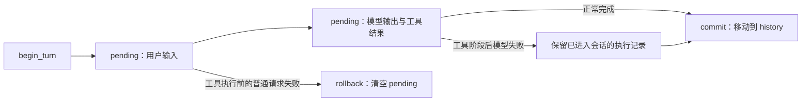

# 33 从一行输入追踪到最终回答

[返回总目录](../README.md) · [上一篇](01-code-map.md) · [下一篇](03-exercises.md)

本篇按当前实现串起前面的概念，例子是用户输入“读取 Cargo.toml，告诉我依赖有哪些”。是否真的调用工具由模型响应决定；流程图不保证每轮一定使用工具。

## 启动：配置与资源建立

[agent::run](/home/lihongyu/projects/geer-agent/src/agent/mod.rs:325) 调 `Config::load()`。缺少必要配置会返回错误；可选 Trace 数据库连接失败则提示并关闭本次持久化。随后探测 Bash/系统/当前目录，组成系统提示，建立 Prompt、Provider、Tools 和会话 ID。

这里能同时看到四种 Rust 选择：`?` 传播必须成功的初始化；`if let Some` 处理可选配置；`match` 表达允许降级的错误；`clone` 让独立组件拥有各自需要的配置数据。

## 输入：字节、文本、命令、消息

[repl::run](/home/lihongyu/projects/geer-agent/src/repl/index.rs) 刷新提示符，再读取一行字节。EOF 退出，非法 UTF-8 提示重输；合法字符串进入 `parse_input`。命令在本地处理，普通消息才调用 `prompt.begin_turn` 并进入 Session。

`flush()` 很重要：没有换行的提示符或分段输出，可能仍停留在缓冲区。写输出使用 Result，终端写失败并非不可能事件。

## 模型和工具之间形成循环

图突出主要业务路径，具体错误出口以源码为准。

### 一次模型步骤

`Prompt::messages_with_runtime_instruction` 构造当前请求的拥有型消息，临时预算提示不直接污染长期历史。Provider 内部选择 Chat Completions 或 Responses，将通用工具描述映射到对应协议。

Responses 逐条接收流事件，文本 delta 通过 `FnMut` 回调交给终端，同时采集 Trace；完整完成事件中的输出交给上层。只收到部分文本再断开，不能当成完整成功。

### 一次工具批次

Agent 从 `ToolCall` 借出名称和 JSON 参数，交给 `Tools::execute_batch`。执行侧完成校验、权限与实际读写。连续 read 可并发，写或 Bash 操作形成顺序边界；失败也以工具结果文本和状态返回，供模型后续理解。

Agent 记录工具指标，将调用与输出配对，再 `apply_tool_results` 放回对话。函数按值接收 ModelStep，因为需要把里面的协议输出转入会话。

## Responses 的 pending 与 history

这个图专门说明 Responses 路径。Chat 路径直接维护它自己的 history，具体回退实现不同，不能假定两种协议都复制一套 pending 结构。

最关键的边界：**会话回退不等于撤销工具副作用**。若已经执行写文件，再因为下一次模型请求失败把工具历史全丢掉，模型会失去实际发生过什么的记录。当前循环用 `used_tools` 区分这些情况；收尾失败时也有保留 pending 的路径。

## 预算、重试和 Trace 的作用范围

模型请求重试属于某次步骤内部；Agent turn 是一次模型步骤；tool call 是步骤要求的具体工具调用。不要拿同一个“次数”概念解释三个指标。

普通步骤的外层 deadline 由 Agent 预算提供；无工具收尾调用使用独立的收尾路径，不沿用同一外层 deadline，内部仍有 Provider 的超时逻辑。因此不能把配置秒数宣传为“整个进程绝不超过的硬实时上限”。

[traced_step](/home/lihongyu/projects/geer-agent/src/agent/mod.rs:640) 将成功、失败、超时和采集的片段整理成记录，再交给可选存储。记录成功不等于业务成功；记录失败也有独立降级处理。

## 用一张表复习 Rust 知识

| 代码动作 | Rust 概念 |
| --- | --- |
| `Config::load()?` | Result 与传播 |
| `match parse_input(...)` | 枚举与穷尽匹配 |
| `&mut self`、`&mut Prompt` | 独占借用 |
| `P: ChatProvider` | 泛型约束与静态分派 |
| `on_delta` | 捕获环境的 FnMut 回调 |
| `stream.next().await` | 异步多值流 |
| `join_all(pending).await` | 并发推进与顺序收集 |
| `mem::take(pending)` | 从借用的字段安全转移拥有值 |
| `Option<&TraceContext<'_>>` | 可选的借用上下文 |

读完后尝试不看图，口述一次“工具读取成功，但下一次模型请求失败”的数据流。能解释历史、文件状态和错误输出分别发生什么，就不只是认得语法了。
