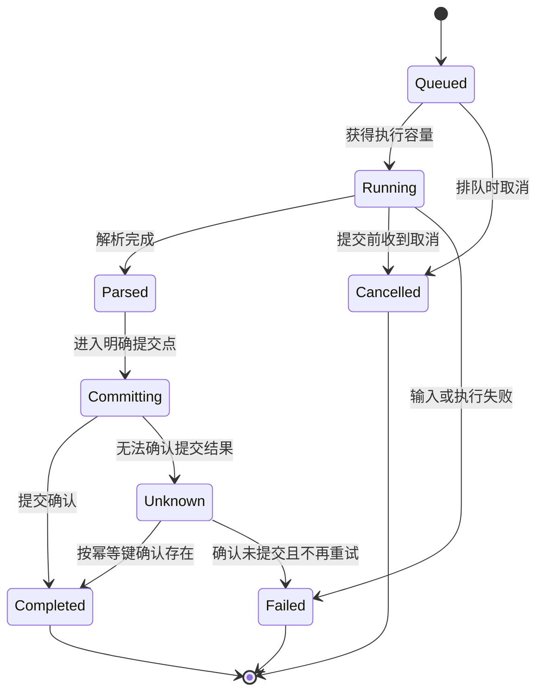

# 毕业项目：以完整交付检验 Rust 能力

[返回总目录](../README.md) · [基础练习](03-exercises.md) · [下一篇：审查训练](05-review-workshop.md)

课程完成的证据应是一项能独立实现、测试、解释和交付的能力。本篇给出独立练习与 geer-agent 增量两条路线，不要求为了学习把全部框架装进主项目。

## 路线 A：本机日志任务工具

实现读取本机文本、按字段聚合并保存摘要的小应用。保留一个共用业务核心，先 CLI，再添加 Web 或 Tauri 宿主；另一个宿主可做扩展练习。

| 能力切片 | 最小可运行交付 | 必须说明的约束 |
| --- | --- | --- |
| 1：纯核心 | 解析行、聚合和排序 | 输入格式、错误位置、溢出、Unicode |
| 2：CLI | 文件输入与有限输出 | Path、EOF、stdout/stderr、退出码 |
| 3：任务 | 有界处理、进度与取消 | 队列、在途任务、状态、提交点 |
| 4：持久化 | SQLite 摘要与查询 | migration、事务、幂等键与未找到 |
| 5：图形宿主 | HTTP API 或 Tauri command | DTO、错误、权限、revision、关闭 |
| 6：交付 | 构建、测试、运行、停止说明 | 平台、配置、资源、故障与恢复 |

每个切片当天可运行。以最小输入验证后再增加复杂度，不提前建设插件平台、账户或多租户。

## 输入与资源契约

建议有限起点：单文件 2 MiB、单行 8 KiB、最多 16 个等待任务、4 个在途任务、单结果 64 KiB、总任务期限 10 秒、关闭宽限期 3 秒。可以调整并记录原因。

这些不是系统测试隔离额度；外层仍经 scripts/test-safe.sh 运行。达到上限应返回明确结果，不默默截断业务数据，也不靠无限内存堆积避免拒绝。

图是本练习的契约选择。提交与取消到达的竞态用明确顺序和结果表示处理；不能把 Unknown 强行标成 Cancelled，让用户误以为没有写入。

## 必须覆盖的失败路径

| 场景 | 验收结果 |
| --- | --- |
| 配置缺失、空值、非法值 | 精确区分，必要项缺失非零退出 |
| 文件不存在、不可读、非法 UTF-8 | 分类错误，原有结果不被错误覆盖 |
| 超大行/文件/输出 | 有限资源，明确拒绝或已定义截断 |
| 重复幂等键 | 不重复产生同一业务结果 |
| 消费者变慢 | 背压或有限拒绝，不无界积压 |
| 客户端断开 | 定义继续、取消或查询最终结果的行为 |
| 提交前/中途取消 | 状态和副作用与契约一致 |
| 关闭时仍有任务 | 停入口，有限等待，回收并准确报告 |
| 数据库故障 | 不把持久化失败标为成功 |
| 旧 revision 到达 | 拒绝或按约定处理过期动作 |

网络仅使用本机临时端口，连接与读写有期限；进程测试使用 tests/support 或等效的受限组清理。异常先停止本轮服务，不用全局 kill 清理。

## 路线 B：geer-agent 一个增量能力

选择与现有行为相关的窄切片，例如更清楚地展示已存在错误，或处理一个确定输入边界。真正改变行为前依 AGENTS 建 OpenSpec，先核对已有能力和进行中 change。

交付顺序：读 spec 与源码 → 定义触发、结果和边界 → 最小实现 → 相关受限验证 → 项目质量门 → 学习记录。不要借练习重写 Agent、拆整个 workspace 或更换全部框架。

## 评分标准：总分 100

| 项 | 分值 | 满分证据 |
| --- | --- | --- |
| 所有权与 API | 15 | 拥有者清楚、借用合理、clone 有解释 |
| 类型与错误 | 15 | 状态合法、输入可失败、类别可处理 |
| 标准库与边界 | 15 | 文本、路径、I/O、溢出和上限正确 |
| 并发生命周期 | 20 | 背压、取消、任务回收与关闭完整 |
| 框架与数据 | 10 | 可画执行链，池/事务/IPC 保证明确 |
| 验证 | 10 | 有限可重复测试，关键失败路径覆盖 |
| 诊断与交付 | 10 | 能复现构建、运行、测量与恢复 |
| 协作说明 | 5 | 他人能理解取舍并完成审查 |

自评合格条件：至少 80 分；所有权/类型/标准库/并发四项各至少一半；没有密钥泄漏、绕过测试隔离、无界工作或正常用户输入触发的无理由 panic。这是训练标准，不是岗位认证。

## 评审追问

1. 为什么参数是 String、&str 或 Arc？
2. 什么状态可构造，什么状态被类型排除了？
3. await 暂停时还保存哪些值和资源？
4. 最多创建多少任务、分配多少输入/输出？
5. timeout 后工作停止了，还是结果未知？
6. 依赖升级影响哪些协议、schema 和平台？
7. 性能瓶颈的基线与证据在哪里？
8. 另一位工程师如何复现构建、测试、启动与停止？

允许回答“不保证”，但必须解释原因和验证范围。用类型证明约束、测量解释成本、文档表达取舍。

## 毕业材料

交付源码、运行说明、版本记录、状态/执行图、验证结果和简短审查记录。保留一个失败设计及修正理由，例如共享锁改为单拥有者，或全量读取改为有限流处理。

随后完成三次真实小任务：一次功能、一次故障修复、一次性能或交付改进。持续处理边界问题，才能把知识变成稳定工程能力。
