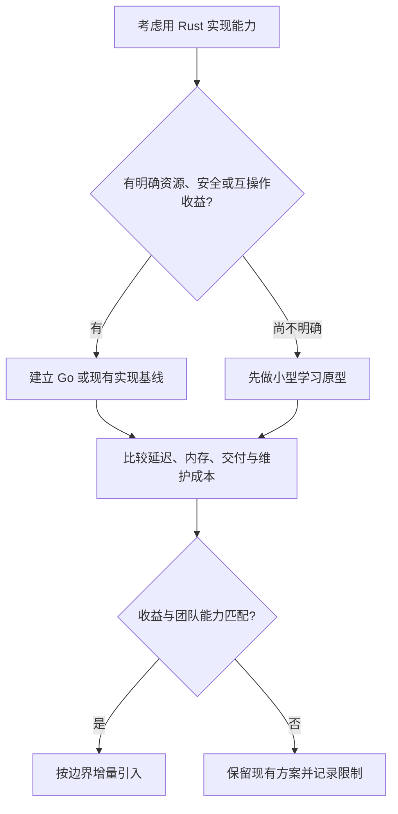

# G1 从 Go 到 Rust：重新理解值、资源和执行

[返回总目录](../README.md) · [下一篇：所有权 API](02-ownership-and-api.md)

Go 的工程经验很有价值：小接口、组合、显式错误、网络编程和部署工具都能复用。Rust 学习最难的部分通常是资源和别名约束进入函数签名后，设计需要比写实现更早确定。

## 先比较解决问题的方式

| 工程问题 | Go 的常见方式 | Rust 的常见方式 | 对设计的影响 |
| --- | --- | --- | --- |
| 内存回收 | GC 管理可达对象；分配位置由编译器等决定 | 所有权与 Drop；也可用引用计数共享 | 签名要说明消费、借用或共享 |
| 资源释放 | 显式 Close，常用 defer 安排 | RAII；可能失败的 flush/close/commit 仍显式调用 | 析构不能替代失败处理 |
| 可选值 | 指针、零值、额外 bool 等 | Option<T> | 使用前必须区分 Some/None |
| 可失败调用 | 多返回值和 error | Result<T, E> 与 ? | 错误传播具有类型约束 |
| 状态建模 | struct、常量、接口及检查 | 带数据 enum 与 match | 非法组合可在表示层减少 |
| 多态 | 隐式实现 interface | 显式 impl Trait；泛型或 dyn | 主动选择静态与动态分派 |
| 线程安全共享 | Mutex、channel、约定和 race detector | 以上手段加 Send/Sync 与借用检查 | 编译器能拒绝部分数据竞争 |
| 大量 I/O 并发 | goroutine 由 Go runtime 调度 | Future 由选定 executor 调度 | await、spawn 和任务所有权需区分 |
| 基础生态 | 标准库覆盖较广 | 标准库提供核心能力，HTTP/JSON/async 常用 crate | 依赖选择属于工程工作 |

表格是工程视角的概括。Go 的语言与内存模型见 [Go 规范](https://go.dev/ref/spec)、[Go 内存模型](https://go.dev/ref/mem)；Rust 的核心规则见 [所有权](https://doc.rust-lang.org/book/ch04-01-what-is-ownership.html)、[Send](https://doc.rust-lang.org/std/marker/trait.Send.html) 和 [Sync](https://doc.rust-lang.org/std/marker/trait.Sync.html)。

## 赋值之后，另一个名字意味着什么

Go 中复制 slice 会复制描述信息，它们可指向相同底层数组；append 是否重新分配影响后续共享关系。Rust 的 `Vec<T>` 赋值通常转移所有权，`&[T]` 则表达借用。[Go slice 说明](https://go.dev/blog/slices-intro)、[Vec 保证](https://doc.rust-lang.org/std/vec/struct.Vec.html#guarantees)。

```go
items := []int{1, 2, 3}
view := items
view[0] = 9 // items 也能观察到同一底层元素的变化
```

```rust
fn main() {
    let items = vec![1, 2, 3];
    let owned = items;
    let view = &owned[..];
    assert_eq!(view, &[1, 2, 3]);
}
```

Rust 不要求变量永远放在栈上，Go 也不要求全部对象都放在堆上。存储位置、值的所有权和是否借用是不同问题。`String` 的局部值通常管理另一块文本缓冲区；移动这个值不等于逐字复制文本，也不保证机器代码完全没有复制操作。

## RAII 和 defer 的思维差异

Go 的 defer 附着于函数执行；Rust 的资源持有者通常在离开对应作用域时 Drop。让资源持有者进入更短的块，可以直接表达更短的资源占用时间。

```rust
use std::sync::Mutex;

fn main() {
    let counter = Mutex::new(0);
    {
        let mut guard = counter.lock().expect("示例中锁未被污染");
        *guard += 1;
    }
    assert_eq!(*counter.lock().expect("示例中锁未被污染"), 1);
}
```

RAII 对正常退出和采用展开的 panic 路径很有用，但 abort、进程强制终止或显式泄漏不能保证析构完成。Drop 也没有返回 `Result` 的接口，所以落盘、提交事务或必须确认的关闭要安排可报告失败的调用。[Go defer](https://go.dev/blog/defer-panic-and-recover)、[Rust Drop](https://doc.rust-lang.org/std/ops/trait.Drop.html)。

## Rust 的技术优势落在哪些具体地方

| 优势 | 适用问题 | 仍然需要考虑的成本 |
| --- | --- | --- |
| 编译期所有权与借用约束 | 资源边界复杂、内存安全要求高 | API 设计与学习投入 |
| 没有强制全局 GC | 关注尾延迟、嵌入式或资源控制 | 分配、引用计数与 Drop 本身仍有成本 |
| 类型携带状态和约束 | 协议、状态机、领域 ID | 泛型复杂度和公共 API 兼容 |
| 静态分派与内联机会 | 数据处理和热点函数 | 单态化会影响编译时间和体积 |
| 原生代码与低层互操作 | 既有 C 接口、系统工具、Wasm | ABI、目标平台和 FFI 安全边界 |

这些是能力和选择理由，不能推出“Rust 总比 Go 快”。Go GC 的开销与延迟需要结合存活数据、分配速率和配置分析；Rust 同样可能因算法、分配和锁而很慢。[Go GC 指南](https://go.dev/doc/gc-guide)、[Rust 编译单态化](https://rustc-dev-guide.rust-lang.org/backend/monomorph.html)。



## 本项目练习

读 [Tools::execute_batch_in](../../../src/tools/mod.rs) 与 [图形工作线程](../../../src/ui/app/runtime.rs)。分别回答：输入是否借用、结果由谁拥有、跨线程传输什么、哪些业务值留在单线程。不要看到 `Arc` 就推断里面任意类型都能跨线程。

学完验收：用自己的话解释“Go 的共享约定”如何变成“Rust 的类型与生命周期约束”，并指出一种 Rust 编译器无法帮你证明的业务问题，例如重复扣费、死锁或跨系统事务。
