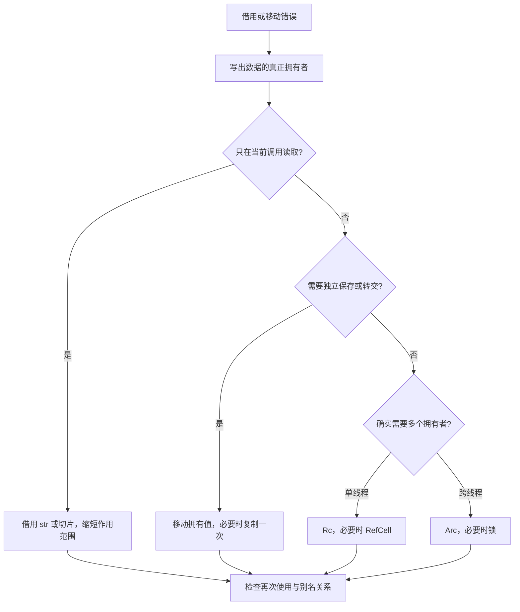

# G2 用所有权设计 API：拥有、借用、转交与共享

[返回总目录](../README.md) · [上一篇](01-mental-model.md) · [下一篇](03-types-traits-and-errors.md)

前置：[所有权基础](../01-basics/03-ownership.md)、[生命周期](../01-basics/08-lifetimes.md)。本篇训练的是接口选择，而不仅是消除编译错误。

## 签名本身就是资源协议

| 参数 | 调用后调用者还能做什么 | 适用意图 |
| --- | --- | --- |
| `value: String` | 原绑定通常不能再用 | 保存、转交、消费拥有的数据 |
| `value: &str` | 继续拥有原数据 | 在调用范围内读取文本 |
| `value: &mut String` | 独占借用结束后可继续使用 | 修改调用者持有的文本 |
| `items: &[T]` | 继续拥有容器 | 读取任意连续序列 |
| `items: &mut [T]` | 借用期间不得冲突访问 | 修改元素，不改变序列长度 |
| `value: Arc<T>` | 可另持 Arc，但需要显式 clone | 跨线程共享所有权 |
| `value: Cow<'a, str>` | 取决于 Borrowed 或 Owned 变体 | 常读、偶尔需要分配的新文本 |

`&mut T` 强调独占访问；它不是“普通指针加一个可写标志”。共享引用也不是保证整个对象没有任何内部变化，`Cell`、锁等内部可变性类型有自己的规则。[借用规则](https://doc.rust-lang.org/book/ch04-02-references-and-borrowing.html)、[UnsafeCell](https://doc.rust-lang.org/std/cell/struct.UnsafeCell.html)。

## 优先为读取接受视图

```rust
fn has_keyword(text: &str, keyword: &str) -> bool {
    text.lines().any(|line| line.contains(keyword))
}

fn main() {
    let text = String::from("Go\nRust\n");
    assert!(has_keyword(&text, "Rust"));
    assert!(has_keyword("Rust", "ust"));
    assert_eq!(text.len(), 8);
}
```

`&String` 把接口绑到特定拥有类型，而 `&str` 可接受 `String` 的视图和字面量。返回一个 `&str` 则要保证它来自仍然有效的数据；如果需要返回新生成的文本，通常返回 `String`。

## 短期解析可以借用，长期保存通常拥有

```rust
struct CommandView<'a> {
    name: &'a str,
    args: &'a str,
}

struct StoredCommand {
    name: String,
    args: String,
}

fn parse(line: &str) -> CommandView<'_> {
    let (name, args) = line.split_once(' ').unwrap_or((line, ""));
    CommandView { name, args }
}

fn persist(view: CommandView<'_>) -> StoredCommand {
    StoredCommand { name: view.name.to_owned(), args: view.args.to_owned() }
}

fn main() {
    let line = String::from("read Cargo.toml");
    let saved = persist(parse(&line));
    drop(line);
    assert_eq!(saved.name, "read");
    assert_eq!(saved.args, "Cargo.toml");
}
```

解析阶段省去复制，进入队列或持久化边界时才建立独立所有权。把生命周期参数一路传播到应用状态，往往意味着你试图让长期结构借用短期输入。应先问是否真的需要借用，而不是先写更多 `'a`。[生命周期关系](https://doc.rust-lang.org/book/ch10-03-lifetime-syntax.html)。

## 对字段转交，用 take 保留有效结构

```rust
#[derive(Default)]
struct Buffer {
    pending: Vec<String>,
}

impl Buffer {
    fn drain_pending(&mut self) -> Vec<String> {
        std::mem::take(&mut self.pending)
    }
}

fn main() {
    let mut buffer = Buffer { pending: vec!["one".into(), "two".into()] };
    let batch = buffer.drain_pending();
    assert!(buffer.pending.is_empty());
    assert_eq!(batch.len(), 2);
}
```

`mem::take` 用默认值替换旧值，返回旧值；`Option::take` 留下 `None`；没有合理默认值时使用 `mem::replace` 提供新的有效值。它们表达状态转交，通常比 clone 后 clear 更清楚。[take](https://doc.rust-lang.org/std/mem/fn.take.html)、[replace](https://doc.rust-lang.org/std/mem/fn.replace.html)。

## clone 要按成本分类

| 类型 | 常见 clone 含义 | 审查要问什么 |
| --- | --- | --- |
| String / Vec<T> | 新缓冲区，复制或克隆元素 | 输入规模与调用次数多大 |
| Arc<T> / Rc<T> | 增加引用计数，共享内部对象 | 生命周期是否因此延长 |
| reqwest::Client | 共享客户端内部状态的句柄 | 是否正确复用连接池 |
| 自定义类型 | 由实现决定，可能递归克隆 | 是否有文档与大小基线 |

移动是转移所有权，Copy 是允许隐式复制，Clone 是显式调用实现。它们都不是统一的速度等级。将共享和独占混淆时，`Arc::clone` 并不会复制出可独立修改的一份 `T`。[Arc](https://doc.rust-lang.org/std/sync/struct.Arc.html)、[Clone](https://doc.rust-lang.org/std/clone/trait.Clone.html)。

## 借用报错时的决策流程



先考虑拆借用、按字段借用、缩短块和转交所有权；再考虑共享。如果把所有字段都套成 `Arc<Mutex<_>>`，会让原本简单的借用关系变成运行时同步问题。

## 两道验收题

1. 批量读取文件后把结果交给另一个线程：路径、结果和错误各用拥有类型还是借用类型？参考：线程在发起函数返回后仍运行时，需要拥有的路径/结果；短期调用内部可借用。
2. 解析消息后保留到下一次交互：是否把 `&str` 放进长期状态？参考：拥有消息或拥有输入缓冲区并管理视图范围；入门优先拥有消息。

项目对应：[Prompt 的 pending/history 转交](../../../src/prompt/conversation.rs)、[SessionManager](../../../src/session/runtime.rs)。请定位真实的 `take`，说出替换后的状态为何仍然合法。
