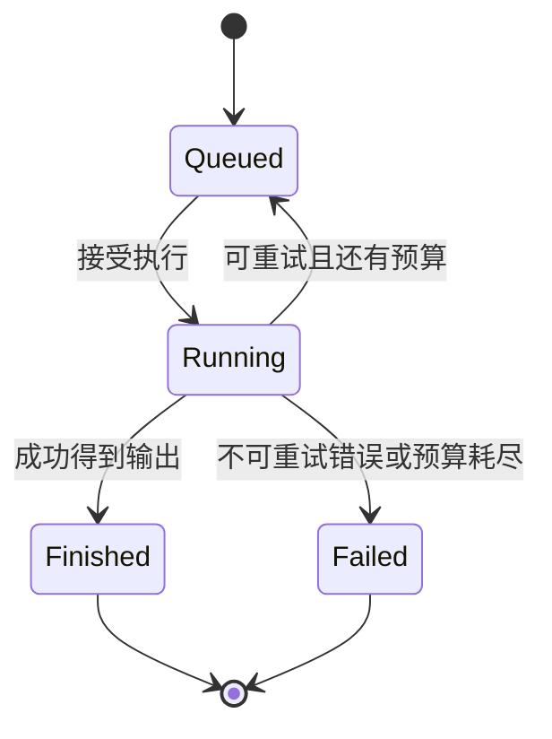

# G3 类型、Trait 和错误：把约束从约定变成接口

[返回总目录](../README.md) · [上一篇](02-ownership-and-api.md) · [下一篇](04-concurrency-and-async.md)

## 从多个布尔值改为带数据的 enum

假设 Go 服务用 `busy`、`done`、`err`、`result` 描述一个任务，需要约定哪些组合有效。Rust 可用枚举将状态与可用数据一起表达：

```rust
#[derive(Debug)]
enum Job {
    Queued { id: u64 },
    Running { id: u64, attempts: u32 },
    Finished { id: u64, output: String },
    Failed { id: u64, reason: String },
}

fn describe(job: &Job) -> String {
    match job {
        Job::Queued { id } => format!("{id}: queued"),
        Job::Running { id, attempts } => format!("{id}: attempt {attempts}"),
        Job::Finished { id, output } => format!("{id}: {output}"),
        Job::Failed { id, reason } => format!("{id}: {reason}"),
    }
}

fn main() {
    let states = [
        Job::Queued { id: 1 },
        Job::Running { id: 1, attempts: 1 },
        Job::Finished { id: 1, output: "ok".into() },
        Job::Failed { id: 2, reason: "timeout".into() },
    ];
    assert_eq!(describe(&states[2]), "1: ok");
}
```

枚举约束“当前形态”，业务代码仍须约束“哪些转换允许”。如果输入来自网络，仍需要验证字段范围和授权；类型安全不自动证明业务正确。[enum 规则](https://doc.rust-lang.org/reference/items/enumerations.html)。



## Go interface 和 Rust trait 的关键差别

Go 类型通过方法集隐式满足接口；Rust 通常通过显式 `impl Trait for Type` 满足 trait。Rust 的泛型 trait bound 可在编译期选择实现，`dyn Trait` 通过特征对象提供动态分派。两者都能实现依赖反转，不要求把每个 struct 抽象成 trait。

```rust
trait Store {
    type Error;
    fn load(&self, id: u64) -> Result<Option<String>, Self::Error>;
}

struct MemoryStore;

impl Store for MemoryStore {
    type Error = std::convert::Infallible;
    fn load(&self, id: u64) -> Result<Option<String>, Self::Error> {
        Ok((id == 1).then(|| String::from("session")))
    }
}

fn lookup<S: Store>(store: &S) -> Result<Option<String>, S::Error> {
    store.load(1)
}

fn main() {
    assert_eq!(lookup(&MemoryStore), Ok(Some("session".into())));
    let dynamic: &dyn Store<Error = std::convert::Infallible> = &MemoryStore;
    assert_eq!(dynamic.load(2), Ok(None));
}
```

关联类型表达“某个实现选择的一种类型”；trait 泛型则允许对不同参数实现不同关系。需要动态分派时，要核对 dyn compatibility，例如泛型方法和直接返回不可擦除类型可能妨碍转换。本项目 `ChatProvider` 的泛型异步方法适合目前的静态分派，不应机械变为 `Box<dyn ChatProvider>`。[traits 与 dyn compatibility](https://doc.rust-lang.org/reference/items/traits.html#dyn-compatibility)。

## 三种多态选择

| 方案 | 适用场景 | 需要评估的成本 |
| --- | --- | --- |
| 泛型 `T: Trait` / 参数 impl Trait | 编译期知道实现、热路径 | 单态化与复杂签名 |
| `&dyn Trait` / Box<dyn Trait> | 运行时选择、异构集合 | 动态分派，Box 还可能分配 |
| enum + match | 实现集合有限且可控制 | 添加实现时更新匹配点 |

`impl Trait` 返回值一般表达某一种隐藏具体类型，不意味着可以随分支返回任意实现者。`dyn Trait` 则真的允许不同具体类型经由对象使用。[impl Trait](https://doc.rust-lang.org/reference/types/impl-trait.html)。

## Option、Result 和 Go 的多返回值

`Result<Option<T>, E>` 有三种业务结果：找到值、成功但未找到、操作失败。`Option<Result<T, E>>` 表示有没有执行结果以及执行是否失败。`transpose()` 可以在两种形态之间转换，不能凭符号数量判断是否过度设计。

```rust
fn parse_limit(value: Option<&str>) -> Result<Option<usize>, std::num::ParseIntError> {
    value.map(str::parse).transpose()
}

fn main() {
    assert_eq!(parse_limit(None), Ok(None));
    assert_eq!(parse_limit(Some("32")), Ok(Some(32)));
    assert!(parse_limit(Some("oops")).is_err());
}
```

缺失用默认值，非法值报错，是配置接口中有用的区分。[Option::transpose](https://doc.rust-lang.org/std/option/enum.Option.html#method.transpose)。

## 库错误和应用错误分开设计

稳定边界的错误用 enum 暴露可处理类别，例如 `NotFound`、`Conflict`、`InvalidInput`。应用组合层可给错误增加上下文，使用动态错误类型方便汇总。`thiserror` 和 `anyhow` 是常见工具，各有用途，不是语言必需组成。手动实现标准库 `Error` 可以先理解它们自动生成什么。[Error](https://doc.rust-lang.org/std/error/trait.Error.html)、[thiserror 作者文档](https://docs.rs/thiserror/latest/thiserror/)、[anyhow 作者文档](https://docs.rs/anyhow/latest/anyhow/)。

Rust 的 `?` 提前返回并按可用转换适配错误，它不会自动记录日志、添加业务上下文或重试。错误在库内返回，在应用边界决定日志级别、状态码与是否重试，避免每层都重复打印。

## 进一步需要认识的约束

完整扩展例子见 [Trait 一致性与异步返回约束](../02-advanced/16-trait-boundaries-and-coherence.md)，常用错误工具的使用见 [thiserror/anyhow/tracing](../08-ecosystem/14-errors-and-observability.md)。

- orphan/coherence：为外部类型实现外部 trait 有限制，可用 newtype 建立本地类型。
- `Eq`/`Hash`：键相等时哈希必须一致，改变键的相关属性会破坏集合逻辑。
- `Send`/`Sync`：传播跨线程约束；`'static` 表达不含较短借用，不等于值必须一直存活。
- `Fn`/`FnMut`/`FnOnce`：闭包使用捕获环境的能力不同；`move` 不直接决定只实现 FnOnce。

对应精确规则：[trait implementations](https://doc.rust-lang.org/reference/items/implementations.html#trait-implementation-coherence)、[Hash 契约](https://doc.rust-lang.org/std/hash/trait.Hash.html)、[闭包](https://doc.rust-lang.org/reference/types/closure.html)。

验收：为“找不到会话”“数据库连接失败”“会话已被删除”设计类型，说明哪一层转换 HTTP 状态码，并给出新增错误变体后必须修改的处理点。
