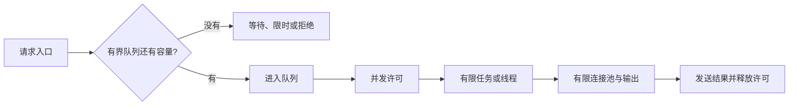

# G4 从 goroutine 到线程与 Future：生命周期先于并发数量

[返回总目录](../README.md) · [上一篇](03-types-traits-and-errors.md) · [下一篇](05-migration-workshop.md)

前置：智能指针和线程基础。详细调度机制随后读 [Tokio 原理](../08-ecosystem/03-tokio-runtime.md)。

## 不要把三个层次混成一个词

| Go 经验 | Rust 对应层次 | 实际差别 |
| --- | --- | --- |
| `go work()` | `std::thread::spawn` 或 `tokio::spawn` | 前者是 OS 线程，后者是运行时任务 |
| 调用普通函数就执行 | 调用 async fn 返回 Future | Future 需要被轮询 |
| goroutine 可调度运行 | executor 轮询 Future | 不让出控制权的 poll 会阻塞 worker |
| context 传播取消 | token、channel、超时、任务句柄 | Rust 没有统一内建 context 协议 |
| channel 关闭通知 | sender/receiver Drop 或 close 等 API | 哪端关闭及残余消息行为依实现而定 |
| WaitGroup | JoinHandle、JoinSet 或任务跟踪器 | 还需处理任务返回值与 panic |

Go context 的取消是通知，接收方要配合；Rust 丢弃一个 Future 也不意味着已执行的外部副作用被撤销。两种语言都需要设计提交点与幂等。[Go context](https://pkg.go.dev/context)、[Future](https://doc.rust-lang.org/std/future/trait.Future.html)、[Tokio tasks](https://docs.rs/tokio/latest/tokio/task/)。

## 借用型线程与拥有型线程

```rust
fn main() {
    let values = [1, 2, 3];
    let sum = std::thread::scope(|scope| {
        let handle = scope.spawn(|| values.iter().sum::<i32>());
        handle.join().expect("示例线程没有 panic")
    });
    assert_eq!(sum, 6);

    let message = String::from("owned");
    let handle = std::thread::spawn(move || message.len());
    assert_eq!(handle.join().expect("示例线程没有 panic"), 5);
}
```

scoped thread 在作用域结束前完成，因此可以借用作用域外的数据；普通 spawn 可能超出调用函数的生命周期，所以捕获值需要满足相应的 Send 和 `'static` 约束。`move` 将捕获方式改为按值，但按值捕获一个引用仍然是引用。[thread::scope](https://doc.rust-lang.org/std/thread/fn.scope.html)、[thread::spawn](https://doc.rust-lang.org/std/thread/fn.spawn.html)。

## Arc 不是自动的线程安全包装

`Arc<T>` 提供原子引用计数的共享所有权。其跨线程能力依赖 `T`；`Arc<RefCell<T>>` 不会因此成为安全的跨线程共享可变对象。读取不可变数据用 Arc，短临界区修改用合适的锁，队列传递状态修改请求则可以减少共享。[Arc 的线程安全](https://doc.rust-lang.org/std/sync/struct.Arc.html#thread-safety)。

## 锁与 await 的危险组合

任务拿着锁 await 网络时，会把锁占用延长到整个外部等待过程。即使异步锁的 guard 可以跨 await，也不意味着这种设计值得采用。

```text
较好的默认流程：
加锁 → 复制必要的小型快照/取出任务 → 解锁
→ await 外部 I/O → 加锁 → 验证版本并应用结果 → 解锁
```

快照方案需要处理等待期间状态变化；用 revision 或操作 ID 检查过期结果。若资源必须由单个任务串行操作，例如一个协议连接，actor 所有权可能更自然。[Tokio shared state](https://tokio.rs/tokio/tutorial/shared-state)。

## 背压应贯穿生产者到资源



有界 channel 限制的是缓冲消息数量，不自动限制已启动任务数、单消息字节数或结果积压。应该同时约束排队数、执行数、每项内存、输出总量和运行时间。`spawn` 一万次后再让任务获取 semaphore，仍然已经创建了一万份任务状态。

## 任务取消与关闭的验收问题

1. 谁拥有 JoinHandle，何时 await 回收任务结果？
2. 丢弃句柄、abort 和合作式取消分别会发生什么？
3. 排队任务是否继续执行，正在执行任务是否允许完成？
4. 持久化是在取消前、取消后还是明确的提交点？
5. 关闭时是否停止接收新工作，是否有总时限？

Tokio 中丢弃 JoinHandle 默认分离任务；abort 对任务提出取消请求，通常在可取消的调度点生效；已开始运行的 `spawn_blocking` 不能用 abort 停掉。具体使用见 [JoinHandle](https://docs.rs/tokio/latest/tokio/task/struct.JoinHandle.html)、[spawn_blocking](https://docs.rs/tokio/latest/tokio/task/fn.spawn_blocking.html)。

本项目对应：图形宿主把拥有的数据发给单独工作线程，Agent 中的非 Send 回调留在该线程；[runtime.rs](../../../src/ui/app/runtime.rs) 和 [授权 Gate](../../../src/ui/app/authorization.rs) 展示了这种边界。独立授权通道避免“执行任务等授权，而授权还排在执行队列后面”的死锁。

验收：画出你实现的服务关闭流程，逐项标出队列、在途任务、数据库连接和结果接收者的最终状态。
