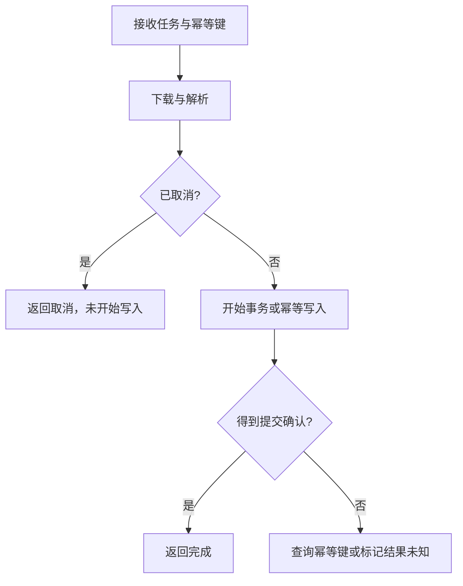

# G5 迁移练习：从 Go 写法到有理由的 Rust 设计

[返回总目录](../README.md) · [上一篇](04-concurrency-and-async.md) · [下一篇](06-syntax-reference.md)

这些练习用于独立学习包，不要求重构 geer-agent。每题先完成简单实现，再解释边界，最后看参考方向。

## 练习一：配置读取

Go 的常见起点是 `os.Getenv` 后解析整数。Rust 版本要求：未设置使用默认值，空字符串和非法数字返回错误，零值和超过上限的值返回业务错误。

```rust
#[derive(Debug, PartialEq, Eq)]
enum LimitError {
    InvalidNumber,
    OutOfRange,
}

fn parse_limit(raw: Option<&str>) -> Result<usize, LimitError> {
    let limit = match raw {
        None => 16,
        Some(value) => value.parse().map_err(|_| LimitError::InvalidNumber)?,
    };
    if !(1..=256).contains(&limit) {
        return Err(LimitError::OutOfRange);
    }
    Ok(limit)
}

fn main() {
    assert_eq!(parse_limit(None), Ok(16));
    assert_eq!(parse_limit(Some("0")), Err(LimitError::OutOfRange));
    assert_eq!(parse_limit(Some("")), Err(LimitError::InvalidNumber));
    assert_eq!(parse_limit(Some("32")), Ok(32));
}
```

参考方向：环境读取放边界，解析接收 `Option<&str>` 保持纯函数；错误类型表示调用方能采取不同处理的类别。不要在单元测试中反复修改全局环境。[env::var](https://doc.rust-lang.org/std/env/fn.var.html) 会区分未设置和非 Unicode 值，接入时需决定相应策略。

## 练习二：文本聚合

输入若干行 `name count`，输出按名字排序的合计。要求处理 Unicode 名字、空行、非法计数和溢出；明确重复名字的行为。

参考方向：`BTreeMap<String, u64>` 自带排序，`entry` 表达插入与更新，`checked_add` 表达溢出策略。如果先用 `HashMap`，输出前必须明确排序，而不是依赖迭代次序。[BTreeMap](https://doc.rust-lang.org/std/collections/struct.BTreeMap.html)、[u64::checked_add](https://doc.rust-lang.org/std/primitive.u64.html#method.checked_add)。

验收输入：空文件、重复项、中文名字、最大整数后再加一、行尾 CRLF。报告某一行失败时，不泄漏完整输入内容。

## 练习三：命令解析与状态

实现 `open <id>`、`save`、`quit`；将解析结果做成枚举。`open` 需要 ID，其他命令不接受多余参数。把解析、状态变化和输出分开，使解析不依赖具体 UI。

参考方向：`Command::Open { id }` 比 `struct { name, optional_id }` 少一种非法组合；`Result<Command, ParseError>` 区分空输入、未知命令和参数错误。对照 [interaction::command](../../../src/interaction/command.rs)，不要复制所有项目命令。

## 练习四：有界并发与确定输出顺序

实现“并发处理最多四个输入，输出仍按输入次序排列”。Go 可以用 worker pool；Rust 用线程或 Tokio 均可。任务模拟使用有限本机延迟，不访问真实模型或任意网站。

参考方向：为输入附序号，执行完成后按序归位；限制实际在途任务。`join_all` 保持输入对应的结果次序，但不等于自动限制并发或任务数。Tokio 练习可用 `JoinSet` 逐项补充，或给 Stream 用 `buffered`/`buffer_unordered` 并分别解释排序成本。[join_all](https://docs.rs/futures-util/latest/futures_util/future/fn.join_all.html)、[StreamExt](https://docs.rs/futures-util/latest/futures_util/stream/trait.StreamExt.html)。

## 练习五：取消和持久化

在“下载 → 解析 → 写入”中间取消。定义：解析完成前不产生持久化记录；写入开始后通过事务或幂等键处理不确定结果；界面准确显示已完成、已取消或结果未知。



图表示本练习的契约选择，不是语言自带的事务能力。取消到达与提交开始之间仍可能竞态，需在实现中定义如何判定。故障测试要覆盖“请求已送达但客户端没拿到响应”。

## 练习六：审查自己的迁移结果

| 检查项 | 警示信号 | 修正方向 |
| --- | --- | --- |
| 所有权 | 每个借用错误都追加 clone | 写出拥有者与边界 |
| 类型 | bool/Option 组合产生非法状态 | 用带数据 enum 或构造函数 |
| 同步 | 全部状态用一个大 Mutex | 缩短锁范围或单拥有者 |
| 错误 | 输入错误 unwrap，所有失败转 String | 分类可处理错误，边界增加上下文 |
| 资源 | 无界队列、无界输出、无限任务 | 同时限制数量、字节和时间 |
| 关闭 | 退出时不等待后台任务 | 停入口、通知、回收、提交结果 |
| 性能 | 凭语言选择声称更快 | 记录可复现基线 |

阶段验收：找一题让另一位工程师只看 README 就能运行，并提出一项与你预期不同的边界输入。你应能给出行为解释和修复证据。
