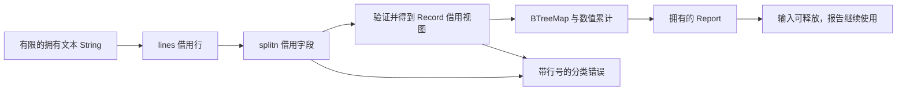

# S5 标准库综合练习：借用解析、拥有汇总与失败上下文

[返回总目录](../README.md) · [集合文本](02-collections-and-text.md) · [I/O 边界](03-io-path-and-process.md)

先做一个没有第三方依赖的小程序，把语言、标准库和契约连起来。输入已经是有限的 UTF-8 文本；文件读取应在外层按 I/O 章节限制字节数。

## 输入契约与数据流

每行是 `时间戳<TAB>等级<TAB>消息`。等级只有 INFO/WARN/ERROR，消息可包含额外 TAB，但不能是空字符串；接受 LF 与 CRLF，忽略空行。时间戳是无符号整数，本例没有日期/时区解释。整份输入最多 16 KiB。



解析视图能减少复制；报告不保存每条原始消息，因而不再借用输入。若以后需要保留消息，必须选择持有原始文本和索引，或将需要保存的字段转为拥有值。

## 完整程序

```rust
use std::{collections::BTreeMap, error::Error, fmt, num::ParseIntError};

const MAX_INPUT: usize = 16 * 1024;

#[derive(Debug, Clone, Copy, PartialEq, Eq, PartialOrd, Ord)]
enum Level { Info, Warn, Error }

struct Record<'a> {
    timestamp: u64,
    level: Level,
    message: &'a str,
}

#[derive(Debug)]
enum Kind { TooLarge, MissingField, Timestamp(ParseIntError), UnknownLevel, EmptyMessage }

#[derive(Debug)]
struct Issue { line: usize, kind: Kind }

impl fmt::Display for Issue {
    fn fmt(&self, f: &mut fmt::Formatter<'_>) -> fmt::Result {
        let description = match &self.kind {
            Kind::TooLarge => "input exceeds 16 KiB",
            Kind::MissingField => "expected timestamp, level and message",
            Kind::Timestamp(_) => "invalid timestamp",
            Kind::UnknownLevel => "unknown level",
            Kind::EmptyMessage => "empty message",
        };
        write!(f, "line {}: {description}", self.line)
    }
}

impl Error for Issue {
    fn source(&self) -> Option<&(dyn Error + 'static)> {
        match &self.kind { Kind::Timestamp(error) => Some(error), _ => None }
    }
}

fn parse(line: &str) -> Result<Record<'_>, Kind> {
    let line = line.strip_suffix('\r').unwrap_or(line);
    let mut fields = line.splitn(3, '\t');
    let timestamp = fields.next().ok_or(Kind::MissingField)?
        .parse().map_err(Kind::Timestamp)?;
    let level = match fields.next().ok_or(Kind::MissingField)? {
        "INFO" => Level::Info,
        "WARN" => Level::Warn,
        "ERROR" => Level::Error,
        _ => return Err(Kind::UnknownLevel),
    };
    let message = fields.next().ok_or(Kind::MissingField)?;
    if message.is_empty() { return Err(Kind::EmptyMessage); }
    Ok(Record { timestamp, level, message })
}

#[derive(Debug, Default)]
struct Report {
    counts: BTreeMap<Level, u64>,
    message_bytes: usize,
    earliest: Option<u64>,
    latest: Option<u64>,
}

fn summarize(input: &str) -> Result<Report, Issue> {
    if input.len() > MAX_INPUT {
        return Err(Issue { line: 0, kind: Kind::TooLarge });
    }
    input.lines().enumerate().try_fold(Report::default(), |mut report, (index, line)| {
        if line.is_empty() { return Ok(report); }
        let record = parse(line).map_err(|kind| Issue { line: index + 1, kind })?;
        // 输入总字节已受限，计数和消息字节总和也具有确定上界。
        *report.counts.entry(record.level).or_default() += 1;
        report.message_bytes += record.message.len();
        report.earliest = Some(report.earliest.map_or(record.timestamp, |t| t.min(record.timestamp)));
        report.latest = Some(report.latest.map_or(record.timestamp, |t| t.max(record.timestamp)));
        Ok(report)
    })
}

fn main() -> Result<(), Box<dyn Error>> {
    let input = String::from("10\tINFO\t启动\r\n8\tWARN\tslow\n12\tINFO\ta\tb\n");
    let report = summarize(&input)?;
    drop(input);
    assert_eq!(report.counts.get(&Level::Info), Some(&2));
    assert_eq!(report.earliest, Some(8));
    assert_eq!(report.latest, Some(12));
    assert_eq!(report.message_bytes, "启动".len() + "slow".len() + "a\tb".len());
    assert!(summarize("")?.counts.is_empty());
    let error = summarize("1\tINFO\tok\nnope\tERROR\tbad").expect_err("fixture has bad timestamp");
    assert_eq!(error.line, 2);
    assert!(error.source().is_some());
    assert!(summarize("1\tDEBUG\tx").is_err());
    assert!(summarize(&"x".repeat(MAX_INPUT + 1)).is_err());
    Ok(())
}
```

用到的契约：[str::lines/splitn](https://doc.rust-lang.org/std/primitive.str.html)、[BTreeMap](https://doc.rust-lang.org/std/collections/struct.BTreeMap.html)、[Error::source](https://doc.rust-lang.org/std/error/trait.Error.html)、[Iterator::try_fold](https://doc.rust-lang.org/std/iter/trait.Iterator.html#method.try_fold)。

## 为什么这些类型这样选

| 选择 | 解决的具体问题 | 代价或边界 |
| --- | --- | --- |
| Record<'a> 借用 message | 临时解析不复制每条文本 | 不能比输入存活更久 |
| Level enum | 只接收三个合法等级 | 新等级要更新处理契约 |
| BTreeMap | 以定义的等级顺序稳定输出 | 顺序来自 enum 的 Ord，不是字母顺序 |
| Option 时间边界 | 空输入没有虚构时间戳 | 调用方显式处理 None |
| Issue + source | 业务行号与底层解析原因同时保留 | 外部显示与内部诊断可分别选择 |
| try_fold | 遇到首个非法行立即停止 | 本例不收集全部输入错误 |

line=0 专门表示整份输入超限，不是一条真实行。更大的应用可以另设 InputError/LineError，避免复用这个约定。

## Go 对照与改造练习

Go 可以通过切片/字符串视图完成相同工作，但引用的存活与共享约束不会以相同的借用关系出现在签名中。Rust 的 parse 签名明确表示返回值借用调用输入；Report 则不携带生命周期参数，因而可以独立保存。

第一轮加本地文件读取上限与路径错误；第二轮加 CLI 输出格式与退出码；第三轮加两个边界：不保存超过上限的错误文本，不在错误处理中输出整个敏感原始行。不要在第一轮就加异步和数据库。

验收：改变输入时间顺序仍得到正确最早/最晚值；空输入、CRLF、UTF-8、多余 TAB、未知等级与超限都有明确结果。解释修改成无限流后，哪一条数值上界证明需要重新建立。
