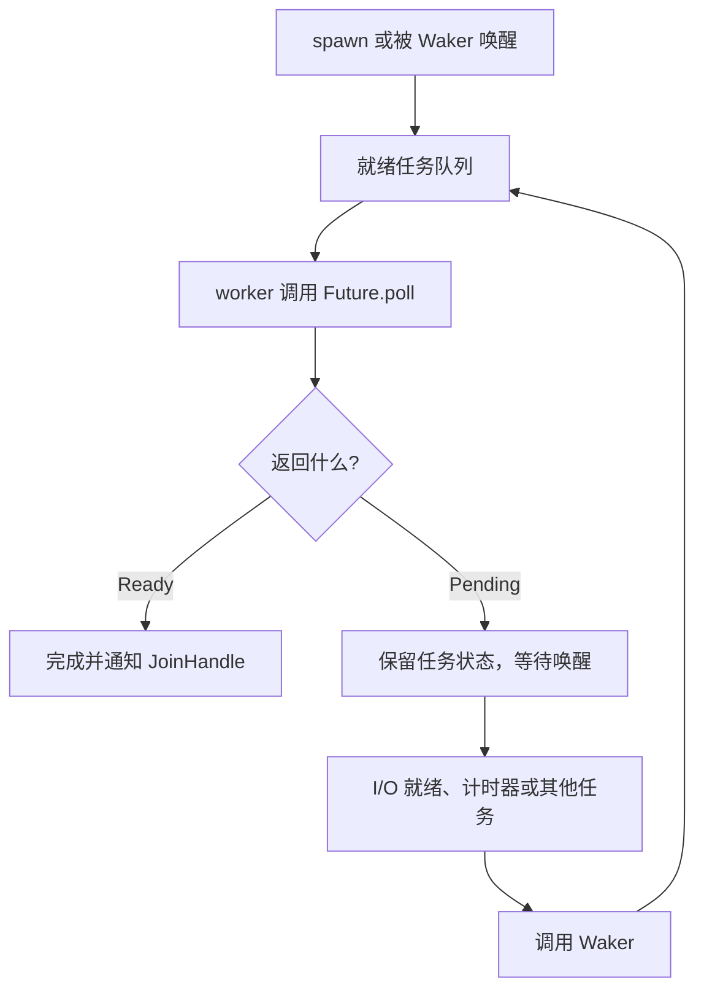

# E3 Tokio 原理：Future、调度、驱动与任务生命周期

[返回总目录](../README.md) · [生态选择](02-stack-decisions.md) · [下一篇：实战](04-tokio-workshop.md) · [深入：分帧与关闭](11-tokio-io-and-shutdown.md)

本篇以 Tokio 1.x 和稳定 Rust 为基线。Tokio 是异步运行时与配套 I/O、同步工具集；async/await 是语言功能，Future 是标准库契约，Tokio 是驱动这些契约的一种实现。先读 [异步基础](../02-advanced/10-async-future-and-pin.md)。

## 运行时的三项职责

| 部分 | 职责 | 在什么情况下参与 |
| --- | --- | --- |
| executor / scheduler | 选择就绪任务并 poll | 新任务、被唤醒任务、继续运行任务 |
| I/O driver | 将底层 I/O 就绪通知接到任务唤醒 | socket 等异步资源等待 |
| timer driver | 管理定时器并唤醒到期任务 | sleep、timeout、interval |
| blocking pool | 承接需要阻塞线程的工作 | spawn_blocking、部分文件操作 |

前三项是异步执行的核心，阻塞池是额外的执行边界。Builder 手工创建 runtime 时需要启用相应驱动；`enable_all` 启用已编入的驱动，不能代替 Cargo feature。[runtime](https://docs.rs/tokio/latest/tokio/runtime/)、[Builder](https://docs.rs/tokio/latest/tokio/runtime/struct.Builder.html)。



Pending 路径必须安排未来被唤醒的机会；运行时不会不停轮询所有等待中的 Future。唤醒表示可以安排再次 poll，不保证对应操作下一次一定完成。[Future 契约](https://doc.rust-lang.org/std/future/trait.Future.html)、[Tokio async in depth](https://tokio.rs/tokio/tutorial/async)。

## async 函数被编译成可暂停的状态

调用 async fn 先建立 Future；执行到未就绪 await 时，把下一次需要的局部状态保存下来，返回控制权。恢复后继续状态机。跨 await 存活的值会影响 Future 的体积、Send 和生命周期要求。

```text
async fn request():
    构造请求
    等连接 await
    等响应 await
    解析返回

概念状态：Start → Connecting → Reading → Completed
```

编译器的实际布局属于实现细节，上面的状态是帮助理解的概念模型。如果连接前持有的 Rc 仍跨 await 存活，整个 Future 可能不是 Send；缩短非 Send 值的作用域可以改变这一点。[Tokio spawning 中的 Send 说明](https://tokio.rs/tokio/tutorial/spawning)。

## current-thread 与 multi-thread

| 配置 | 执行方式 | 适用选择 |
| --- | --- | --- |
| current-thread | 异步任务由调用线程驱动 | 小型应用、特定线程归属、同步/异步桥接 |
| multi-thread | worker 池调度，可在 worker 之间迁移 | 多连接服务、需要多核调度的场景 |
| LocalSet | 给本地任务提供同一线程的执行集合 | 使用 Rc 或其他非 Send 状态 |
| spawn_blocking | 另一个阻塞线程池执行普通闭包 | 阻塞 API、有限耗时的同步工作 |

current-thread 并不表示程序绝不会创建其他线程；阻塞池、库和显式线程仍可能存在。普通 `tokio::spawn` 即使在 current-thread runtime 里仍要求 Send；非 Send 任务使用 LocalSet 和 spawn_local，或像本项目那样在工作线程直接 block_on。[LocalSet](https://docs.rs/tokio/latest/tokio/task/struct.LocalSet.html)、[同步桥接](https://tokio.rs/tokio/topics/bridging)。

Tokio 多线程调度器使用就绪队列和 work stealing 等策略；具体队列容量、轮询间隔与快速路径会随版本改变。工程代码应依赖文档化的运行保证，而不依赖某个博客中的内部常数。公平性保证也有前提，例如任务数有界、每次 poll 能在有限时间内返回。[runtime 的行为与公平性](https://docs.rs/tokio/latest/tokio/runtime/#detailed-runtime-behavior)。

## await 不保证每次让出线程

如果被 await 的 Future 立即 Ready，当前任务可直接继续执行。连续 CPU 运算、阻塞系统调用、无限 ready 循环，都可能使其他任务得不到运行机会。Tokio 对参与其协作机制的操作提供预算辅助，但不能自动把任意用户 CPU 循环改造成可抢占任务。[协作调度](https://docs.rs/tokio/latest/tokio/task/coop/index.html)。

解决路线：分块处理并提供合作式取消；有限阻塞工作放 spawn_blocking；持续 CPU 并行计算考虑受限 Rayon 池；不要只加一个 await 字样就认为程序已经可公平调度。

## Pin 是地址稳定约束，不是堆分配语法

Future 内部可能有与自身地址有关的状态。`Pin<P>` 通过指针 API 限制对被固定目标的移动，`Unpin` 表示类型可以安全地不受这项限制。移动 Pin<Box<T>> 的句柄与移动 Box 内的 T 是两回事；pinning 也可以由栈上的机制完成。[Pin](https://doc.rust-lang.org/std/pin/index.html)。

日常代码优先使用 async、pin!、Box::pin 和库提供的安全组合器；本仓库禁止 unsafe，不必自己写结构体字段投影。

## join、spawn、select 的不同含义

| API | 行为 | 结果与所有权 |
| --- | --- | --- |
| `join!` | 在同一任务中推进多个 Future，等待全部 | 不创建独立任务；一个阻塞分支会影响其他分支 |
| `try_join!` | 多个 Result Future，错误时提前结束 | 其他未完成分支通常被丢弃 |
| `spawn` | 创建受运行时调度的独立任务 | 获得 JoinHandle，需管理结果 |
| `JoinSet` | 跟踪一组任务，按完成收取 | Drop 会取消集合内任务，仍需考虑回收 |
| `select!` | 多个分支竞争，本轮选择完成分支 | 未选中的本轮 Future 被丢弃 |

对应文档：[join!](https://docs.rs/tokio/latest/tokio/macro.join.html)、[try_join!](https://docs.rs/tokio/latest/tokio/macro.try_join.html)、[JoinSet](https://docs.rs/tokio/latest/tokio/task/struct.JoinSet.html)、[select!](https://docs.rs/tokio/latest/tokio/macro.select.html)。

select 默认进行分支选择上的公平性处理；`biased;` 按顺序检查，把公平责任交给调用者。循环中的高频消息分支可能饿死关闭分支，需要明确顺序与处理预算。

## 取消安全要看已经做了什么

循环 select 中 mpsc recv 是取消安全的常见接口；read_exact/write_all 等可能已处理部分字节，丢弃后重建 Future 会丢失进度。锁或 semaphore 等公平队列中的等待被取消时也可能失去排队位置。[select 取消安全清单](https://docs.rs/tokio/latest/tokio/macro.select.html#cancellation-safety)。

| 动作 | 真正发生什么 | 常见误判 |
| --- | --- | --- |
| 丢弃普通 Future | 停止继续推进这份计算 | 以为撤销已发送请求 |
| 丢弃 JoinHandle | 默认让任务继续独立运行 | 以为自动取消任务 |
| abort 任务 | 请求取消，在可处理的调度点清理 | 以为立刻打断任何 CPU 代码 |
| timeout Future | 超时后返回错误并丢弃内部 Future | 以为抢占长 poll 或外部事务 |
| abort spawn_blocking | 尚未启动时可能阻止执行；已启动后无法靠此停止 | 以为能杀死阻塞闭包 |

超时需要被运行时调度检查，非让出任务可能超过期限仍返回完成。[timeout](https://docs.rs/tokio/latest/tokio/time/fn.timeout.html)、[JoinHandle](https://docs.rs/tokio/latest/tokio/task/struct.JoinHandle.html)、[spawn_blocking](https://docs.rs/tokio/latest/tokio/task/fn.spawn_blocking.html)。

## 数据通道与锁的选择

| 类型 | 典型用途 | 要处理的边界 |
| --- | --- | --- |
| mpsc 有界通道 | 多生产者、单消费者任务入口 | 容量、发送等待、关闭与残余消息 |
| oneshot | 一次请求的一次回复 | 接收方取消后发送失败 |
| broadcast | 多订阅者接收事件 | 慢订阅者落后，需恢复策略 |
| watch | 传播最新状态 | 中间状态可能不被观察 |
| Semaphore | 并发资源许可 | 获取位置、持有时间和取消 |
| std Mutex | 短小不跨 await 的临界区 | 竞争时阻塞线程 |
| Tokio Mutex | 确实需要异步等锁或跨 await 独占 | 串行化成本与死锁仍存在 |

通道不是自动 actor 框架。actor 的关键是某个任务唯一拥有状态，其他任务只发送消息；通道容量和消息处理时间属于设计。[channels 教程](https://tokio.rs/tokio/tutorial/channels)、[shared state](https://tokio.rs/tokio/tutorial/shared-state)。

## geer-agent 的具体选择

读 [ui::run](../../../src/ui/mod.rs) 与 [ui/app/runtime](../../../src/ui/app/runtime.rs)：创建 current-thread runtime，调用 enable_all，再在所属线程 block_on Agent。读取工具可用多个 Future 组合，文件操作用 spawn_blocking；写入/Bash 作为顺序边界，见 [tools/mod.rs](../../../src/tools/mod.rs)。

这是为项目的状态归属与简洁性作出的选择，不是“current-thread 永远比 multi-thread 好”。请标出跨线程的拥有消息、线程内的非 Send 值，以及可以同时等待但不能同时提交的操作。

验收：不看笔记，解释一次 socket 未就绪到任务再次运行的全过程，并说明把 `std::thread::sleep` 放进 async handler 会影响什么。
