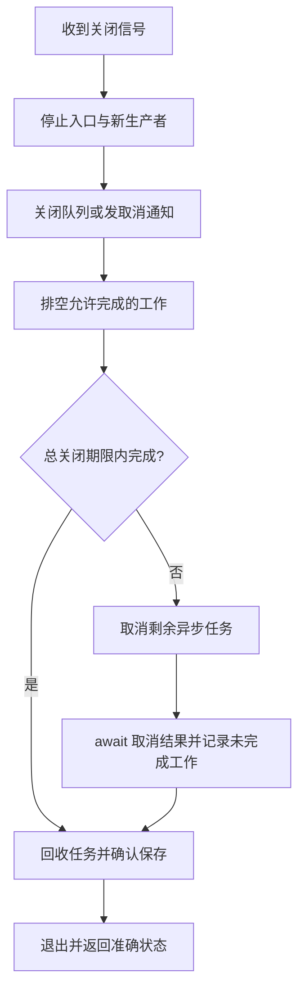

# E4 Tokio 实战：有界 actor、受限任务与关闭

[返回总目录](../README.md) · [上一篇](03-tokio-runtime.md) · [下一篇](05-axum-and-tower.md)

下面框架示例需要独立 Cargo 包，故用 `rust,ignore` 围栏；它不表示代码故意无法使用。复制指定依赖与完整 main 后可以构建，实际验证结果见 [验证记录](../05-reference/02-resources-and-verification.md)。

## 准备最小练习包

在独立练习目录 `cargo new tokio-lab`，使用 edition 2024。Cargo.toml 添加：

```toml
[dependencies]
tokio = { version = "1", features = ["macros", "rt", "time", "sync"] }
```

网络练习再增加 net/io-util/signal；多线程 scheduler 再增加 rt-multi-thread。避免一开始启用 full 后不知道自己依赖哪些能力。[Tokio feature](https://docs.rs/tokio/latest/tokio/#feature-flags)。本仓库内测试入口是 `scripts/test-safe.sh cargo test --manifest-path <练习包>/Cargo.toml`，不是裸 cargo test。

## 完整练习一：一个任务拥有计数器

```rust,ignore
use std::{error::Error, time::Duration};
use tokio::sync::{mpsc, oneshot};

enum Command {
    Add { amount: u64, reply: oneshot::Sender<Option<u64>> },
}

#[tokio::main(flavor = "current_thread")]
async fn main() -> Result<(), Box<dyn Error>> {
    let (sender, mut receiver) = mpsc::channel::<Command>(2);
    let worker = tokio::spawn(async move {
        let mut value = 0_u64;
        while let Some(command) = receiver.recv().await {
            match command {
                Command::Add { amount, reply } => {
                    let result = value.checked_add(amount);
                    if let Some(next) = result {
                        value = next;
                    }
                    // 调用方取消后回复可能失败，但已完成的更新不会被撤销。
                    let _ = reply.send(result);
                }
            }
        }
        value
    });

    for amount in [2, 3] {
        let (reply, result) = oneshot::channel();
        tokio::time::timeout(
            Duration::from_secs(1),
            sender.send(Command::Add { amount, reply }),
        ).await??;
        assert!(result.await?.is_some());
    }
    drop(sender);
    assert_eq!(worker.await?, 5);
    Ok(())
}
```

理解重点：value 没有 Arc/Mutex；只有 worker 修改它。容量为 2 控制等待消息数；oneshot 给每个命令回复；最后释放全部 sender，receiver 排空后得到 None，主任务 await worker 回收结果。[mpsc](https://docs.rs/tokio/latest/tokio/sync/mpsc/index.html)、[oneshot](https://docs.rs/tokio/latest/tokio/sync/oneshot/index.html)。

send 成功仅表示消息已被接受，回复成功才证明拿到了执行结果。若等待回复超时，更新仍可能已发生；加请求 ID 与去重记录是另一个业务设计步骤。不能直接重试 Add 然后声称“超时已回滚”。

## 完整练习二：最多三个在途任务

将 main.rs 替换为下例，不与上一例放在同一文件：

```rust,ignore
use std::{error::Error, time::Duration};
use tokio::task::JoinSet;

#[tokio::main(flavor = "current_thread")]
async fn main() -> Result<(), Box<dyn Error>> {
    let mut running = JoinSet::new();
    let mut output = vec![0; 8];
    for id in 0..8_usize {
        if running.len() >= 3 {
            if let Some(result) = running.join_next().await {
                let (index, value) = result?;
                output[index] = value;
            }
        }
        running.spawn(async move {
            tokio::time::sleep(Duration::from_millis(5)).await;
            (id, id * 2)
        });
    }
    while let Some(result) = running.join_next().await {
        let (index, value) = result?;
        output[index] = value;
    }
    assert_eq!(output, [0, 2, 4, 6, 8, 10, 12, 14]);
    Ok(())
}
```

满额时先收取一个结果再创建任务，所以实际任务集合有上界；输出按输入 index 放回，不依赖完成顺序。真实处理函数返回 Result 时，需要分别处理 `Result<Result<T, E>, JoinError>` 的任务层和业务层错误。[JoinSet](https://docs.rs/tokio/latest/tokio/task/struct.JoinSet.html)。

## 超时包住什么，决定谁被取消

```text
timeout(duration, operation())：超时丢弃 operation Future。
timeout(duration, handle)：拥有 handle 被超时包装；超时丢弃 handle，任务可能继续。
timeout(duration, &mut handle)：超时后仍持有 handle，可主动 abort 并 await。
```

对分离任务要保留句柄，并在失败/超时路径显式处理；对数据库提交等副作用要定义“结果未知”的恢复策略。`timeout` 不是线程终止器。[timeout](https://docs.rs/tokio/latest/tokio/time/fn.timeout.html)、[JoinHandle](https://docs.rs/tokio/latest/tokio/task/struct.JoinHandle.html)。

## 网络实践按五步增加能力

先运行 [分帧、截断与任务回收完整练习](11-tokio-io-and-shutdown.md)，再按下面步骤迁移到本机网络。

1. Tokio TcpListener 只绑定 `127.0.0.1:0`，记录实际临时端口。
2. 处理一个固定上限的消息，明确长度前缀或换行 framing。
3. 给握手、读取和整个请求增加有限超时，限制单帧字节数。
4. 用有上限的任务集合处理多个连接，满额时定义等待或拒绝。
5. 增加关闭信号：停止 accept，通知任务，在总期限内等待，超时后 abort 并继续回收。

本机测试的 connect/read/write 也要设置期限；不能只给服务端设置超时。TCP 的一次 read 可能得到半帧或多帧，要维护解析缓冲与大小上限。[Tokio I/O](https://tokio.rs/tokio/tutorial/io)、[framing](https://tokio.rs/tokio/tutorial/framing)。

## 关闭是独立的一条执行路径



取消通知可用 tokio-util CancellationToken，跟踪可用 TaskTracker/JoinSet；选用时添加对应 feature 并核对版本。已开始的 blocking 工作需要自己的合作式停止信号和有限时长，不能依赖异步任务 abort。[Tokio graceful shutdown](https://tokio.rs/tokio/topics/shutdown)。

## 必做故障练习

| 故障 | 应观察的行为 |
| --- | --- |
| 所有 sender 退出 | 消费者排空后正常结束 |
| 回复接收者提前退出 | worker 不 panic，业务副作用语义明确 |
| 消费者很慢 | 生产者受背压，内存受限 |
| 单个任务 panic | JoinError 被记录，关闭策略明确 |
| 任务等待超时 | 任务和句柄没有遗失，结果未知可解释 |
| 关闭时仍有工作 | 最终保存和退出状态可验证 |

测试按失败路径编写，不用真实网络偶发性证明正确。Tokio 的测试时间工具可暂停/推进时间，需 test-util feature；仅靠 sleep 后断言容易产生不稳定测试。[Tokio testing](https://tokio.rs/tokio/topics/testing)。

项目对照：[tools 的顺序边界](../../../src/tools/mod.rs)、[图形关闭](../../../src/ui/app/close.rs)、[Web 生命周期](../../../src/ui/web/mod.rs)。验收时请说明当前项目哪些保证已实现，哪些仅是你的练习设计。
