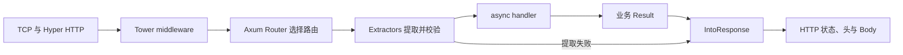

# E5 Axum 与 Tower：HTTP 请求如何经过类型与中间件

[返回总目录](../README.md) · [上一篇](04-tokio-workshop.md) · [下一篇](06-serde-and-reqwest.md)

本篇使用 Axum 0.8、Tower 0.5、Tokio 1。geer-agent 的 web feature 已采用 Axum；示例是独立练习服务，不表示本项目的真实认证接口。

## 先看执行链



Axum 的 handler 接受 extractor 并返回可转为 Response 的结果；Tower Service/Layer 提供共用中间件抽象。Hyper 是底层 HTTP 实现，Tokio 负责运行和 I/O；这些不是四个竞争的完整 Web 框架。[Axum](https://docs.rs/axum/latest/axum/)、[Tower](https://docs.rs/tower/latest/tower/)。

## 最小可运行服务

独立练习包 Cargo.toml：

```toml
[dependencies]
axum = "0.8"
serde = { version = "1", features = ["derive"] }
tokio = { version = "1", features = ["macros", "rt", "net", "signal"] }
```

main.rs，需上述 Cargo 上下文：

```rust,ignore
use std::{error::Error, sync::{Arc, Mutex}};
use axum::{extract::State, http::StatusCode, routing::{get, post}, Json, Router};
use serde::{Deserialize, Serialize};

#[derive(Clone, Default)]
struct AppState {
    counter: Arc<Mutex<u32>>,
}

#[derive(Deserialize)]
#[serde(deny_unknown_fields)]
struct Increment {
    amount: u32,
}

#[derive(Serialize)]
struct Snapshot {
    value: u32,
}

async fn increment(
    State(state): State<AppState>,
    Json(input): Json<Increment>,
) -> Result<Json<Snapshot>, (StatusCode, &'static str)> {
    if !(1..=100).contains(&input.amount) {
        return Err((StatusCode::BAD_REQUEST, "invalid amount"));
    }
    let mut value = state.counter.lock()
        .map_err(|_| (StatusCode::INTERNAL_SERVER_ERROR, "state unavailable"))?;
    let next = value.checked_add(input.amount)
        .ok_or((StatusCode::CONFLICT, "counter overflow"))?;
    *value = next;
    Ok(Json(Snapshot { value: next }))
}

#[tokio::main(flavor = "current_thread")]
async fn main() -> Result<(), Box<dyn Error>> {
    let app = Router::new()
        .route("/health", get(|| async { "ok" }))
        .route("/counter", post(increment))
        .with_state(AppState::default());
    let listener = tokio::net::TcpListener::bind("127.0.0.1:3000").await?;
    axum::serve(listener, app)
        .with_graceful_shutdown(async {
            if let Err(error) = tokio::signal::ctrl_c().await {
                eprintln!("shutdown signal failed: {error}");
            }
        })
        .await?;
    Ok(())
}
```

手工运行后用本机请求验证；以下客户端也有超时：

```bash
curl --max-time 2 http://127.0.0.1:3000/health
curl --max-time 2 -H 'content-type: application/json' \
  -d '{"amount":3}' http://127.0.0.1:3000/counter
```

此服务用于教学，只监听本机。真实服务还需认证、总资源预算、配置和关闭期限；测试改用临时端口并经受限入口执行。[serve](https://docs.rs/axum/latest/axum/fn.serve.html)。

## Extractor 的顺序是契约

| extractor | 从哪里读 | 常见失败 |
| --- | --- | --- |
| State<T> | 应用状态 | 状态类型未正确注入时常表现为编译问题 |
| Path<T> | 路由参数 | 参数无法反序列化 |
| Query<T> | query string | 格式或字段类型错误 |
| HeaderMap / 自定义认证 extractor | 请求 parts | 缺认证或无效头 |
| Json<T> / String / Bytes | 消费 request body | 类型、编码、大小或内容错误 |

消耗 body 的 extractor 通常只能出现一次并放最后；前面的 parts extractor 不应提前消费它。Json 的结构解析不等于业务验证，amount 的范围仍由业务处理。[extractors](https://docs.rs/axum/latest/axum/extract/index.html)。

Axum 0.8 路径参数使用 `/{id}` 形式，旧教程的 `/:id` 不能直接搬用。错误消息很长时，先检查 handler 参数顺序、返回值、State 类型以及 Future 是否 Send，再考虑 debug_handler 辅助诊断。[Router](https://docs.rs/axum/latest/axum/struct.Router.html)。

## Tower Service 和 Layer 的含义

Service 对请求产生一个 Future，并通过 poll_ready 表达当前是否可接受工作；Layer 把一个 Service 包装成另一个 Service。超时、并发限制、缓冲、追踪都可以沿这条链组合。需要直接调用 Service 时应遵守 readiness 协议，不只调用 call。[Service](https://docs.rs/tower/latest/tower/trait.Service.html)、[Layer](https://docs.rs/tower/latest/tower/trait.Layer.html)。

中间件的顺序影响语义：

```text
Error mapping → Timeout → Concurrency limit → Handler
```

先区分 `poll_ready` 与 `call`：Tower Timeout 在 call 时创建计时器；ConcurrencyLimit 在 readiness 阶段等待许可。仅把 Timeout 放到 limit 外面，不会自动将此前的 readiness 等待计入超时。需要整个调用预算时，可在调用方对 `service.oneshot(request)` 的 Future 设置 timeout，另行限制响应 body 的读取。[Timeout 源码](https://docs.rs/tower/latest/src/tower/timeout/mod.rs.html)、[ConcurrencyLimit](https://docs.rs/tower/latest/tower/limit/concurrency/struct.ConcurrencyLimit.html)。

Buffer 会把部分等待带入返回的响应 Future，放在 limit 内外也会改变排队和执行的数量。ServiceBuilder 按添加顺序组合，多次 Router.layer 的嵌套顺序则不同；不要只凭链条位置猜超时范围。Axum 路由层的 backpressure 策略还有专门限制，应核对官方说明。[ServiceBuilder 的顺序说明](https://docs.rs/tower/latest/tower/struct.ServiceBuilder.html#order)、[Axum middleware](https://docs.rs/axum/latest/axum/middleware/index.html)。

## HTTP 失败响应与 Service error 不同

handler 返回 `Result<T, AppError>`，只要 AppError 实现 IntoResponse，就能生成正常的 HTTP 错误响应。Tower Timeout 等产生的 Service error 需要用对应错误处理层转换，否则不能直接满足 Axum 的服务要求；不是简单让 handler 返回 String 就能处理所有层失败。[Axum error handling](https://docs.rs/axum/latest/axum/error_handling/index.html)。

外部响应使用稳定错误码和脱敏文本，内部日志保留上下文；不要向用户返回整个数据库或客户端错误 Debug。

## 状态、WebSocket 与关闭

State 通常持有廉价 clone 的句柄，如 Arc、数据库池、HTTP Client。示例 Mutex guard 不跨 await；需要长时间独占的资源可交给单拥有者任务。

WebSocket 需要连接上限、消息上限、心跳、慢客户端策略和恢复快照；upgrade 成功不会替你解决这些问题。优雅关闭也要管理连接内独立任务，不能只停止 listener。[WebSocketUpgrade](https://docs.rs/axum/latest/axum/extract/ws/struct.WebSocketUpgrade.html)。

## 与 Actix Web 的选型对照

Axum 适合希望统一 Tokio/Tower 中间件并沿用本项目技术栈的学习者。Actix Web 有自己的成熟 HTTP 服务、extractor 和 middleware 体系；其 Web 框架不要求你把业务设计成 actor。比较官方入门、worker/状态模型、已有集成和团队经验，别从微型 benchmark 得出通用结论。[Actix Web](https://actix.rs/)、[应用状态](https://actix.rs/docs/application)。

验收：为示例增加一个查询接口、body 限额、错误类型和操作 ID；编写请求解析失败、错误方法、溢出和关闭测试。项目参考：[web/mod.rs](../../../src/ui/web/mod.rs)、[web/auth.rs](../../../src/ui/web/auth.rs)、[tests/web_ui.rs](../../../tests/web_ui.rs)。

接着做 [不启动端口的请求与中间件练习](12-web-testing-and-middleware.md)，区分路由契约验证和真实 TCP/HTTP 验收。
