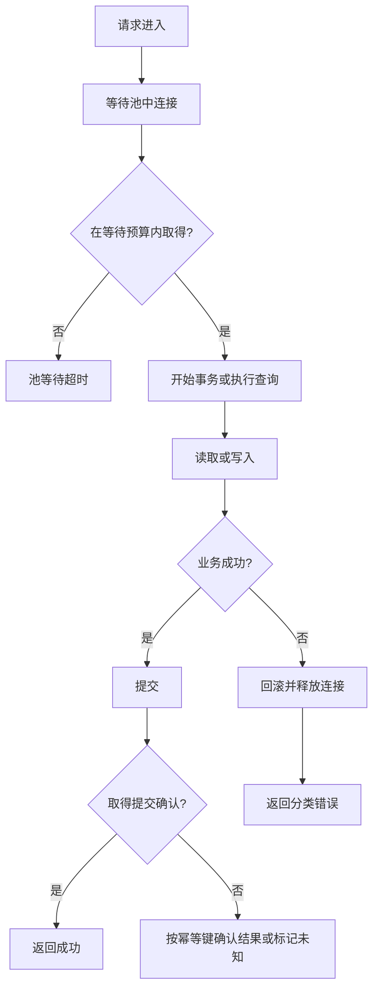

# E7 数据库与 RPC：SQLx、SeaORM、Diesel 和 Tonic

[返回总目录](../README.md) · [上一篇](06-serde-and-reqwest.md) · [Tauri 原理](08-tauri-architecture.md)

框架选择要匹配查询控制、模型复杂度、迁移习惯和同步/异步边界。Rust 类型安全无法自动证明 SQL 查询成本、事务隔离或远程调用的幂等性。

## 四种数据访问路线

| 方案 | 主要抽象 | 适用倾向 | 先理解的成本 |
| --- | --- | --- | --- |
| SQLx | SQL、连接池、查询映射 | 希望明确写 SQL 的异步应用 | SQL/数据库特性、宏检查环境 |
| SeaORM | Entity、Model、ActiveModel、查询构造 | CRUD、关系和多后端动态查询 | 模型层、查询生成和依赖规模 |
| Diesel | 类型化 schema 与查询 DSL | 强类型查询构造和明确数据模型 | 类型复杂度；核心同步接口的线程边界 |
| 官方 MongoDB driver | BSON、collection、cursor | 适合文档模型的数据访问 | 文档契约、索引、游标与事务适用范围 |

来源：[SQLx](https://docs.rs/sqlx/latest/sqlx/)、[SeaORM](https://www.sea-ql.org/SeaORM/docs/index/)、[Diesel](https://diesel.rs/)、[MongoDB Rust driver](https://www.mongodb.com/docs/drivers/rust/current/)。这张表是选型解释，不表示各框架功能互斥。

## SQLx 的运行时查询与编译期查询

`query`/`query_as` 在运行时构造查询与映射；`query!`/`query_as!` 宏可在构建时验证 SQL 和输出类型，但需要能描述 schema 的数据库环境或准备好的离线元数据。编译期检查不能证明权限、查询计划、实际数据分布和未来迁移兼容。[query!](https://docs.rs/sqlx/latest/sqlx/macro.query.html)。

应用交付应明确：谁更新 schema、谁刷新离线查询信息、CI 如何检查元数据、测试如何创建独立数据库。不要在构建时默默访问生产数据库。

## 完整练习：SQLite、事务与可选查询结果

采用与本项目传递依赖相同的 SQLx 0.9 主次版本路线，独立包添加：

```toml
[dependencies]
sqlx = { version = "0.9", default-features = false, features = ["runtime-tokio", "sqlite"] }
tokio = { version = "1", features = ["macros", "rt", "time"] }
```

下面不使用 query 宏，因此不需要构建时的外部 DATABASE_URL：

```rust,ignore
use sqlx::sqlite::SqlitePoolOptions;

#[tokio::main(flavor = "current_thread")]
async fn main() -> Result<(), sqlx::Error> {
    let pool = SqlitePoolOptions::new()
        .max_connections(1)
        .connect("sqlite::memory:").await?;
    sqlx::query("CREATE TABLE notes (id INTEGER PRIMARY KEY, title TEXT NOT NULL)")
        .execute(&pool).await?;

    let mut transaction = pool.begin().await?;
    sqlx::query("INSERT INTO notes (id, title) VALUES (?, ?)")
        .bind(1_i64).bind("learn rust")
        .execute(&mut *transaction).await?;
    transaction.commit().await?;

    let row: Option<(i64, String)> = sqlx::query_as(
        "SELECT id, title FROM notes WHERE id = ?"
    ).bind(1_i64).fetch_optional(&pool).await?;
    assert_eq!(row, Some((1, "learn rust".into())));
    let missing: Option<(i64, String)> = sqlx::query_as(
        "SELECT id, title FROM notes WHERE id = ?"
    ).bind(2_i64).fetch_optional(&pool).await?;
    assert!(missing.is_none());
    pool.close().await;
    Ok(())
}
```

内存数据库的连接与存活范围需要注意，练习显式限制为一个连接。生产服务根据数据库能力、请求并发和事务时间设置池，而不是把连接数设为“CPU 核数的固定倍数”。[SqlitePoolOptions](https://docs.rs/sqlx/latest/sqlx/sqlite/type.SqlitePoolOptions.html)。

## 连接池和事务也是状态机



等待池、查询运行和提交等待是不同耗时；不要把它们全记成“数据库慢”。事务期间不要等待用户确认或外部 HTTP，否则占用连接、锁和事务资源。未提交事务 Drop 的回滚路径依赖驱动与运行条件，明确 commit/rollback 能更好报告失败。[Transaction](https://docs.rs/sqlx/latest/sqlx/struct.Transaction.html)、[Pool](https://docs.rs/sqlx/latest/sqlx/struct.Pool.html)。

## SeaORM 怎样使用

学习四个概念：Entity 描述表与查询入口；Model 是读取到的数据；ActiveModel 用 Set/Unchanged/NotSet 等状态描述写入意图；Migration 管数据库结构版本。[entity/model/active model](https://www.sea-ql.org/SeaORM/docs/basic-crud/insert/)。

在已有 entity::notes 模型和数据库连接 db 的工程中，典型写法如下；这不是完整独立程序：

```rust,ignore
use sea_orm::{ActiveModelTrait, EntityTrait, Set};

let inserted = notes::ActiveModel {
    title: Set("learn rust".to_owned()),
    ..Default::default()
}.insert(&db).await?;

let found = notes::Entity::find_by_id(inserted.id).one(&db).await?;
```

理解默认 ActiveModel 的字段状态，不能把“未设置”和“写入 NULL”混淆。关系预加载、分页和批量查询要观察实际 SQL，ORM 不会自动避免所有 N+1。[SeaORM 查询](https://www.sea-ql.org/SeaORM/docs/basic-crud/select/)。

geer-agent 已使用 SeaORM 2.0.3 和版本化 migration。读 [dao/sql.rs](../../../src/dao/sql.rs)：实体转换、批量查询、幂等写入和迁移分别在哪一层？多后端共有行为要在领域接口钉住，不仅验证 SQLite 能运行。

## Diesel 的使用路径

从 migration 和 schema 开始，定义 Queryable/Selectable 模型，通过类型化 DSL 构建查询，并显式选择连接和事务。Diesel 核心常见接口是同步的；在 Tokio handler 里应使用受限阻塞边界，或明确采用 diesel-async 等相应方案，不要直接阻塞 worker。[Diesel getting started](https://diesel.rs/guides/getting-started.html)、[diesel-async](https://docs.rs/diesel-async/latest/diesel_async/)。

对复杂报表、动态查询和数据库专属能力，分别比较 SQL 可控性与模型约束；“类型化”不是默认查询性能更好。

## Tonic：gRPC 的传输与代码生成

Tonic 在 Rust 中提供 gRPC client/server 与相关生成集成，Prost 负责 Protocol Buffers 消息表示。学习顺序：proto 契约 → 生成消息与服务接口 → 实现服务 trait → 启动传输 → client 调用 → deadline/错误/流控制。[Tonic](https://docs.rs/tonic/latest/tonic/)、[维护方仓库](https://github.com/grpc/grpc-rust)。

```proto
syntax = "proto3";
package notes;

service Notes {
  rpc GetNote(GetNoteRequest) returns (GetNoteReply);
}
message GetNoteRequest { string id = 1; }
message GetNoteReply { string title = 1; }
```

字段编号属于兼容契约，删除字段后不要重用同一个编号；消息缺字段、错误码和“找不到”的表达要提前定义。生成工具已随版本演进拆分，按匹配版本的 tonic/prost 和 build crate 文档准备，不复制历史依赖清单。[Protobuf 编号规则](https://protobuf.dev/programming-guides/proto3/#assigning)。

| gRPC 问题 | 必须设计的行为 |
| --- | --- |
| deadline | 接入剩余总预算，服务端工作配合取消 |
| retry | 状态码、幂等键、退避、重试上限 |
| streaming | 每条消息上限、流背压、断开处理 |
| metadata | 认证与 trace 传播，避免放敏感日志 |
| shutdown | 停新连接并收敛已有调用 |

gRPC 相比 JSON HTTP 更适合强契约和多语言服务调用，但引入代码生成、schema 演进和运维协议成本。桌面本机 IPC 不需要因为学习 Tonic 就改成 gRPC。

验收：用同一“获取笔记”能力比较直接 SQL、ORM 和 RPC 的边界，至少注入一次未找到、唯一键冲突、池等待失败及提交结果未知。
