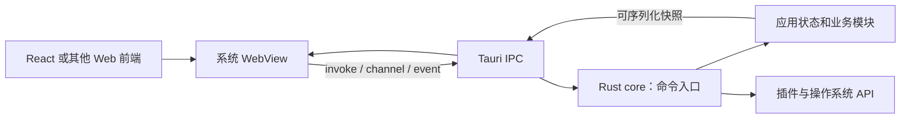
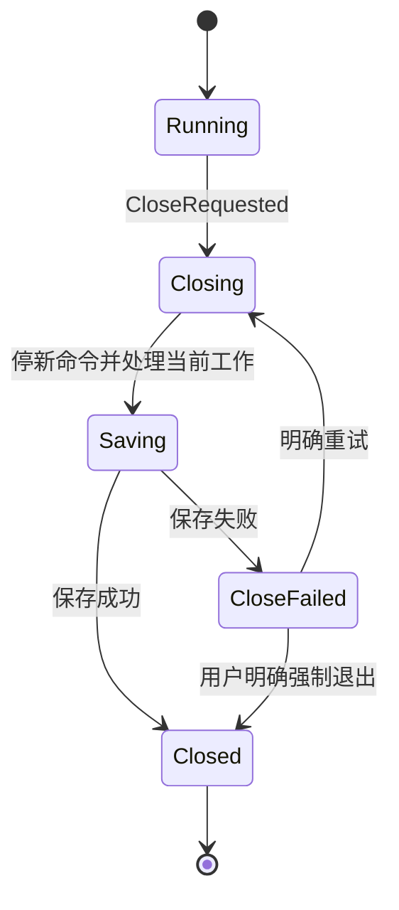

# E8 Tauri 原理：WebView、IPC、状态归属与权限

[返回总目录](../README.md) · [下一篇：Tauri 实战](09-tauri-workshop.md)

用户所说的 tarui 在本项目语境下指 Tauri。本篇以 Tauri 2 为基线，旧版 Tauri 1 的 allowlist 和 API 路径不能直接照搬。

## 桌面程序的两侧

Tauri core 使用 Rust 管理窗口、系统能力和应用状态；前端使用 HTML/CSS/JavaScript，通过系统 WebView 渲染。Windows 使用 WebView2，macOS 使用 WKWebView，Linux 使用 WebKitGTK，具体运行要求需按目标系统核对。[process model](https://v2.tauri.app/concept/process-model/)、[WebView 版本](https://v2.tauri.app/reference/webview-versions/)。



系统 WebView 的进程组织由平台实现参与；不能把“一个窗口”机械等同于“固定一个 OS 进程”。复用系统引擎常能减少随应用分发的浏览器体积，但运行资源、兼容性和性能仍要测量。Tauri 不自带 Electron 式的 Node 环境，构建时使用 Bun/Node 不表示运行时自动有 Node。[架构](https://v2.tauri.app/concept/architecture/)。

## 底层组件各做什么

| 组件 | 职责 | 学习时关注什么 |
| --- | --- | --- |
| tao | 跨平台窗口和事件循环基础 | 窗口事件和线程归属 |
| wry | 系统 WebView 抽象 | 不同平台引擎差异 |
| tauri-runtime / runtime-wry | 连接 Tauri 与窗口/WebView 实现 | runtime 抽象不是 Tokio runtime |
| tauri-macros | command、handler、context 等代码生成 | 宏帮忙生成参数和消息适配 |
| tauri-build | 构建期处理配置、权限等 | 与运行期逻辑分开 |
| CLI / bundler | 开发启动、编译与分发包 | 编译成功和可安装是不同验收 |

不要因都叫 runtime 就把 UI 事件循环与 Tokio executor 混为一谈。窗口事件循环保持响应，长任务交给业务执行边界，结果再通过 IPC 送回。[Tauri core ecosystem](https://v2.tauri.app/concept/architecture/#core-ecosystem)。

## invoke 是协议调用，不是直接函数指针

1. 前端调用 `invoke("command_name", { arguments })`。
2. IPC 传递命令名和可序列化参数。
3. 生成的适配层解析参数、注入 State/AppHandle 等上下文。
4. Rust command 校验输入并调用业务能力。
5. 可序列化返回值完成 Promise；错误进入 reject 路径。

这条边界意味着参数、返回值、命令名称都是协议的一部分。默认参数命名转换需要核对 camelCase；TypeScript 的泛型返回标注只约束前端静态类型，不会自动验证后端真实响应。[Calling Rust](https://v2.tauri.app/develop/calling-rust/)。

## command、event 和 channel 如何分工

| 机制 | 适用用途 | 应另行设计的保证 |
| --- | --- | --- |
| invoke command | 提交动作、查询快照、获得确认 | 输入校验、错误、操作 ID |
| event | 广播低频通知 | 订阅清理、目标窗口、是否会错过 |
| Channel<T> | 向本次连接发送连续消息 | 消息类型、大小、客户端生命期 |
| 状态快照 | 首次连接与恢复一致状态 | revision、过期消息拒绝 |

事件不是耐久消息日志，IPC 也不是自动重放系统。流式输出需要明确首次快照、增量消息、关闭和恢复协议；不能无限发送逐字符事件并假设前端能跟上。[Calling the frontend](https://v2.tauri.app/develop/calling-frontend/)。

## State 的共享边界

`Builder::manage` 注册由应用管理的状态，command 用 `State<'_, T>` 借用它。被管理值需要满足框架的线程与存活要求，通常使用线程安全句柄。短临界区用 Mutex，长任务不要持有 guard 执行网络等待。[state management](https://v2.tauri.app/develop/state-management/)。

```text
UI command → 校验并创建拥有的请求 → 有界业务队列
→ worker 唯一拥有业务状态 → 返回快照/事件
```

若业务对象含 Rc、RefCell 或非 Send 回调，不要为迎合 State 约束强行换成全局 Arc<Mutex<_>>。可把对象留在所属工作线程，State 只保留线程安全的发送端和事件句柄。geer-agent 的 [GuiBridge](../../../src/ui/gui/bridge.rs) 和 [AppRuntime](../../../src/ui/app/runtime.rs) 就采用这一方式。

## capabilities、permissions、scope 与业务授权

| 层 | 主要负责什么 | 举例 |
| --- | --- | --- |
| capability | 哪些窗口/WebView 获得哪些权限 | main 窗口可调用选择目录插件 |
| permission | 某组命令的允许/拒绝等定义 | dialog:allow-open |
| scope | 已允许操作的资源范围 | 某目录下的文件访问 |
| command 业务校验 | 当前动作是否合理且获授权 | workspace 路径、revision、删除确认 |
| CSP | 限制页面内容与连接来源 | script-src、connect-src |

插件权限配置与自定义应用命令的注册/权限配置不是同一个步骤。不要仅因写了 capability 就假设所有自定义命令自动得到同样保护；按应用 manifest 与 command 配置核对，再在业务层验证来源和输入。[capabilities](https://v2.tauri.app/security/capabilities/)、[permissions](https://v2.tauri.app/security/permissions/)、[AppManifest](https://docs.rs/tauri-build/latest/tauri_build/struct.AppManifest.html)。

CSP 不能替代路径验证与授权，Rust command 也不能信任前端“按钮已经隐藏”。桌面应用的密钥留在 Rust 配置层，返回到前端的日志与错误同样需要脱敏。[CSP](https://v2.tauri.app/security/csp/)。

## 关闭窗口应触发业务生命周期



图描述一种应用策略。收到 CloseRequested 后可以先 prevent_close，再发关闭工作，完成后真正退出；不能在 UI 事件回调中同步等待整个网络操作。强制退出是独立、有说明的用户动作。项目实现见 [gui/mod.rs](../../../src/ui/gui/mod.rs) 与 [close.rs](../../../src/ui/app/close.rs)。

## 构建和打包还涉及什么

前端编译产生静态资源；Cargo 编译 Rust 和构建脚本；Tauri CLI/bundler 在目标系统制作安装或分发包。签名、公证、更新签名、图标和 WebView 安装要求都是交付的一部分。[prerequisites](https://v2.tauri.app/start/prerequisites/)、[distribute](https://v2.tauri.app/distribute/)。

本项目的 `bundle.active` 为 false，Make 当前产出可执行文件；不能称为已经生成完整 Tauri 安装包。Windows `geer-agent-desktop.exe` 是 GUI 专用入口形态，Linux 通用程序仍支持多种 UI。真实配置见 [tauri.conf.json](../../../src/ui/gui/tauri.conf.json)、[Makefile](../../../Makefile)。

验收：能解释点击按钮后涉及哪些线程/进程和协议边界，为什么不能让 WebView 持有模型密钥，以及关闭时业务任务如何完成或被取消。
