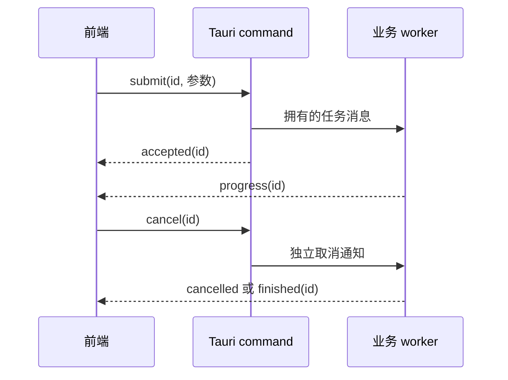

# E9 Tauri 2 使用：命令、状态、插件与交付练习

[返回总目录](../README.md) · [上一篇](08-tauri-architecture.md)

框架代码需放在独立 Tauri 2 练习工程，依赖来自生成模板；不是向 geer-agent 添加第二套前端。以下主练习使用模板现有 Serde 与 tauri 依赖。

## 从官方模板开始

按 [create project](https://v2.tauri.app/start/create-project/) 创建练习，并按 [prerequisites](https://v2.tauri.app/start/prerequisites/) 准备当前平台依赖。可选择 Bun、TypeScript 和你熟悉的前端框架：

```bash
bun create tauri-app
# 在生成的独立目录中，若还没有 lock，首次安装生成它：
bun install --concurrent-scripts 1
bun run tauri dev
```

脚本名以生成 package.json 为准。独立工程已有 bun.lock 后使用 bun install --frozen-lockfile --concurrent-scripts 1；geer-agent 的现有前端始终使用 frozen-lockfile。Rust 代码通常在 src-tauri，前端在根目录；模板布局不要求本项目也迁成同样目录。依赖版本、CLI 与 JS API 保持同一主版本并提交 lock。

## 练习一：Rust 管理计数器，前端只显示快照

放在练习模板的 Rust library 中，用它替换相应模板入口。完整示例保留 main 调用 run 的模板结构，若生成模板已有 mobile_entry_point 属性，可按模板要求保留。

```rust,ignore
use std::sync::Mutex;
use serde::Serialize;

#[derive(Default)]
struct Counter {
    value: Mutex<u32>,
}

#[derive(Serialize)]
struct Snapshot {
    value: u32,
}

#[tauri::command]
fn increment(state: tauri::State<'_, Counter>, amount: u32) -> Result<Snapshot, String> {
    if !(1..=100).contains(&amount) {
        return Err("amount must be between 1 and 100".into());
    }
    let mut value = state.value.lock().map_err(|_| "counter state unavailable")?;
    let next = value.checked_add(amount).ok_or("counter overflow")?;
    *value = next;
    Ok(Snapshot { value: next })
}

pub fn run() -> Result<(), tauri::Error> {
    tauri::Builder::default()
        .manage(Counter::default())
        .invoke_handler(tauri::generate_handler![increment])
        .run(tauri::generate_context!())
}
```

若模板 main 原来把 run 当作不返回值的函数，需要处理返回错误，例如打印启动错误并以非零状态退出。状态持锁只覆盖有限的整数更新，没有文件或网络等待。[commands](https://v2.tauri.app/develop/calling-rust/)、[managed state](https://v2.tauri.app/develop/state-management/)。

前端调用：

```typescript
import { invoke } from "@tauri-apps/api/core";

type Snapshot = { value: number };

export async function incrementCounter(): Promise<Snapshot> {
  return await invoke<Snapshot>("increment", { amount: 1 });
}
```

React 点击事件应禁用重复提交并捕获 reject，把错误放到可见状态中。不要在 render 期间调用 invoke，也不要无处理地丢弃 Promise。测试 amount=0、101 和连续提交；前端校验不能替代 Rust 校验。

## 练习二：参数命名与协议兼容

将 Rust 参数改为 `request_id: String`，按默认命名规则从 TS 传 `requestId`，或使用明确 rename_all 配置。让返回类型携带操作 ID 和状态快照，定义请求是否可以重复提交。

JSON 数字与 JavaScript Number 的整数精度不同；u64 类型的 ID/revision 若可能超出安全整数范围，应在边界使用字符串或定义明确限额。本练习计数器用 u32，避免暗中引入这种协议问题。[Rust 参数命名](https://v2.tauri.app/develop/calling-rust/#passing-arguments)、[Serde 数据表示](https://serde.rs/data-model.html)。

## 练习三：从 Rust 向前端发进度

前端建立 Channel，传入 Rust command；命令回复表示“接受任务”，进度和终态经 channel 返回。以下为客户端片段，需接入自己的 submit_job command：

```typescript
import { Channel, invoke } from "@tauri-apps/api/core";

type Progress =
  | { kind: "started"; id: string }
  | { kind: "progress"; id: string; completed: number; total: number }
  | { kind: "finished"; id: string };

export async function submitJob(onProgress: (p: Progress) => void) {
  const channel = new Channel<Progress>();
  channel.onmessage = onProgress;
  await invoke("submit_job", { onProgress: channel });
}
```

Rust 参数对应 `tauri::ipc::Channel<Progress>`，Progress 实现 Serialize。有限任务由 worker 执行，失败和取消也需要终态变体；一旦客户端退出，send 失败应触发你定义的清理策略。Channel 本身不替你提供耐久结果或恢复快照。[channels](https://v2.tauri.app/develop/calling-frontend/#channels)。

使用 event 订阅时，`listen` 返回的 unlisten 要在组件卸载时调用；异步订阅可能在组件已卸载后完成，还要处理这个竞态。项目使用 Channel 与 active 标记见 [desktop HostAdapter](../../../src/ui/frontend/src/hosts/desktop.ts)。

## 练习四：增加目录选择插件

通过官方 Tauri CLI 为独立练习添加 dialog 插件，再调用 JS API。插件需要 Rust 初始化、JS 包和 capability 权限共同配合。[dialog plugin](https://v2.tauri.app/plugin/dialog/)。

```json
{
  "$schema": "../gen/schemas/desktop-schema.json",
  "identifier": "main-dialog",
  "windows": ["main"],
  "permissions": ["core:default", "dialog:allow-open"]
}
```

schema 路径按生成工程调整。允许打开选择器不等于用户选择的任意路径都获业务工具授权；Rust 仍要检查 workspace 和后续读写操作。权限报错应检查 window label、capability 是否加载、permission 名称与插件初始化，不用扩大到全部权限来碰运气。

## 练习五：长任务和取消

完整命令实现与前端协议见 [Tauri 长任务生命周期](13-tauri-ipc-and-lifecycle.md)，下图说明另一种接受后立即回复的 worker 路线。

给每项任务分配 ID，提交请求进入有限队列；取消命令走不会被该长任务堵住的通道。worker 定期检查取消，结果带 revision 或任务 ID，避免旧结果覆盖新状态。



接受、完成和取消是不同阶段。复制 geer-agent 的设计思路即可，不要照抄所有会话和授权业务。项目 [AuthorizationGate](../../../src/ui/app/authorization.rs) 说明为什么授权回复需要独立唤醒路径。

## 本项目的真实使用入口

```bash
make frontend-build
cargo build --features gui
GEER_AGENT_UI=gui cargo run --features gui
```

根目录 make build/run 自动准备两种静态前端并编入 gui,web；直接 Cargo GUI 构建则先做 frontend-build。项目 [build.rs](../../../build.rs) 指定自定义配置与 capability 路径，并追踪静态资源变化。不要把模板 `src-tauri` 路径套到本仓库。

## 交付与验收

独立练习使用模板 CLI 的 build 流程，实际打包/签名在目标系统验证。[distribution](https://v2.tauri.app/distribute/)。至少检查：干净环境启动、WebView 要求、离线资源、插件拒绝路径、窗口缩放、重复打开/关闭、后台任务退出、错误可见性。

本项目目前 bundle.active=false；cargo build 产出的程序可运行，不代表已验证安装器、签名或自动更新。桌面 UI 手工验收与纯 Rust 文档样例编译是两种证据，必须分别记录。
