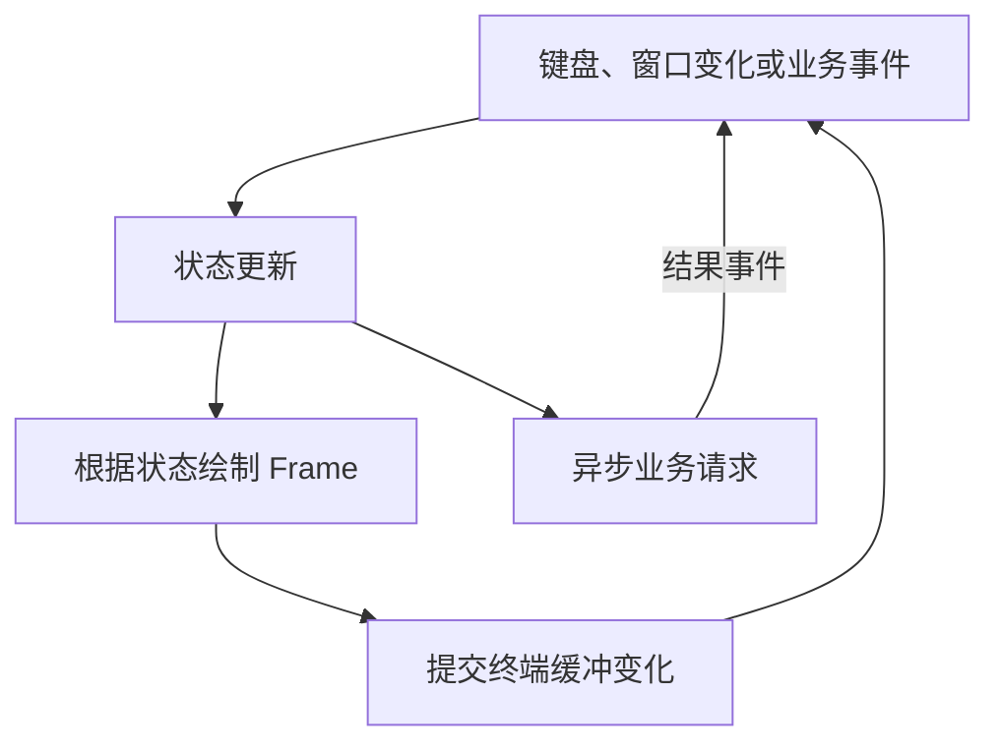

# E10 常用领域工具：CLI、TUI、CPU 并行与互操作

[返回总目录](../README.md) · [生态地图](02-stack-decisions.md) · [日常错误与观测工具](14-errors-and-observability.md)

核心语言和生命周期掌握后，再选一到两个方向深入。本篇给出原理、最小使用路径与验收题，避免所有方向同时堆进主项目。

## clap：从手工 args 到类型化 CLI

clap 支持 builder 和 derive 两条路线，解析参数、选项、子命令并生成帮助。derive 根据结构体/枚举与属性建立解析协议；它不负责你的业务验证。[clap tutorial](https://docs.rs/clap/latest/clap/_derive/_tutorial/index.html)。

独立练习依赖 `clap = { version = "4", features = ["derive"] }`：

```rust,ignore
use clap::Parser;

#[derive(Parser)]
#[command(version, about = "Count lines in a local file")]
struct Args {
    path: std::path::PathBuf,
    #[arg(long, default_value_t = 1000)]
    max_lines: usize,
}

fn main() {
    let args = Args::parse();
    println!("path={}, max_lines={}", args.path.display(), args.max_lines);
}
```

下一步用 TryFrom 把 Args 转成已验证配置，拒绝零上限，设计 stdout/stderr 与退出码。测试用 try_parse_from 注入参数，避免操纵全局进程参数或每次启动子进程。geer-agent 交互命令有自己的 parser，不能只因学 clap 就把 REPL 改成 CLI 参数框架。

## Ratatui/Crossterm：状态、事件和绘制

Ratatui 描述终端 widget 与 Frame/Buffer，Crossterm 提供终端模式、输入事件等平台能力。典型循环是读事件 → 更新应用状态 → 重绘，不应在渲染函数中执行网络或数据库写入。[Ratatui rendering](https://ratatui.rs/concepts/rendering/)。



raw mode、alternate screen、光标和输入线程都要在正常、失败和关闭路径恢复。消息列表、滚动位置和输入草稿应是可独立测试的状态，终端尺寸改变不能使下标越界。项目练习：[ui/tui](../../../src/ui/tui/mod.rs)。

## Rayon：CPU 并行迭代

独立练习依赖 `rayon = "1"`，下面计算没有外部 I/O：

```rust,ignore
use rayon::prelude::*;

fn main() {
    let values: Vec<u64> = (0..10_000).collect();
    let sum: u64 = values.par_iter().map(|value| value * value).sum();
    let sequential: u64 = values.iter().map(|value| value * value).sum();
    assert_eq!(sum, sequential);
}
```

par_iter 表达可并行的读取，闭包捕获必须满足相应线程约束。使用受限 ThreadPoolBuilder 设置 CPU 线程预算，别把示例“输出一致”当性能证据；先做输入规模和耗时对照。[Rayon](https://docs.rs/rayon/latest/rayon/)。

## egui/eframe 与 Iced

egui 是即时模式 GUI：每帧根据应用状态声明界面，eframe 提供常用宿主/运行集成。Iced 采用状态、消息、更新和视图的组织方式。二者都可以用 Rust 写 UI，Tauri 则复用 Web 前端；选择与 UI 能力、平台集成和团队经验有关。[egui](https://docs.rs/egui/latest/egui/)、[Iced Book](https://book.iced.rs/)。

练习：用一种方案做“开始任务、进度、取消”窗口，业务代码保持独立；解释重绘期间不能阻塞、结果怎样回到 UI，以及关闭窗口后谁回收任务。不要把桌面方案选择缩成“哪个界面看起来更现代”。

## Web 全栈 Rust 的选修边界

Leptos、Dioxus、Yew 等提供 Rust UI/组件路线，SSR、hydration、Wasm 与宿主支持各有侧重。学习时先选一个官方入门并确认目标形态，不要因后端 Rust 就假设前端必须改写为 Rust。geer-agent 已有共用 React/TS 包，继续使用它有明显的增量成本优势。[Leptos Book](https://book.leptos.dev/)、[Dioxus 0.7 文档](https://dioxuslabs.com/learn/0.7/)、[Yew](https://yew.rs/docs/getting-started/introduction)。

## Wasm：浏览器与 WASI 是两条宿主路径

wasm-bindgen 生成 Rust 与 JavaScript 的互操作适配，浏览器中的 Wasm 不直接拥有 std::net 或任意文件系统。WASI 提供另一组宿主接口与权限模型，不等于浏览器环境。[wasm-bindgen guide](https://rustwasm.github.io/docs/wasm-bindgen/)、[WASI](https://wasi.dev/)。

实践顺序：纯计算函数 → 确认目标 → 构建绑定 → JS 调用 → 观察跨边界复制与错误表示。返回大量字符串、数组和反复跨边界小调用可能有明显成本；Wasm 不是所有前端代码自动更快。

## PyO3、CXX 与 C ABI

PyO3 把 Rust 能力暴露给 Python，适合保留 Python 编排而用 Rust 实现明确热点；Python 版本、解释器线程模型和扩展打包要按对应版本确认。[PyO3 guide](https://pyo3.rs/)。

CXX 为 Rust/C++ 提供受约束的桥接与生成代码；它减少接口适配风险，但不能让任意 C++ 生命周期、异常和并发自动变成安全。[CXX](https://cxx.rs/)。直接 C ABI 则必须说明布局、调用约定、谁分配/释放、错误和线程规则。[Rustonomicon FFI](https://doc.rust-lang.org/nomicon/ffi.html)。

本仓库禁止 unsafe，互操作章节用于理解边界，相关实作放经过单独评审的独立练习，不在主项目加入裸指针演示。

## 嵌入式与 Embassy

no_std、HAL、interrupt、静态资源与目标内存约束是嵌入式基础；Embassy 将 async 任务与硬件/中断环境连接。它与桌面 Tokio 的执行环境不同，不能假设有 OS 线程、文件系统或同样的 allocator。[Embedded Book](https://doc.rust-lang.org/embedded-book/)、[embedded-hal](https://docs.rs/embedded-hal/latest/embedded_hal/)、[Embassy Book](https://embassy.dev/book/)。

先做仿真或受控板卡上的单个能力，说明任务唤醒来源和资源上限；无需为学习业务 Rust 同时采购硬件。

## 方向验收

每选一个方向，交付一个最小可运行程序，画执行/数据流，记录平台与版本，并回答：状态由谁拥有、工作在哪里执行、错误怎样跨边界、资源如何限制、退出如何清理。能回答这些问题才是真正学会使用框架。
