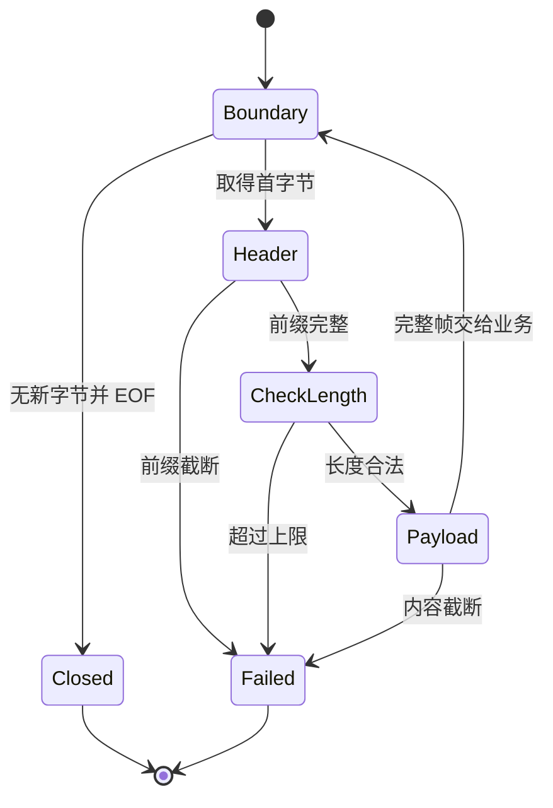

# E11 Tokio 深入练习：分帧、半包、取消与任务回收

[返回总目录](../README.md) · [前置实战](04-tokio-workshop.md) · [Future 实验](../02-advanced/15-future-send-and-pin-workshop.md)

从 TCP/文件得到的是字节流，应用消息边界需要自己定义。本篇先在有限的内存字节流里验证协议，再迁移到本机 TCP；避免用网络偶发性来解释正确性。

## 协议先写成契约

采用四字节大端长度前缀，payload 上限 512 字节，零长度是合法消息：

```text
| u32 big-endian length | length bytes payload |
```

新帧开头读到 EOF 表示正常结束；前缀或 payload 中途 EOF 表示截断错误。长度超限必须在分配 payload 前拒绝。这里 payload 是字节，不默认它一定是 UTF-8。



## 完整程序：分片传输与失败输入

独立练习包只需 Tokio 的 macros/rt/time/io-util feature。本例用 duplex(8) 故意使缓冲小于一部分消息，读写必须交替推进。[duplex](https://docs.rs/tokio/latest/tokio/io/fn.duplex.html)、[AsyncReadExt](https://docs.rs/tokio/latest/tokio/io/trait.AsyncReadExt.html)。

```toml
[dependencies]
tokio = { version = "1", features = ["macros", "rt", "time", "io-util"] }
```

```rust,ignore
use std::{io, time::Duration};
use tokio::io::{AsyncRead, AsyncReadExt, AsyncWrite, AsyncWriteExt};

const MAX_FRAME: usize = 512;

async fn read_frame<R: AsyncRead + Unpin>(reader: &mut R) -> io::Result<Option<Vec<u8>>> {
    let mut header = [0_u8; 4];
    if reader.read(&mut header[..1]).await? == 0 {
        return Ok(None);
    }
    reader.read_exact(&mut header[1..]).await?;
    let length = usize::try_from(u32::from_be_bytes(header))
        .map_err(|_| io::Error::new(io::ErrorKind::InvalidData, "length out of range"))?;
    if length > MAX_FRAME {
        return Err(io::Error::new(io::ErrorKind::InvalidData, "frame too large"));
    }
    let mut body = vec![0; length];
    reader.read_exact(&mut body).await?;
    Ok(Some(body))
}

async fn write_frame<W: AsyncWrite + Unpin>(writer: &mut W, body: &[u8]) -> io::Result<()> {
    if body.len() > MAX_FRAME {
        return Err(io::Error::new(io::ErrorKind::InvalidInput, "frame too large"));
    }
    let length = u32::try_from(body.len())
        .map_err(|_| io::Error::new(io::ErrorKind::InvalidInput, "length out of range"))?;
    writer.write_all(&length.to_be_bytes()).await?;
    writer.write_all(body).await
}

async fn truncated(raw: &[u8], expected: io::ErrorKind) -> io::Result<()> {
    let (mut writer, mut reader) = tokio::io::duplex(64);
    writer.write_all(raw).await?;
    writer.shutdown().await?;
    let error = read_frame(&mut reader).await.expect_err("fixture must be rejected");
    assert_eq!(error.kind(), expected);
    Ok(())
}

async fn exercise() -> io::Result<()> {
    let expected = vec![b"hello".to_vec(), "Rust 中文".as_bytes().to_vec(), vec![]];
    let input = expected.clone();
    let (mut writer, mut reader) = tokio::io::duplex(8);
    let send = async move {
        for body in input {
            write_frame(&mut writer, &body).await?;
        }
        writer.shutdown().await
    };
    let receive = async move {
        let mut output = Vec::new();
        while let Some(body) = read_frame(&mut reader).await? {
            output.push(body);
        }
        assert_eq!(output, expected);
        Ok::<(), io::Error>(())
    };
    tokio::try_join!(send, receive)?;

    truncated(&[0, 0], io::ErrorKind::UnexpectedEof).await?;
    truncated(&[0, 0, 0, 3, b'a'], io::ErrorKind::UnexpectedEof).await?;
    truncated(&513_u32.to_be_bytes(), io::ErrorKind::InvalidData).await?;
    Ok(())
}

#[tokio::main(flavor = "current_thread")]
async fn main() -> Result<(), Box<dyn std::error::Error>> {
    tokio::time::timeout(Duration::from_secs(2), exercise()).await??;
    Ok(())
}
```

try_join 在同一任务里推进发送与接收，没有创建游离任务。总超时丢弃这一组 Future，也释放它们拥有的流。例子中的 Vec 输出只有三项；真实长连接不能无限累积历史帧。

为什么不一上来 `read_exact(&mut [u8; 4])`？它能读取前缀，却无法单靠 UnexpectedEof 区分“新帧前正常 EOF”和“只收到两字节的截断”；本例先读一个字节建立帧是否已开始的事实。

## 这个 read_frame 不是可随意重建的取消安全操作

read_frame 将已读前缀和 payload 进度放在当前 Future 的局部变量里。若 select/timeout 在中途丢弃它，再从同一连接重新调用 read_frame，解析会从残余字节开始，协议位置已经错了。

可选设计：取消后关闭连接；或将解析缓冲与阶段放进连接对象，在下一次调用继续推进。本篇程序采用整体结束/释放流的策略。成熟协议可考虑 tokio-util codec/Framed，但仍需配置帧上限与业务背压。[取消安全](https://docs.rs/tokio/latest/tokio/macro.select.html#cancellation-safety)、[Tokio framing](https://tokio.rs/tokio/tutorial/framing)。

write_all 也可能已发送部分消息。取消后外部已经观察到的字节不会倒退；协议必须定义断线重试、请求 ID 和幂等处理。

## 完整程序：通知关闭，超过期限后取消并回收

下面四个任务中三个配合关闭，第四个故意永远 Pending，以验证强制收敛路径。故障是有限任务，不创建递归或无界资源。

```rust,ignore
use std::{error::Error, sync::{Arc, atomic::{AtomicUsize, Ordering}}, time::Duration};
use tokio::{sync::watch, task::JoinSet};

struct Reclaimed(Arc<AtomicUsize>);
impl Drop for Reclaimed {
    fn drop(&mut self) { self.0.fetch_add(1, Ordering::Relaxed); }
}

#[tokio::main(flavor = "current_thread")]
async fn main() -> Result<(), Box<dyn Error>> {
    let reclaimed = Arc::new(AtomicUsize::new(0));
    let (cancel, receiver) = watch::channel(false);
    let mut tasks = JoinSet::new();
    for id in 0..4 {
        let mut stop = receiver.clone();
        let resource = Reclaimed(Arc::clone(&reclaimed));
        tasks.spawn(async move {
            let _resource = resource;
            if id == 3 {
                std::future::pending::<()>().await;
            }
            loop {
                if *stop.borrow_and_update() { break; }
                if stop.changed().await.is_err() { break; }
            }
            id
        });
    }
    cancel.send(true)?;
    let drain = async {
        while let Some(result) = tasks.join_next().await {
            let _id = result?;
        }
        Ok::<(), tokio::task::JoinError>(())
    };
    match tokio::time::timeout(Duration::from_millis(20), drain).await {
        Ok(result) => result?,
        Err(_) => {
            tasks.abort_all();
            while let Some(result) = tasks.join_next().await {
                match result {
                    Ok(_) => {},
                    Err(error) if error.is_cancelled() => {},
                    Err(error) => return Err(error.into()),
                }
            }
        }
    }
    assert_eq!(reclaimed.load(Ordering::Relaxed), 4);
    Ok(())
}
```

watch 传递最新停止状态，borrow_and_update/changed 的组合避免忽略已到达的更新。abort_all 只是发出取消请求，join_next 排空之后才验证资源 Drop。第 4 个任务停在可取消的 Pending，不是运行永不让出的 CPU 循环。[watch](https://docs.rs/tokio/latest/tokio/sync/watch/index.html)、[JoinSet](https://docs.rs/tokio/latest/tokio/task/struct.JoinSet.html)。

对已经启动的 spawn_blocking 闭包，上述 abort 路径不足以保证结束；它必须有自己的有限执行边界和合作式停止。本仓库的 cgroup 测试隔离是外层兜底，不能由 Drop 或 JoinSet 替代。

## 迁移到真实网络时增加什么

| 边界 | 内存练习已有 | 本机 TCP / 服务必须另加 |
| --- | --- | --- |
| 协议 | 前缀、EOF、帧上限 | 版本、消息类型、认证与业务验证 |
| 等待 | 整体两秒练习期限 | connect、空闲、每帧和整个请求预算 |
| 并发 | 一个读写对 | 连接数、在途请求、队列和总字节上限 |
| 关闭 | 完成释放、有限取消 | 停 accept、通知连接、等待、记录未完成状态 |
| 观测 | assert | trace ID、错误分类、排队与 I/O 耗时 |

下一项练习：用 `127.0.0.1:0` 和最多三个连接重复相同故障输入；所有客户端和服务端都有期限，并通过仓库安全入口运行。验收时解释缓冲上限、消息上限与在途请求上限为何是三种限制。
