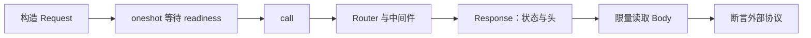

# E12 Axum/Tower 实战：不启动端口也能验证请求契约

[返回总目录](../README.md) · [Web 原理](05-axum-and-tower.md) · [服务工程](../03-engineering/11-production-services.md)

业务 handler、路由与中间件可以直接接收 HTTP Request，不必每个用例都启动服务器。此层能验证协议行为，真实网络、TLS、代理和 WebSocket 仍需要另一个层次的验收。

## ServiceExt::oneshot 做了什么

它接管一个 Service，等待 readiness，再调用请求并等待响应 Future。使用 Router.clone 是克隆服务句柄，不是为每个请求复制一份数据库。State 若持有 Arc/Pool/Client，仍使用所指共享状态。[ServiceExt](https://docs.rs/tower/latest/tower/trait.ServiceExt.html)。



HTTP 服务通常返回 Response 时 body 还可能是流。Tower Timeout 对响应 Future 的完成计时，不自动把后续整个 body 消费纳入同一个超时；客户端应为 body 读取另定剩余预算。[Tower Timeout](https://docs.rs/tower/latest/tower/timeout/struct.Timeout.html)。

## 完整程序：正常请求、无效输入、大小限制与超时

独立包依赖：

```toml
[dependencies]
axum = "0.8"
serde = { version = "1", features = ["derive"] }
tokio = { version = "1", features = ["macros", "rt", "time"] }
tower = { version = "0.5", features = ["util", "timeout"] }
```

以下是有限的 main 验证程序，全部操作在内存中完成：

```rust,ignore
use std::{error::Error, sync::{Arc, Mutex}, time::Duration};
use axum::{
    body::{Body, to_bytes},
    error_handling::HandleErrorLayer,
    extract::{DefaultBodyLimit, State},
    http::{Request, StatusCode},
    routing::{get, post},
    BoxError, Json, Router,
};
use serde::{Deserialize, Serialize};
use tower::{ServiceBuilder, ServiceExt};

#[derive(Deserialize)]
#[serde(deny_unknown_fields)]
struct Input { amount: u32 }

#[derive(Serialize)]
struct Output { value: u32 }

async fn increment(
    State(counter): State<Arc<Mutex<u32>>>,
    Json(input): Json<Input>,
) -> Result<Json<Output>, StatusCode> {
    if !(1..=100).contains(&input.amount) {
        return Err(StatusCode::BAD_REQUEST);
    }
    let mut value = counter.lock().map_err(|_| StatusCode::INTERNAL_SERVER_ERROR)?;
    *value = value.checked_add(input.amount).ok_or(StatusCode::CONFLICT)?;
    Ok(Json(Output { value: *value }))
}

async fn map_service_error(error: BoxError) -> StatusCode {
    if error.is::<tower::timeout::error::Elapsed>() {
        StatusCode::GATEWAY_TIMEOUT
    } else {
        StatusCode::INTERNAL_SERVER_ERROR
    }
}

fn app() -> Router {
    Router::new()
        .route("/counter", post(increment))
        .route("/slow", get(|| async { std::future::pending::<&'static str>().await }))
        .layer(DefaultBodyLimit::max(64))
        .layer(ServiceBuilder::new()
            .layer(HandleErrorLayer::new(map_service_error))
            .timeout(Duration::from_millis(20)))
        .with_state(Arc::new(Mutex::new(0_u32)))
}

fn request(body: &str) -> Result<Request<Body>, axum::http::Error> {
    Request::post("/counter")
        .header("content-type", "application/json")
        .body(Body::from(body.to_owned()))
}

#[tokio::main(flavor = "current_thread")]
async fn main() -> Result<(), Box<dyn Error>> {
    let exercise = async {
        let app = app();
        let response = app.clone().oneshot(request(r#"{"amount":3}"#)?).await?;
        assert_eq!(response.status(), StatusCode::OK);
        let body = to_bytes(response.into_body(), 1024).await?;
        assert_eq!(&body[..], br#"{"value":3}"#);

        let invalid = app.clone().oneshot(request(r#"{"amount":0}"#)?).await?;
        assert_eq!(invalid.status(), StatusCode::BAD_REQUEST);
        let malformed = app.clone().oneshot(request("{")?).await?;
        assert!(malformed.status().is_client_error());
        let large = format!(r#"{{"amount":1,"padding":"{}"}}"#, "x".repeat(64));
        let too_large = app.clone().oneshot(request(&large)?).await?;
        assert_eq!(too_large.status(), StatusCode::PAYLOAD_TOO_LARGE);
        let wrong_method = app.clone().oneshot(Request::get("/counter").body(Body::empty())?).await?;
        assert_eq!(wrong_method.status(), StatusCode::METHOD_NOT_ALLOWED);
        let slow = app.oneshot(Request::get("/slow").body(Body::empty())?).await?;
        assert_eq!(slow.status(), StatusCode::GATEWAY_TIMEOUT);
        Ok::<(), Box<dyn Error>>(())
    };
    tokio::time::timeout(Duration::from_secs(2), exercise).await??;
    Ok(())
}
```

实际项目测试可以把 main 内的行为分成测试用例；本篇用有限程序便于复制并统一隔离验证。`/slow` 等待永不完成但会让出执行权的 Future，专门验证 Timeout 路径，不能改成无限忙循环。

HandleErrorLayer 在 Timeout 外层，把 service error 转成 HTTP 状态；正常业务错误通过 handler 的 IntoResponse 转换。64 字节限制用于练习，真实 API 根据协议设值。[Axum error handling](https://docs.rs/axum/latest/axum/error_handling/index.html)、[DefaultBodyLimit](https://docs.rs/axum/latest/axum/extract/struct.DefaultBodyLimit.html)。

## 从这个程序继续增加四层证据

| 层 | 要验证的内容 | 不替代什么 |
| --- | --- | --- |
| 纯业务 | 输入、状态变更、错误、溢出 | extractor 与路由行为 |
| Router | HTTP 方法、结构、限额、错误响应 | 真正的传输与部署 |
| 本机服务 | 临时端口、请求结束、断连、关闭 | 代理、TLS 与目标系统配置 |
| 部署验收 | 地址、证书、资源预算、监控与退出 | 持续的业务故障分析 |

错误响应从 StatusCode 升级为固定 `{ code, message, request_id }` 后，用实际返回 JSON 验证；不要只断言内部 Err 变体。JsonRejection 的默认响应也是对外行为，若要统一错误协议，需要显式捕获并映射。

## 排队、超时和响应流要分别计时

```text
调用方等待 readiness → call → handler/上游等待 → Response 产生 → Body 读取结束
```

`timeout(total, service.oneshot(request))` 能覆盖调用方看到的 readiness 与响应 Future；结束后继续读 body 时，还需要使用同一个 deadline 的剩余时间。单纯叠加多个固定 timeout 可能让总请求远超预算。

ConcurrencyLimit 的许可等待在 poll_ready；Buffer 的排队又有自己的边界。Axum Router 对路由服务的 readiness 有专门策略，不应假设普通 Tower 背压设计在 Router 内原样成立。容量上限、LoadShed/拒绝路径与许可持有时间应由一项饱和实验说明。[Axum routing and backpressure](https://docs.rs/axum/latest/axum/middleware/index.html#routing-to-servicesmiddleware-and-backpressure)。

验收：分别解释 400、413、405、504 由哪一层产生；再加入查询接口，证明非法请求没有改变计数值。不要以“服务编译成功”替代协议行为已经正确。
