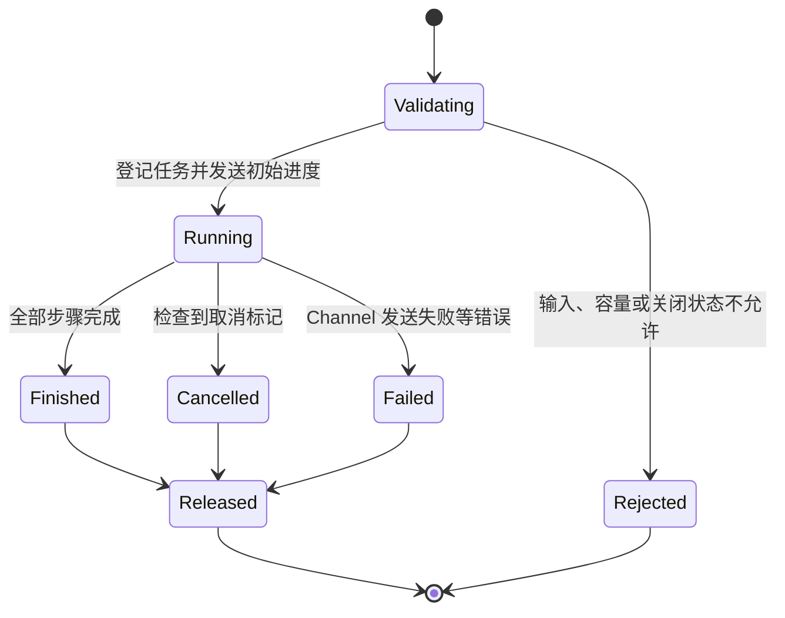
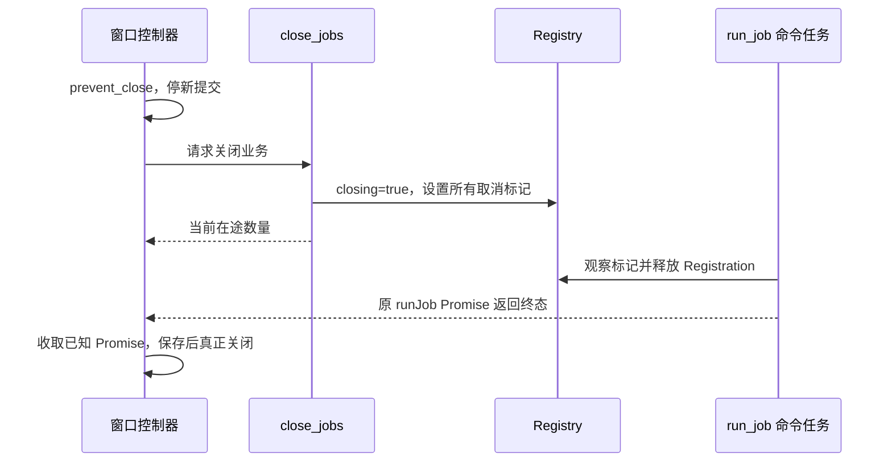

# E13 Tauri 长任务：协议、取消、资源与窗口生命周期

[返回总目录](../README.md) · [Tauri 原理](08-tauri-architecture.md) · [入门使用](09-tauri-workshop.md)

计数器练习说明 invoke/State，真实应用更难的是任务进行中发生取消、断开与关闭。本篇完成一个最多两个任务、每项最多二十步的有限练习；它不引入任务平台或持久后台服务。

## 两种 command 协议都可行

| 协议 | Promise 何时完成 | 谁追踪后台任务 |
| --- | --- | --- |
| run_job | 任务结束时返回终态 | 本次 async command 的执行任务 |
| submit_job | 接受后立即返回任务 ID | 应用拥有的 worker/任务集合 |

本篇选 run_job：进度通过 Channel 发送，最终结果通过 Promise 返回。这样不必再自行 spawn 一个任务然后丢掉句柄。若需要窗口关闭后继续、任务恢复或保存结果，必须另建应用级拥有者与快照协议。

Tauri async command 由框架调度成异步任务；普通同步 command 默认在主线程执行，不能用它直接做长 I/O/CPU 工作。async 也不能让同步阻塞调用自动变成非阻塞。[async commands](https://v2.tauri.app/develop/calling-rust/#async-commands)、[async_runtime](https://docs.rs/tauri/latest/tauri/async_runtime/index.html)。

## 最小协议与状态



取消 command 的成功表示登记了意图；终态仍由 run_job 决定。取消和最后一步同时发生时，可能先得到 finished。UI 不能把“取消请求已送出”直接当作“任务已经没有副作用”。

## Rust：完整命令与注册适配

放进独立 Tauri 2 模板的一个 Rust 模块；依赖是 tauri/serde 和 Tokio 的 time feature。configure 接受 Builder，模板入口调用 configure 后继续使用自己的 generate_context/run。此模块不需要自己创建第二个 Tokio runtime。

```toml
# 独立练习包已有 tauri 和 serde；只补实际用到的 Tokio 能力。
tokio = { version = "1", features = ["time"] }
```

```rust,ignore
use std::{
    collections::HashMap,
    sync::{Arc, Mutex, atomic::{AtomicBool, Ordering}},
    time::Duration,
};
use serde::Serialize;
use tauri::{ipc::Channel, State};

#[derive(Debug, Serialize)]
#[serde(tag = "code", rename_all = "snake_case")]
enum CommandError {
    InvalidInput, DuplicateId, Busy, Closing, StateUnavailable, ProgressUnavailable,
}

#[derive(Default)]
struct Inner {
    closing: bool,
    jobs: HashMap<String, Arc<AtomicBool>>,
}

#[derive(Default)]
struct Registry {
    inner: Mutex<Inner>,
}

struct Registration {
    registry: Arc<Registry>,
    id: String,
    cancelled: Arc<AtomicBool>,
}

impl Registry {
    fn register(self: &Arc<Self>, id: String) -> Result<Registration, CommandError> {
        let mut inner = self.inner.lock().map_err(|_| CommandError::StateUnavailable)?;
        if inner.closing { return Err(CommandError::Closing); }
        if inner.jobs.contains_key(&id) { return Err(CommandError::DuplicateId); }
        if inner.jobs.len() >= 2 { return Err(CommandError::Busy); }
        let cancelled = Arc::new(AtomicBool::new(false));
        inner.jobs.insert(id.clone(), Arc::clone(&cancelled));
        Ok(Registration { registry: Arc::clone(self), id, cancelled })
    }
}

impl Drop for Registration {
    fn drop(&mut self) {
        // 登记项与本次命令同寿命，所有正常/错误返回都移除它。
        // 锁若已 poison，后续命令会拒绝使用状态，而非假装恢复。
        if let Ok(mut inner) = self.registry.inner.lock() {
            inner.jobs.remove(&self.id);
        }
    }
}

#[derive(Serialize)]
struct Progress {
    id: String,
    completed: u32,
    total: u32,
}

#[derive(Serialize)]
#[serde(rename_all = "snake_case")]
enum End { Finished, Cancelled }

#[derive(Serialize)]
struct Outcome {
    id: String,
    status: End,
    completed: u32,
}

#[tauri::command]
async fn run_job(
    state: State<'_, Arc<Registry>>,
    id: String,
    steps: u32,
    on_progress: Channel<Progress>,
) -> Result<Outcome, CommandError> {
    if id.is_empty() || id.len() > 64 || !id.bytes().all(|b| b.is_ascii_alphanumeric() || b == b'-')
        || !(1..=20).contains(&steps) {
        return Err(CommandError::InvalidInput);
    }
    let registry = Arc::clone(state.inner());
    let registration = registry.register(id.clone())?;
    on_progress.send(Progress { id: id.clone(), completed: 0, total: steps })
        .map_err(|_| CommandError::ProgressUnavailable)?;
    for completed in 1..=steps {
        tokio::time::sleep(Duration::from_millis(10)).await;
        if registration.cancelled.load(Ordering::Relaxed) {
            return Ok(Outcome { id, status: End::Cancelled, completed: completed - 1 });
        }
        on_progress.send(Progress { id: id.clone(), completed, total: steps })
            .map_err(|_| CommandError::ProgressUnavailable)?;
    }
    Ok(Outcome { id, status: End::Finished, completed: steps })
}

#[tauri::command]
fn cancel_job(state: State<'_, Arc<Registry>>, id: String) -> Result<bool, CommandError> {
    let inner = state.inner().inner.lock().map_err(|_| CommandError::StateUnavailable)?;
    let Some(cancelled) = inner.jobs.get(&id) else { return Ok(false); };
    // 只传递一个标记，不借此发布其他内存数据。
    cancelled.store(true, Ordering::Relaxed);
    Ok(true)
}

#[tauri::command]
fn close_jobs(state: State<'_, Arc<Registry>>) -> Result<usize, CommandError> {
    let mut inner = state.inner().inner.lock().map_err(|_| CommandError::StateUnavailable)?;
    inner.closing = true;
    for cancelled in inner.jobs.values() {
        cancelled.store(true, Ordering::Relaxed);
    }
    Ok(inner.jobs.len())
}

pub fn configure<R: tauri::Runtime>(builder: tauri::Builder<R>) -> tauri::Builder<R> {
    builder.manage(Arc::new(Registry::default()))
        .invoke_handler(tauri::generate_handler![run_job, cancel_job, close_jobs])
}
```

调用 State 取出的具体类型必须与 manage 的 `Arc<Registry>` 相同。这里克隆拥有句柄，再由 Registration 管理登记项；Mutex guard 从不跨 await。返回 Result 同时满足 async command 使用借用状态时的适配要求；遇到这类宏错误，应核对匹配版本的官方说明。[managed state](https://v2.tauri.app/develop/state-management/)、[command 参数与返回](https://v2.tauri.app/develop/calling-rust/)。

模板入口仍负责 generate_context 和启动错误处理。configure 的 invoke_handler 应注册完整应用命令列表；别先调用一次 invoke_handler，后面再调用一次并以为会自动合并。

## 前端：对应的协议与取消调用

```typescript
import { Channel, invoke } from "@tauri-apps/api/core";

export type Progress = { id: string; completed: number; total: number };
export type Outcome = { id: string; status: "finished" | "cancelled"; completed: number };

export function runJob(id: string, steps: number, onProgress: (p: Progress) => void) {
  const progress = new Channel<Progress>();
  progress.onmessage = (event) => {
    if (event.id === id) onProgress(event);
  };
  return invoke<Outcome>("run_job", { id, steps, onProgress: progress });
}

export function cancelJob(id: string) {
  return invoke<boolean>("cancel_job", { id });
}

export function closeJobs() {
  return invoke<number>("close_jobs");
}
```

调用方保存每个 runJob 返回的 Promise，捕获 reject，并在它完成后更新终态。id 可用 `crypto.randomUUID()`，本次窗口生命周期内不复用；本例只拒绝在途重复 ID，不保存无限历史去重表。TypeScript 类型不验证运行时 JSON，外部或可演进协议可另外做结构解析。[Channel](https://v2.tauri.app/develop/calling-frontend/#channels)。

组件卸载后停止更新已失效 UI，同时明确是否发 cancelJob；单纯忘记 Promise 或删除 JS 引用不能作为后端取消协议。Channel.send 失败映射为进度通道不可用，不凭它确定具体断开原因；返回成功也不能证明 React 已渲染、用户已看到或数据已持久化。

## 关闭流程：先停止接受，再等已知任务结束



实际 UI 控制器需要幂等关闭标记、已知 Promise 集合、总关闭期限与失败提示。关闭窗口后重开仍使用同一个 Registry 时，closing 不会自动恢复；应重新创建业务生命周期或定义明确的 reopen 操作。

该练习没有需要保存的业务数据。接到“运行步骤”之外的文件写入、数据库提交、模型调用时，要另行区分取消检查点、结果未知和最终保存；不能让 UI 设置一个 bool 就声称已经撤销外部副作用。已有 worker 模式见 [AppRuntime](../../../src/ui/app/runtime.rs)、[close](../../../src/ui/app/close.rs)。

## 输入与权限检查仍是另一层

| 约束 | 本例提供 | 实际应用要补 |
| --- | --- | --- |
| 任务容量 | 最多两个已登记任务 | IPC 输入总体大小、窗口与用户授权 |
| 执行范围 | 最多二十个短异步步骤 | 外部服务期限、CPU/阻塞预算 |
| ID | 长度、字符、在途重复检查 | 幂等与持久结果的业务语义 |
| 关闭 | 拒新任务、通知已知任务 | 窗口回调、保存、总期限与重开 |
| 进度 | 最多二十一次有限消息 | 大流节流、快照恢复与慢客户端策略 |

自定义 command 的注册不自动形成文件 scope 或完整 capability 策略；插件权限、应用 command 权限、窗口来源和业务路径验证分别核对。多窗口情况下，应绑定任务所属窗口并拒绝另一个窗口取消它。[capabilities](https://v2.tauri.app/security/capabilities/)、[permissions](https://v2.tauri.app/security/permissions/)。

验收：同时运行两个任务，第三个被拒绝；取消其中一个并看到它的真正终态；验证步骤越界、重复 ID、断开与关闭后新提交。把“命令模块能编译”和“目标系统 WebView/窗口行为已经验收”分别记录。
