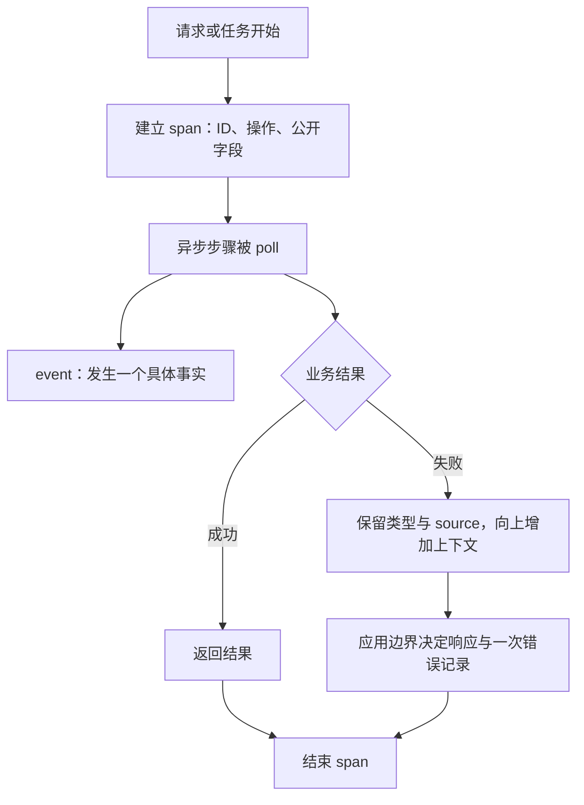

# E14 日常工程组合：thiserror、anyhow 与 tracing

[返回总目录](../README.md) · [错误模型](../06-go-to-rust/03-types-traits-and-errors.md) · [服务工程](../03-engineering/11-production-services.md)

错误要能分类处理，诊断要保留上下文，可观测记录要关联一次工作。三个 crate 分别减少这些领域的样板代码，不能互相替代。

## 工具各自生成或保存什么

| 工具 | 主要职责 | 保留的边界 |
| --- | --- | --- |
| thiserror | 为自定义错误生成 Display/Error/From 等实现 | 错误类别由自己的 enum/struct 定义 |
| anyhow | 在应用组合处汇总不同错误，增加 context 和原因链 | 公共库/协议仍可需要稳定可处理类别 |
| tracing | 定义 event、span 和结构化字段 | 不自行决定输出、存储或收集服务 |
| tracing-subscriber | 消费、过滤、格式化或组合事件处理 | 应用入口负责初始化与输出策略 |

thiserror 的 from 同时指明 source；额外行号、请求 ID 等上下文通常在自己的错误字段或应用 context 中表达。anyhow 不要求所有底层函数都返回 anyhow::Result。[thiserror](https://docs.rs/thiserror/latest/thiserror/)、[anyhow](https://docs.rs/anyhow/latest/anyhow/)。

## 完整练习：类型化错误与异步 span

独立 Cargo 包：

```toml
[dependencies]
anyhow = "1"
thiserror = "2"
tracing = { version = "0.1", features = ["attributes"] }
tracing-subscriber = { version = "0.3", default-features = false, features = ["fmt"] }
tokio = { version = "1", features = ["macros", "rt", "time"] }
```

```rust,ignore
use std::{num::ParseIntError, time::Duration};
use anyhow::Context;
use thiserror::Error;
use tracing::info;
use tracing_subscriber::fmt::format::FmtSpan;

#[derive(Debug, Error)]
enum InputError {
    #[error("limit must be an integer")]
    NotInteger(#[from] ParseIntError),
    #[error("limit must be between 1 and 10")]
    OutOfRange,
}

#[tracing::instrument(skip(input), fields(input_bytes = input.len()))]
async fn process(request_id: u64, input: String) -> Result<u16, InputError> {
    let limit: u16 = input.parse()?;
    if !(1..=10).contains(&limit) { return Err(InputError::OutOfRange); }
    tokio::time::sleep(Duration::from_millis(5)).await;
    info!(limit, "input accepted");
    Ok(limit)
}

#[tokio::main(flavor = "current_thread")]
async fn main() -> anyhow::Result<()> {
    let subscriber = tracing_subscriber::fmt()
        .with_max_level(tracing::Level::INFO)
        .with_ansi(false)
        .with_span_events(FmtSpan::CLOSE)
        .with_writer(std::io::stderr)
        .finish();
    tracing::subscriber::set_global_default(subscriber)
        .context("install tracing subscriber")?;

    assert_eq!(process(7, "3".to_owned()).await.context("request 7 failed")?, 3);
    let invalid = process(8, "wrong".to_owned()).await;
    assert!(matches!(&invalid, Err(InputError::NotInteger(_))));
    let report = invalid.context("request 8 failed").expect_err("fixture is not an integer");
    assert!(report.downcast_ref::<InputError>().is_some());
    eprintln!("{report:#}");
    assert!(matches!(process(9, "0".to_owned()).await, Err(InputError::OutOfRange)));
    Ok(())
}
```

库逻辑返回 InputError，应用增加请求上下文；展示完整原因链不等于将字符串当成错误分类。input 被 skip，只记录字节数与可公开请求 ID；derive Debug 和 instrument 的默认参数记录都需要按实际字段审查。[instrument](https://docs.rs/tracing/latest/tracing/attr.instrument.html)、[fmt subscriber](https://docs.rs/tracing-subscriber/latest/tracing_subscriber/fmt/index.html)。

该程序的失败是预期输入用例，main 最终成功；真实 CLI 的不可恢复失败需要返回非零状态。不要为了“程序运行成功”吞掉实际失败。

## span 与 event、错误日志的关系



span 表达一段工作和关联关系，event 表达一次发生；错误 source 表达原因链。不是每个错误都要每层重复打印，也不是每个 span 都应带上原始输入。

## 不要跨 await 保留同步 enter guard

同步 `span.enter()` 改变当前线程上下文，若 guard 跨 await 保存，线程在暂停后可能执行别的任务，关联就会错乱。对 Future 使用 instrument 宏或 Instrument::instrument 等异步适配，让上下文与 poll 关联。[Instrument](https://docs.rs/tracing/latest/tracing/trait.Instrument.html)。

spawn 的上下文传播要显式检查，可用 in_current_span/instrument；不能仅因为创建任务发生在某 span 内，就推定所有后续事件都有正确父级。业务取消、任务失败与外部请求 ID 仍有自己的生命周期。

## 从练习走向实际应用

| 变化 | 先确定什么 |
| --- | --- |
| 文本 → JSON 日志 | 固定字段、时间格式、日志消费者和脱敏 |
| 多层 subscriber | 各层过滤与重复输出是否符合预期 |
| 缓冲写入 | 队列上限、丢弃/阻塞策略、退出刷新 |
| 分布式 trace | trace context 的跨协议传播、采样与 exporter |
| 性能指标 | 排队、处理、上游等待分别计时；避免无限 label |
| 错误协议 | 稳定 code 和用户文本，内部原因留在诊断边界 |

tracing 并不自动提供 OpenTelemetry collector、指标系统或任务进度协议。进程内 span 时间还要结合 Future 暂停与格式化配置解释，不能把它直接当作纯 CPU 时间。

本项目 trace 模块保存模型调用记录，与 tracing crate 的事件订阅体系不同；按需增量学习，别为读这篇就更换主项目日志。对照 [现有 Trace 导读](../03-engineering/03-logging-and-tracing.md)。

验收：解释一项错误如何经过类型、原因链、应用上下文与 HTTP/IPC 响应；让两个异步请求交错并检查每条记录归属正确，日志不带敏感原文。
