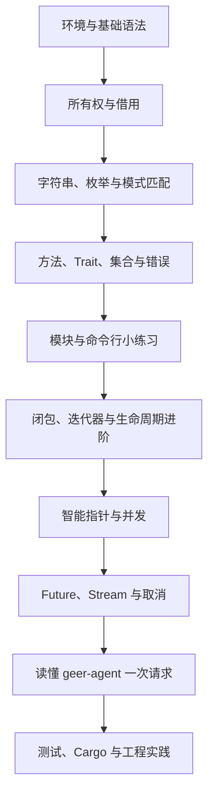

# 跟着 geer-agent 学 Rust

面向 Rust 初学者的中文笔记：沿《Rust 语言圣经》的章节推进，用本仓库的代码解释概念，再用小练习验证理解。第一次阅读不必从头到尾背完；先把一个输入如何变成一次模型请求看懂。

## 从哪里开始

| 你的目标 | 阅读入口 |
| --- | --- |
| 按原教程逐章学习 | [完整章节对照](00-course-map.md) |
| 第一次接触 Rust | [环境与 Cargo](01-basics/01-setup.md)，接着读基础目录 |
| 卡在所有权、借用 | [所有权](01-basics/03-ownership.md) → [生命周期](01-basics/08-lifetimes.md) |
| 看不懂 `async`、`Stream`、`Pin` | [异步基础](02-advanced/10-async-future-and-pin.md) → [流与取消](02-advanced/11-streams-and-cancellation.md) |
| 想直接读本项目 | [源码地图](04-project/01-code-map.md) → [追踪一次请求](04-project/02-reading-a-request.md) |
| 想边练边学 | [分阶段练习与答案](04-project/03-exercises.md) |
| 编译报错了 | [编译错误与陷阱](03-engineering/06-compiler-and-pitfalls.md) |

## 建议学习顺序

每次学习按四步走：先读概念，手动预测例子结果，再编译验证，最后在项目中找到同一写法。基础部分建议每次 1–2 篇；链表、Unsafe、性能布局属于选读，不是运行本项目的前置条件。

## 笔记目录

- `01-basics/`：安装、类型、所有权、模式、Trait、集合、生命周期、错误、模块和 CLI 实战。
- `02-advanced/`：生命周期进阶、闭包、类型转换、智能指针、线程、宏、异步和 Web/Redis 实战导读。
- `03-engineering/`：测试、Cargo、日志、开发技巧、链表、编译错误和性能。
- `04-project/`：源码阅读路线、完整请求流程和带参考答案的练习。
- `05-reference/`：语法速查、版本差异、资料来源与验证说明。

| 章节 | 笔记 |
| --- | --- |
| 01 | [环境、Cargo 与第一次运行](01-basics/01-setup.md) |
| 02 | [变量、基本类型、表达式与函数](01-basics/02-values-and-functions.md) |
| 03 | [所有权、移动、借用与复制](01-basics/03-ownership.md) |
| 04 | [字符串、切片、元组、结构体、枚举与数组](01-basics/04-strings-and-compound-types.md) |
| 05 | [流程控制与模式匹配](01-basics/05-control-flow-and-patterns.md) |
| 06 | [方法、泛型、Trait 与特征对象](01-basics/06-methods-and-traits.md) |
| 07 | [Vec、HashMap、HashSet 与集合遍历](01-basics/07-collections.md) |
| 08 | [生命周期：说明引用来自哪里](01-basics/08-lifetimes.md) |
| 09 | [Option、Result、问号与错误边界](01-basics/09-error-handling.md) |
| 10 | [包、模块、可见性、文档与格式化输出](01-basics/10-modules-and-docs.md) |
| 11 | [入门实战：做一个小型文本搜索器](01-basics/11-cli-practice.md) |
| 12 | [深入生命周期与 `'static`](02-advanced/01-lifetimes-and-static.md) |
| 13 | [闭包与迭代器：读懂函数式管道](02-advanced/02-closures-and-iterators.md) |
| 14 | [类型转换、newtype、别名与 DST](02-advanced/03-type-conversions.md) |
| 15 | [智能指针：Box、Rc、Arc、Cell 与 RefCell](02-advanced/04-smart-pointers.md) |
| 16 | [循环引用、自引用与 Weak](02-advanced/05-cycles-and-self-reference.md) |
| 17 | [线程、消息、锁、原子操作与 Send/Sync](02-advanced/06-threads-and-synchronization.md) |
| 18 | [全局变量与惰性初始化](02-advanced/07-globals.md) |
| 19 | [Unsafe、FFI 与内联汇编：先认识边界](02-advanced/08-unsafe-and-ffi.md) |
| 20 | [宏：先读懂，再考虑编写](02-advanced/09-macros.md) |
| 21 | [async、Future、运行时与 Pin](02-advanced/10-async-future-and-pin.md) |
| 22 | [Stream、并发组合、超时与取消](02-advanced/11-streams-and-cancellation.md) |
| 23 | [Web 服务器实战：从串行到并发，再到关闭](02-advanced/12-web-server.md) |
| 24 | [Tokio 与 mini-Redis 逐节导读](02-advanced/13-tokio-redis.md) |
| 25 | [自动化测试：验证可见行为](03-engineering/01-tests.md) |
| 26 | [Cargo 工程指南](03-engineering/02-cargo.md) |
| 27 | [日志、可观测性与项目的数据库 Trace](03-engineering/03-logging-and-tracing.md) |
| 28 | [开发技巧、生态选择与企业案例怎么读](03-engineering/04-practices-and-ecosystem.md) |
| 29 | [链表系列：按阶段理解所有权设计](03-engineering/05-linked-lists.md) |
| 30 | [编译错误、难点与常见陷阱](03-engineering/06-compiler-and-pitfalls.md) |
| 31 | [性能：先测量，再解释成本](03-engineering/07-performance.md) |
| 32 | [geer-agent 源码地图与阅读顺序](04-project/01-code-map.md) |
| 33 | [从一行输入追踪到最终回答](04-project/02-reading-a-request.md) |
| 34 | [分阶段练习与参考答案](04-project/03-exercises.md) |
| 35 | [语法速查、派生特征与版本差异](05-reference/01-syntax-and-versions.md) |
| 36 | [来源、学习资料与验证说明](05-reference/02-resources-and-verification.md) |

每篇均包含项目对应位置或明确说明“本项目未采用”，避免把教程的演示设计误认为现有功能。文中“项目摘录”依赖仓库上下文；“独立示例”只需要标准库。`rust,compile_fail` 标识的是故意不能编译的教学例子；`rust,ignore` 标识不能脱离上下文独立运行的片段。

## 教程来源与覆盖边界

原始入口是 [BeatAI《Rust 语言圣经》](https://beatai.org/rust-course/about-book)。2026-09-26 整理时，该入口返回 HTTP 403，因此改用作者维护的 [sunface/rust-course 源码](https://github.com/sunface/rust-course)。其 `about-book.md` 正文链接指向上述站点，可确认属于同一教程；不声称已核对网页端的最新排版。

目录依据源码提交 `ebe2d82437f621085b0cb6895edbd1283ed63cb1` 的 [SUMMARY.md](https://github.com/sunface/rust-course/blob/ebe2d82437f621085b0cb6895edbd1283ed63cb1/src/SUMMARY.md)，保留全部 **300 个带 Markdown 路径的公开目录条目**，不含 HTML 注释中的未公开条目。相近小节合并到同一篇笔记，并在对照表逐项定位。原文的 TODO、仅标题或外链占位会单独标识；这些位置的知识补充来自官方文档或本项目，不冒充原文已经写完的内容。

笔记以自己的解释和项目示例为主，不复制整本教程。语言规则补充核对 Rust 官方 Book、Reference、标准库、Cargo 与 Tokio 文档；每篇末尾提供具体入口。

## 项目快照与阅读方式

源码依据本仓库提交 `4f6a0a2`；本机实际输出为 `rustc 1.98.1`、`cargo 1.98.1`，项目使用 edition 2024。这是本次验证环境，不是最低版本声明。源码已包含 REPL、双模型协议、工具循环和可选数据库 Trace；不能再按治理文件里早期的 Hello World 描述理解项目。

使用支持 Mermaid 的 Markdown 预览打开本文件，点击目录逐篇阅读。图都在 `mermaid` 代码围栏内，无需外部图片服务。若预览器只显示源码，需使用其 Mermaid 支持；正文也保留了文字解释。

验证范围见 [资料与验证记录](05-reference/02-resources-and-verification.md)。
