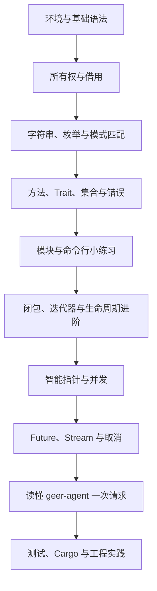

# 从资深工程师到合格 Rust 开发者

这套中文教程面向已经熟悉 Go 或其他后端语言的软件工程师。目标是能够独立设计、实现、测试、诊断和交付 Rust 程序：理解工具链，利用所有权和类型表达约束，掌握标准库，正确使用异步运行时，并能解释自己的框架选择。

基础笔记保留《Rust 语言圣经》的章节映射；新增主线按工程能力组织。建议先读 [工程师学习路线与验收标准](00-engineer-roadmap.md)，再从 [Go → Rust 思维迁移](06-go-to-rust/01-mental-model.md) 开始。阅读量不是完成标准，能够用代码证明理解才是。

## 面向工程师的主线

| 阶段 | 重点 | 阅读入口 |
| --- | --- | --- |
| 1 | 工具链、编译、Cargo、edition 与构建诊断 | [工具链原理](03-engineering/08-toolchain-and-compilation.md)、[Cargo](03-engineering/02-cargo.md) |
| 2 | Go 对照、所有权 API、类型与错误、并发迁移 | [Go 专题](06-go-to-rust/01-mental-model.md) → 该目录六篇 |
| 进阶选修 | HRTB、GAT、const generics、变型、布局与 Future | [类型系统进阶](02-advanced/14-type-system-and-layout.md)、[Future 实验](02-advanced/15-future-send-and-pin-workshop.md) |
| 3 | 标准库类型、集合、文本、I/O、进程、同步 | [标准库地图](07-standard-library/01-map-and-reading.md) → 该目录五篇 |
| 4 | 运行时、任务、背压、取消和关闭 | [Tokio 原理](08-ecosystem/03-tokio-runtime.md)、[Tokio 实战](08-ecosystem/04-tokio-workshop.md) |
| 5 | HTTP 服务、序列化与数据访问 | [Axum/Tower](08-ecosystem/05-axum-and-tower.md)、[Serde/Reqwest](08-ecosystem/06-serde-and-reqwest.md)、[数据库](08-ecosystem/07-database-and-rpc.md) |
| 6 | 桌面应用、IPC、权限、状态与打包 | [Tauri 原理](08-ecosystem/08-tauri-architecture.md)、[Tauri 实战](08-ecosystem/09-tauri-workshop.md) |
| 7 | 社区规范、API、依赖治理、服务交付与性能 | [API 与状态设计](03-engineering/09-api-design-and-state.md)、[工程验证](03-engineering/14-testing-and-contracts.md)、[社区实践](03-engineering/15-community-and-open-source.md) |
| 8 | 项目阅读、综合练习、代码审查与能力验收 | [毕业项目](04-project/04-capstone-and-rubric.md)、[审查练习](04-project/05-review-workshop.md) |

资料选择见 [社区教程怎么学](08-ecosystem/01-learning-resources.md)，技术选型见 [常用生态与选择依据](08-ecosystem/02-stack-decisions.md)。调查时间、版本边界和事实来源见 [调研记录](05-reference/03-research-log.md)。这里的“常用”表示值得工程师了解的代表方案，不表示有统一的市场排名。

阶段复习可用 [术语与自测](05-reference/04-glossary-and-self-check.md)，框架深讲之后再用源码与毕业任务验证，不需要将全部框架加入项目。

## 深化练习：把原理变成代码证据

| 主题 | 完整练习与追问 |
| --- | --- |
| Future 与类型约束 | [有限次数手动 poll](02-advanced/15-future-send-and-pin-workshop.md)：Pending、唤醒、Send 与 static |
| Trait 和宏进阶 | [一致性与动态接口](02-advanced/16-trait-boundaries-and-coherence.md)、[宏与 cfg](02-advanced/17-macro-and-cfg-workshop.md)：异步返回、求值、构建边界 |
| 标准库数据处理 | [借用解析与拥有汇总](07-standard-library/05-data-processing-workshop.md)：行号、UTF-8、上限和错误来源 |
| Tokio I/O 与回收 | [分帧与关闭](08-ecosystem/11-tokio-io-and-shutdown.md)：半包、EOF、取消与 await 回收 |
| Web 契约 | [Axum/Tower 请求验证](08-ecosystem/12-web-testing-and-middleware.md)：输入限制、错误方法与超时层 |
| 桌面长任务 | [Tauri 任务协议](08-ecosystem/13-tauri-ipc-and-lifecycle.md)：Channel、真正终态、独立取消与关闭 |
| 错误与观测工具 | [thiserror/anyhow/tracing 实战](08-ecosystem/14-errors-and-observability.md)：错误分类、原因链和异步 span |
| 质量与协作 | [属性和失败路径](03-engineering/14-testing-and-contracts.md)、[社区贡献流程](03-engineering/15-community-and-open-source.md) |

## Go 学习经验如何复用

复用 Go 的接口隔离、组合、显式错误、并发设计和性能测量经验。需要重新建立的直觉是：赋值可能转移所有权；引用携带有效性与别名约束；枚举能表达带数据的状态；泛型与动态分派需要主动选择；异步任务必须由运行时轮询；释放资源与任务取消都具有具体边界。

Rust 的优势在于将部分资源管理、别名和线程安全约束放进编译期，并允许细致控制分配、布局和运行时成本。收益要结合场景验证；学习难度、编译成本、团队经验和生态适配同样进入选择。对照 [思维迁移](06-go-to-rust/01-mental-model.md) 阅读 [Go GC 指南](https://go.dev/doc/gc-guide) 与 [Rust 所有权](https://doc.rust-lang.org/book/ch04-01-what-is-ownership.html)。

## 从哪里开始

| 你的目标 | 阅读入口 |
| --- | --- |
| 按原教程逐章学习 | [原教程章节对照](00-course-map.md) |
| 已经熟悉 Go，想系统成为 Rust 开发者 | [工程师学习路线](00-engineer-roadmap.md) |
| 第一次接触 Rust | [环境与 Cargo](01-basics/01-setup.md)，接着读基础目录 |
| 卡在所有权、借用 | [所有权](01-basics/03-ownership.md) → [生命周期](01-basics/08-lifetimes.md) |
| 看不懂 `async`、`Stream`、`Pin` | [异步基础](02-advanced/10-async-future-and-pin.md) → [流与取消](02-advanced/11-streams-and-cancellation.md) |
| 想直接读本项目 | [源码地图](04-project/01-code-map.md) → [追踪一次请求](04-project/02-reading-a-request.md) |
| 想边练边学 | [分阶段练习与答案](04-project/03-exercises.md) |
| 编译报错了 | [编译错误与陷阱](03-engineering/06-compiler-and-pitfalls.md) |

## 建议学习顺序

```mermaid
flowchart TD
    A[环境与基础语法] --> B[所有权与借用]
    B --> C[字符串、枚举与模式匹配]
    C --> D[方法、Trait、集合与错误]
    D --> E[模块与命令行小练习]
    E --> F[闭包、迭代器与生命周期进阶]
    F --> G[智能指针与并发]
    G --> H[Future、Stream 与取消]
    H --> I[读懂 geer-agent 一次请求]
    I --> J[测试、Cargo 与工程实践]
```

每次学习按四步走：先读概念，手动预测例子结果，再编译验证，最后在项目中找到同一写法。基础部分建议每次 1–2 篇；链表、Unsafe、性能布局属于选读，不是运行本项目的前置条件。

## 基础笔记与原章节目录

- `01-basics/`：安装、类型、所有权、模式、Trait、集合、生命周期、错误、模块和 CLI 实战。
- `02-advanced/`：生命周期进阶、闭包、类型转换、智能指针、线程、宏、异步和 Web/Redis 实战导读。
- `03-engineering/`：测试、Cargo、日志、开发技巧、链表、编译错误和性能。
- `04-project/`：源码阅读路线、完整请求流程和带参考答案的练习。
- `05-reference/`：语法速查、版本差异、资料来源与验证说明。
- `06-go-to-rust/`：Go 对照与所有权、类型、并发迁移训练。
- `07-standard-library/`：标准库按工程问题系统学习。
- `08-ecosystem/`：教程调研、框架原理与实际使用；包含 Tokio、Tauri、Axum/Tower、Serde/Reqwest、数据库与 RPC。

| 章节 | 笔记 |
| --- | --- |
| 01 | [环境、Cargo 与第一次运行](01-basics/01-setup.md) |
| 02 | [变量、基本类型、表达式与函数](01-basics/02-values-and-functions.md) |
| 03 | [所有权、移动、借用与复制](01-basics/03-ownership.md) |
| 04 | [字符串、切片、元组、结构体、枚举与数组](01-basics/04-strings-and-compound-types.md) |
| 05 | [流程控制与模式匹配](01-basics/05-control-flow-and-patterns.md) |
| 06 | [方法、泛型、Trait 与特征对象](01-basics/06-methods-and-traits.md) |
| 07 | [Vec、HashMap、HashSet 与集合遍历](01-basics/07-collections.md) |
| 08 | [生命周期：说明引用来自哪里](01-basics/08-lifetimes.md) |
| 09 | [Option、Result、问号与错误边界](01-basics/09-error-handling.md) |
| 10 | [包、模块、可见性、文档与格式化输出](01-basics/10-modules-and-docs.md) |
| 11 | [入门实战：做一个小型文本搜索器](01-basics/11-cli-practice.md) |
| 12 | [深入生命周期与 `'static`](02-advanced/01-lifetimes-and-static.md) |
| 13 | [闭包与迭代器：读懂函数式管道](02-advanced/02-closures-and-iterators.md) |
| 14 | [类型转换、newtype、别名与 DST](02-advanced/03-type-conversions.md) |
| 15 | [智能指针：Box、Rc、Arc、Cell 与 RefCell](02-advanced/04-smart-pointers.md) |
| 16 | [循环引用、自引用与 Weak](02-advanced/05-cycles-and-self-reference.md) |
| 17 | [线程、消息、锁、原子操作与 Send/Sync](02-advanced/06-threads-and-synchronization.md) |
| 18 | [全局变量与惰性初始化](02-advanced/07-globals.md) |
| 19 | [Unsafe、FFI 与内联汇编：先认识边界](02-advanced/08-unsafe-and-ffi.md) |
| 20 | [宏：先读懂，再考虑编写](02-advanced/09-macros.md) |
| 21 | [async、Future、运行时与 Pin](02-advanced/10-async-future-and-pin.md) |
| 22 | [Stream、并发组合、超时与取消](02-advanced/11-streams-and-cancellation.md) |
| 23 | [Web 服务器实战：从串行到并发，再到关闭](02-advanced/12-web-server.md) |
| 24 | [Tokio 与 mini-Redis 逐节导读](02-advanced/13-tokio-redis.md) |
| 25 | [自动化测试：验证可见行为](03-engineering/01-tests.md) |
| 26 | [Cargo 工程指南](03-engineering/02-cargo.md) |
| 27 | [日志、可观测性与项目的数据库 Trace](03-engineering/03-logging-and-tracing.md) |
| 28 | [开发技巧、生态选择与企业案例怎么读](03-engineering/04-practices-and-ecosystem.md) |
| 29 | [链表系列：按阶段理解所有权设计](03-engineering/05-linked-lists.md) |
| 30 | [编译错误、难点与常见陷阱](03-engineering/06-compiler-and-pitfalls.md) |
| 31 | [性能：先测量，再解释成本](03-engineering/07-performance.md) |
| 32 | [geer-agent 源码地图与阅读顺序](04-project/01-code-map.md) |
| 33 | [从一行输入追踪到最终回答](04-project/02-reading-a-request.md) |
| 34 | [分阶段练习与参考答案](04-project/03-exercises.md) |
| 35 | [语法速查、派生特征与版本差异](05-reference/01-syntax-and-versions.md) |
| 36 | [来源、学习资料与验证说明](05-reference/02-resources-and-verification.md) |

文中“项目摘录”依赖仓库上下文；普通 `rust` 围栏是可独立验证的标准库示例。`rust,compile_fail` 是故意不能编译的例子；`rust,ignore` 是项目摘录或需要单独 Cargo 练习包、前端和系统依赖的框架示例，其验证状态另行记录。练习命令默认从仓库根目录执行；本仓库所有测试和文档示例测试均通过 `scripts/test-safe.sh`，具体步骤见 [验证说明](05-reference/02-resources-and-verification.md)。

## 教程来源与覆盖边界

原始入口是 [BeatAI《Rust 语言圣经》](https://beatai.org/rust-course/about-book)。2026-09-26 整理时，该入口返回 HTTP 403，因此改用作者维护的 [sunface/rust-course 源码](https://github.com/sunface/rust-course)。其 `about-book.md` 正文链接指向上述站点，可确认属于同一教程；不声称已核对网页端的最新排版。

目录依据源码提交 `ebe2d82437f621085b0cb6895edbd1283ed63cb1` 的 [SUMMARY.md](https://github.com/sunface/rust-course/blob/ebe2d82437f621085b0cb6895edbd1283ed63cb1/src/SUMMARY.md)，保留全部 **300 个带 Markdown 路径的公开目录条目**，不含 HTML 注释中的未公开条目。相近小节合并到同一篇笔记，并在对照表逐项定位。原文的 TODO、仅标题或外链占位会单独标识；这些位置的知识补充来自官方文档或本项目，不冒充原文已经写完的内容。

笔记以自己的解释和项目示例为主，不复制整本教程。语言规则补充核对 Rust 官方 Book、Reference、标准库、Cargo 与 Tokio 文档；每篇末尾提供具体入口。

## 项目快照与阅读方式

2026-10-03 扩充依据工作区 HEAD `99e8690`、当前 Cargo.toml 和源码；本机 `rustc 1.98.1`，项目 edition 2024。版本记录描述验证环境，不是最低支持版本承诺。源码包含四种 UI、双模型协议、工具循环、会话与 Trace 持久化、项目指令和主动记忆召回。原教程映射仍保留其固定历史快照，新增教程的调查记录单独维护。

使用支持 Mermaid 的 Markdown 预览打开本文件，点击目录逐篇阅读。图都在 `mermaid` 代码围栏内，无需外部图片服务。若预览器只显示源码，需使用其 Mermaid 支持；正文也保留了文字解释。

验证范围见 [资料与验证记录](05-reference/02-resources-and-verification.md)。
