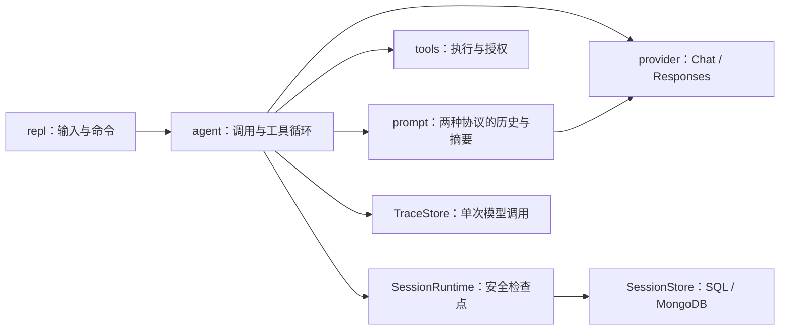

# Session 上下文压缩与恢复计划

## 现状与目标

`repl` 接收输入，`Prompt` 管理两种协议的消息状态，`agent` 编排模型和工具，`provider` 只做请求与响应适配。现有 Session ID 仅关联 Trace；退出后不能恢复对话。长对话和工具结果会持续进入每次模型请求。

本轮实现自动及手动压缩，并让已配置数据库的会话可在退出后恢复。原始记录与发给模型的上下文分开：前者保留消息和压缩事件，后者由当前环境提示、累计摘要和近期原文组成。保持工具调用/结果配对、双协议原始输出和每会话授权语义。

`Prompt` 是唯一的消息状态所有者；provider 只转换协议，REPL 不持有历史，DAO 不从 Trace 反推会话。这个边界让压缩逻辑无需为 Chat 和 Responses 各写一套策略，也让恢复不依赖服务端的历史状态。Trace 仍按 request ID 记录调用；会话按 Session ID 发布可恢复状态，两者可独立启用。

参考：[GeekAgent Day5](https://geektutu.com/en/post/geekagent-day5.html) 的自动与手动入口；[pi](https://github.com/earendil-works/pi/blob/main/packages/coding-agent/docs/compaction.md) 的预算、边界与摘要记录；[Anthropic](https://www.anthropic.com/engineering/effective-context-engineering-for-ai-agents) 的高保真摘要；[LangGraph](https://docs.langchain.com/oss/python/langchain/short-term-memory) 的会话检查点。

| 方案启发 | 本项目取舍 |
| --- | --- |
| GeekAgent 的最小自动/手动压缩 | 保留简单入口，但不按固定消息条数截断 |
| pi 的边界感知压缩 | 以完整轮次和工具批次选切点，保留近期约 20,000 tokens 原文 |
| Anthropic 的高保真上下文工程 | 摘要保留目标、约束、进展、决策和下一步，不把旧工具内容提升为系统指令 |
| LangGraph 的线程检查点 | 用可选数据库保存已发布的安全状态；不引入图运行时或跨会话调度 |

## 压缩与模型调用

- 默认上下文窗口 **272,000 tokens**，估算用量达到 **90%（244,800）** 自动压缩；通过 `GEER_AGENT_CONTEXT_WINDOW_TOKENS` 覆盖窗口，通过 `GEER_AGENT_AUTO_COMPACT` 关闭自动触发。`/compact` 始终可手动触发。
- 新输入进入 Prompt 后、完整工具批次结果进入历史后，于下一次模型调用前检查。估算包括系统提示、工具定义、摘要、近期历史、当前输入和运行提示；用已知的真实 input usage 校准。累计费用和 token 预算仍单独计算。
- 自动压缩优先保留最近约 20,000 tokens 原文；手动压缩允许摘要唯一的完整旧轮次。以完整用户轮次和模型调用及对应工具结果为边界。超长单轮只在完整工具批次之间切分，当前用户输入始终保留。Responses 的非文本输出也随所属模型调用保留。
- 摘要结合上一份摘要与新增旧历史，重点保留目标、约束、决策、已完成工作、未解决问题和必要路径；默认上限 4,096 tokens。摘要作为标记清楚的历史背景，不取得 system 权限或工具授权。
- 每个摘要分块只有在完整、非空、未要求工具且确实缩小上下文后才替换对应前缀。历史过大时按安全边界逐块提交；失败块保留原文，已成功压缩的块保持有效，同一请求不对相同前缀无限重试。明确上下文溢出时最多压缩并重试一次模型请求，已执行工具不重放。
- 摘要调用复用当前模型/Trace/超时路径，不向用户流出摘要正文；记录其 request ID、耗时和用量，计入资源预算但不消耗工具循环 Turn。Chat 截断与 Responses 空 `ModelStep.text` 都不能被误认成有效摘要。

## 会话检查点与终端入口

- 用 `GEER_AGENT_SESSION_DATABASE` / `GEER_AGENT_SESSION_DATABASE_URL` 启用会话存储，复用现有 SQLite、PostgreSQL、MySQL、MongoDB 的 DAO 基础；可与 Trace 使用同一数据库，未配置时保持内存会话。
- 持久化带版本的会话元数据、追加式原始消息与压缩事件，以及可直接恢复的 Prompt 检查点。原始消息按既有凭据脱敏规则保存。先写原始增量，再发布带 revision 的检查点；恢复只读完整发布的状态。保持旧 Trace 迁移身份，新增独立迁移及索引。
- 在输入进入、工具批次结束、回答完成、压缩成功及失败回滚后保存。工具执行中退出时恢复最近安全检查点，显示中断与副作用未确认状态；不自动重跑工具。
- 保存失败按用户选择告警并继续，缓存未保存增量供后续补写；恢复仅承诺最后一次成功发布的检查点。退出、重置或切换前再尝试保存。
- 新增 `/compact`、`/sessions`（当前目录最近 20 个会话）、`/resume <session-id>`。恢复限定相同工作目录、模型、协议及端点；版本或配对异常拒绝恢复并保持当前会话。恢复时重新生成系统环境上下文、清空工具授权。`/reset` 建新 Session ID，已保存的旧会话可再恢复。

## 落地与验收

先用 OpenSpec CLI 建立 `session-context-compaction` 变更，规划 `history-compaction` 与 `session-persistence` 能力，再按 Prompt 压缩状态、Agent 调度、DAO 检查点、REPL 命令的顺序增量实现。不要为本能力增加 Agent 框架、Tokenizer 或向量库。

双协议测试覆盖阈值、工具调用配对、连续压缩、空/截断摘要、失败不丢历史、压缩后退出恢复、工具中断标记、持久化补写、并发 revision、恢复不兼容及授权重置。SQLite 执行完整契约；其他后端在可用时运行相同契约。最终运行 `cargo fmt --all`、`cargo test`、`cargo clippy --all-targets --all-features`、OpenSpec 严格校验，并报告模拟服务与真实服务各自的验证范围。
