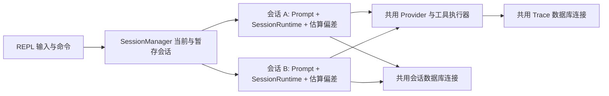

# 会话隔离与默认持久化技术方案

## 目标与依据

沿用现有 `Prompt`、`SessionRuntime` 和 DAO，在一个 REPL 进程内维护多条独立会话。每条会话使用稳定 UUID，保存 Chat/Responses 原始历史、摘要、上下文估算偏差和未落库事件；切换后继续自己的上下文。默认把会话检查点与完整模型调用 Trace 写入工作目录的 `./.db/geer.sqlite`。启动仍创建新会话，旧会话由用户显式打开。

参考 [GeekAgent Day6](https://geektutu.com/post/geekagent-day6.html) 的新建、列表与切换，[pi 会话格式](https://github.com/earendil-works/pi/blob/main/packages/coding-agent/docs/session-format.md) 的工作目录分组和 UUID，以及 [LangGraph 持久化](https://docs.langchain.com/oss/python/langgraph/persistence) 的每会话检查点。保留本项目已有的数据库事件链、revision 条件更新与跨进程恢复语义，不照搬教程的整集合 JSON 文件。

## 状态与命令

`SessionState` 把 UUID、完整 `Prompt`、上下文估算偏差和独立的 `SessionRuntime` 放在一起。进程内切换移动完整对象，不通过仅包含可恢复消息的快照替换内存状态，因此未保存原始事件和失败后待补写队列不会消失。`SessionManager` 管理当前状态和按 UUID 索引的暂存状态；provider 与工具只保留一份。每次真正切换均清空工具授权。命令只在完整的用户轮次之间执行。

| 命令 | 行为 |
| --- | --- |
| `/new` | 创建空会话，切换并显示 UUID |
| `/open <id>` | 先查内存，未命中再校验并恢复数据库检查点 |
| `/resume <id>` | 与 `/open` 同义，兼容原命令 |
| `/reset` | 新建会话，旧会话仍可打开 |
| `/sessions` | 合并进程内会话与当前目录最近 20 条存档，按 UUID 去重，标记当前及保存状态 |
| `/save` | 重试保存所有待写会话，并报告每条结果 |
| `/exit` / EOF | 尝试保存所有待写会话；报告仍未保存的 UUID |

打开当前 UUID 不改状态。先验证目标的工作目录、模型、接口、端点、快照版本和工具调用配对，再保存当前会话并切换；目标不存在或损坏时保留当前会话及授权。恢复时使用当前环境提示，不自动重放工具；已有的工具副作用未确认提示继续生效。

## 数据库配置

| 变量 | 默认值 |
| --- | --- |
| `GEER_AGENT_DATABASE` | `sqlite` |
| `GEER_AGENT_DATABASE_URL` | `sqlite://.db/geer.sqlite?mode=rwc` |
| `GEER_AGENT_TRACE` | `on` |
| `GEER_AGENT_SESSION_PERSISTENCE` | `on` |

只读取公共数据库配置；未配置时使用默认 SQLite。旧的 `GEER_AGENT_TRACE_DATABASE{,_URL}` 和 `GEER_AGENT_SESSION_DATABASE{,_URL}` 不再生效。公共配置仅指定 `sqlite` 可用默认 URL，指定其他后端必须提供匹配协议的 URL。显式无效配置在 REPL 启动前报错。两个开关分别控制 Trace 和会话持久化，关闭后不妨碍进程内多会话对话。

默认文件路径相对启动工作目录，连接前创建默认 `./.db/`，并将其加入 Git 忽略。两个有效配置相同时，共用数据库连接与现有 SQL/MongoDB 迁移、集合及索引；保留原有会话表、事件表、Trace 表、迁移标识和版本 1 快照。原有数据库无需搬迁。保存前继续脱敏 API key、认证头及实际使用的数据库凭据；Trace 使用当前会话 UUID。

## 保存与失败边界

现有检查点时机和“先追加事件、再以 revision 发布检查点”的流程保留。每条会话分别跟踪成功、待补写或 revision 冲突状态。写入失败只告警，队列留在所属会话；后续 `/save` 或检查点重试。revision 冲突不提升本地 revision，不自动覆盖或合并另一进程的记录。数据库初始化失败时告警并降级为内存多会话；退出后只承诺最后一次成功发布的检查点。`/sessions` 和 `/save` 显示待写或冲突状态，避免误认为已持久化。

会话仅隔离模型上下文；同一工作目录里的文件依然共享。本轮不增加会话命名、分叉、删除、沙箱或后台并发调度。

## 实施与验收

1. 补齐已实现的 `session-persistence`、`llm-trace` 主规范基线，再用 OpenSpec CLI 创建并校验 `improve-session-isolation` 变更。
2. 接入公共数据库配置和共用连接，再将完整会话状态归入 `SessionManager`，最后补充 REPL 命令、帮助与 README。
3. 双协议测试 A/B 切换及压缩后恢复，确认历史、摘要、估算偏差、Trace UUID 和工具授权互不串用。
4. 在临时工作目录测试默认 SQLite 跨进程恢复、共享 Trace；用配置单元测试覆盖公共数据库配置和两个关闭开关。非目标集成测试显式关闭默认持久化。
5. 测试保存失败后切换与补写、损坏或跨目录恢复拒绝、revision 冲突不覆盖、退出报告未保存 UUID。按顺序执行 `cargo fmt --all`、完整 `cargo test`、`cargo clippy --all-targets --all-features` 和 OpenSpec 严格校验。

## 落地记录

已补齐 `session-persistence`、`llm-trace` 主规范基线，CLI 创建 `improve-session-isolation` 变更并通过严格校验。实现中保留现有 `Prompt` 消息所有权和工具循环的检查点时机，新增活动/暂存会话状态；切换前先恢复并验证目标，成功切换时清空工具授权。保存状态按会话跟踪；`/save`、`/exit` 和 EOF 会遍历待写会话，并显示仍未保存的 UUID。只解析公共数据库配置；两种记录同时启用时只初始化一次 DAO 连接。Trace 请求与响应还会遮蔽认证字段、认证头文本及实际使用的数据库 URL。

双协议单元测试覆盖 A/B 摘要、历史、估算偏差与未保存事件的进程内切换；授权测试覆盖成功、失败和打开当前会话。SQLite 故障测试覆盖切换后补写、revision 冲突不覆盖、损坏快照和跨目录恢复拒绝。双协议模拟服务测试在独立临时工作目录验证默认 SQLite、Trace UUID 关联及两条会话跨进程继续；EOF 测试确认退出补写。其他模拟服务测试已显式关闭不需要的默认存储。

验证结果：`cargo fmt --all` 通过；`cargo test` 共 141 项通过（107 项单元测试、34 项集成测试）；`cargo clippy --all-targets --all-features` 无警告；`openspec validate improve-session-isolation --strict`、`openspec validate --specs --strict` 和 `git diff --check` 均通过。另在临时目录运行 `cargo run`，手动执行 `/sessions`、`/new`、`/save`、`/exit` 并确认默认 SQLite 文件生成。完整测试中修正了一处既有搜索测试的偶发误判：临时目录名含 `99` 时不应被误认为匹配了被排除文件。PostgreSQL、MySQL、MongoDB 外部服务和真实模型接口未实测；本轮只复用这些后端的现有 DAO 路径。
