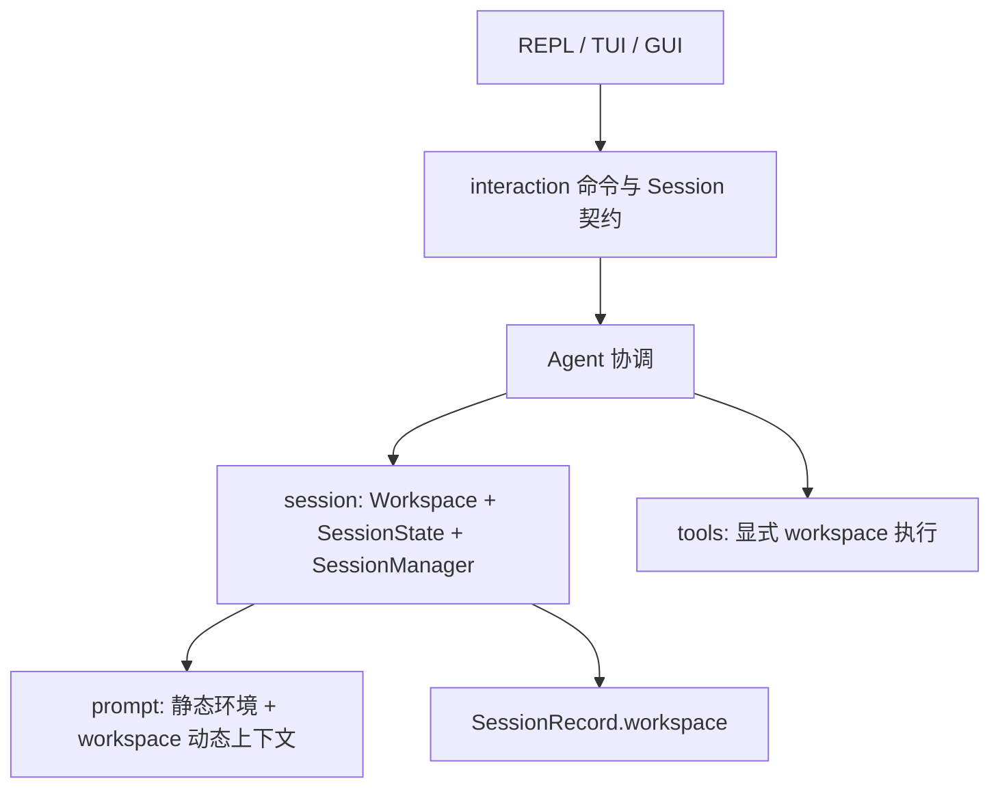

# 可配置 Workspace 技术方案

## 目标

把 workspace 从进程启动目录提升为会话状态。每条会话保存自己的 workspace；活动会话的目录统一驱动工具相对路径、Bash 工作目录、LLM 环境提示和三种界面的状态展示。进程 cwd、配置文件位置和默认数据库位置保持不变。

切换 workspace 时先校验目标目录，再保存并暂存当前会话，在目标目录创建新的 UUID 会话。`/new` 与 `/reset` 继承当前 workspace。打开旧会话时同时恢复该会话的 workspace；目标目录已删除、不是目录或不可访问时，恢复失败且当前会话、授权和界面状态均不改变。

## 分层

`src/session` 定义 `Workspace`，并承接现有会话状态与管理职责。`Workspace` 保存规范化的绝对目录；输入可为绝对路径、相对当前 workspace 的路径或 `~/`，允许路径外层存在一层配对的单引号或双引号。它只展开 `~`，不执行变量、通配符或 Shell 展开。解析后要求路径存在、可规范化且为目录。

`SessionState` 持有 `Workspace`、`Prompt`、上下文估算偏差和可选的持久化运行状态。持久化运行状态不再固定 workspace，保存时使用所属状态的目录写入既有 `SessionRecord.workspace`，因此不需要数据库迁移。进程内暂存会话即使关闭持久化，也继续保留自己的 workspace。

`prompt` 在启动时探测系统和 Bash 版本，形成可复用的静态环境；创建或恢复会话时再用 workspace 组装系统提示。已有历史、摘要、待提交消息和显示事件仍由 `Prompt` 持有。切换 workspace 总是创建新 `Prompt`；恢复旧会话则以当前静态环境和会话 workspace 重建系统提示，再载入安全检查点。

`Tools` 继续共享工具定义和会话授权，但不再保存启动 cwd。每次执行批次时由 Agent 显式传入活动会话的 workspace。Bash 的 `current_dir`、文件路径解析和查询工具根目录使用同一值；切换或恢复会话后清空工具授权。

## 命令与界面

- `/workspace` 显示当前完整路径；`/workspace <path>` 校验后切换并创建新会话。
- `/sessions` 只列当前 workspace；`/sessions --all` 合并所有进程内会话和近期存档，并标注 workspace。
- REPL 启动和成功切换后显示 workspace 与 Session ID。
- TUI 状态区显示 workspace；F2 进入预填当前路径的编辑模式，Enter 切换，Esc 取消。聊天草稿单独保存，目录错误时保留编辑内容。
- GUI 侧栏显示 workspace，可手工输入或通过系统目录选择器填充，确认后走与命令相同的串行提交路径。会话列表提供“当前 / 全部”筛选。

GUI 仅在 `gui` feature 中增加 `tauri-plugin-dialog` 及前端包，并只授予打开目录对话框的权限。默认 REPL/TUI 构建不引入该运行时依赖。

## 原子切换与失败

workspace 设置先完成输入解析、目录校验、静态环境提示组装和新会话准备，之后才保存并暂存当前会话、替换活动状态。规范化后与当前目录相同的输入是无操作。旧会话保存失败不会阻止切换，其待补写队列留在旧状态，后续 `/save` 或退出继续重试。

打开会话时先从内存或数据库准备目标状态，校验模型接口、模型、端点、快照、事件链和目标 workspace；全部成功后才保存当前状态并切换。打开当前 UUID 不改变授权。任何准备或验证失败都不修改当前状态。

## 验证

单元测试覆盖路径解析、相对路径、中文和空格、`~/`、配对引号、符号链接、同目录、文件路径和不存在目录。会话测试覆盖关闭持久化时跨 workspace 往返、保存失败补写、恢复旧 workspace、目标目录删除、当前/全部列表及授权清空。

工具测试在两个临时目录放置不同内容，验证 Bash、文件工具和查询工具都使用显式 workspace。双协议模拟服务检查 workspace 出现在系统提示且旧会话历史不进入新会话。TUI 测试覆盖 F2、Enter、Esc、草稿和窄屏；GUI 测试覆盖输入、浏览取消、切换错误、忙碌禁用与列表筛选。

最终运行 Rust 格式、测试和 Clippy，GUI 前端类型检查、测试与构建，以及 OpenSpec 严格校验。本机验证 REPL、TUI 和 Linux GUI；Windows 原生目录对话框只记录未实测边界。
