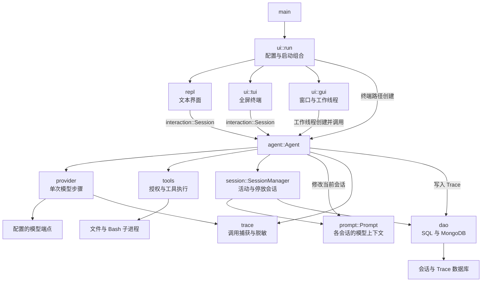
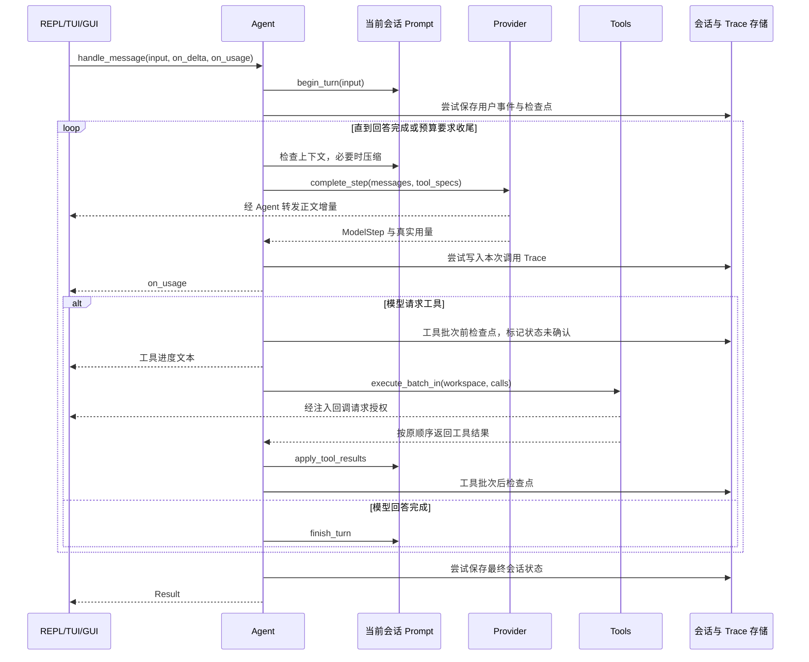
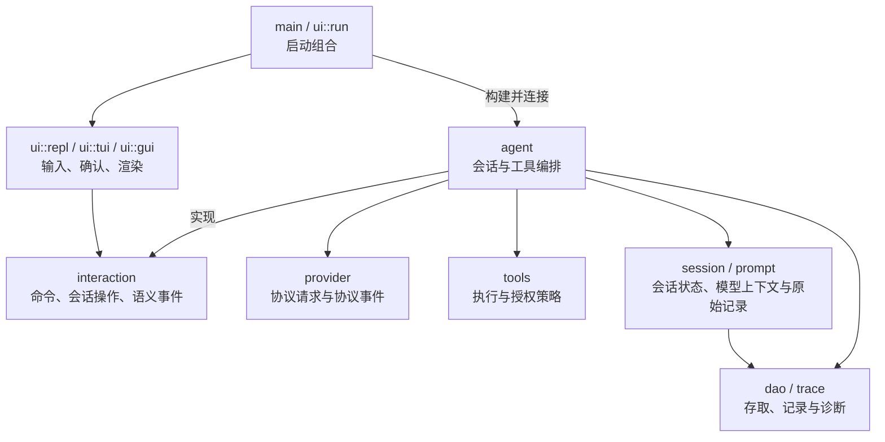

# geer-agent 技术架构与优化方案

本文梳理当前项目的模块职责、运行流程和依赖边界，并提出围绕 REPL 与 UI 分层的增量优化方案。核心结论是：当前 `repl` 已经承担纯文本 UI 的职责，模型协议交互在 `provider`，对话与工具编排在 `agent`；颜色代码本身属于文本 UI，问题主要在于目录归属不统一，以及核心逻辑通过展示字符串向界面传递运行事件。

建议先将整个文本界面归入 `ui/repl`，再将正文、工具进度、重试和压缩通知改为结构化事件，并把终端授权输入移到 UI。这些调整可以沿用现有 `interaction::Session` 契约，不需要增加新的 Agent 框架或另一套对话引擎。

## 分析范围与依据

- 分析日期：2026 年 9 月 30 日。
- 依据：当前工作区源码、依赖清单、已有测试与相关 OpenSpec 设计；源码基线 HEAD 为 `3f78f5a`。
- 文档性质：当前实现分析与待实施设计。本文提出的文件迁移、事件类型和接口调整尚未落地。
- 验证方式：静态阅读与调用关系核对；本轮只新增设计文档，没有执行模型请求、构建或项目测试。

项目已经具备工具循环、文件工具、历史压缩、会话持久化、TUI 与可选 GUI。治理文件仍有“Hello World”“主 spec 为空”等早期描述，部分旧设计也对应更早的模块结构，因此现状以源码为准。实施优化时仍应遵循现行的增量开发和测试隔离约束。

## 技术栈与运行入口

### 技术栈

| 范围 | 当前选择 | 在项目中的作用 |
| --- | --- | --- |
| 程序形态 | Rust 2024 edition，单一二进制 crate | 模块在同一可执行文件内组合 |
| 异步执行 | Tokio current-thread runtime | 驱动模型流、数据库与子进程；文件操作另有阻塞任务 |
| 模型接口 | async-openai，Responses 与 Chat Completions | 访问用户配置的 OpenAI 兼容端点，解析流式正文、工具调用和用量 |
| 文本界面 | 标准输入输出与 ANSI 颜色 | 按行输入、命令处理、流式输出和管道兼容 |
| 全屏终端 | Ratatui 与 Crossterm | 键盘事件、布局、颜色、滚动和终端恢复 |
| 桌面界面 | 可选 Tauri 2，React 与 TypeScript，Vite | 窗口、Rust 桥接、前端状态与 Markdown 展示 |
| 数据持久化 | SeaORM 与 MongoDB driver | SQLite、PostgreSQL、MySQL、MongoDB 的会话与 Trace 适配 |
| 配置与数据 | dotenvy、Serde、serde_json、UUID | 环境配置、快照、事件与标识符 |

依赖依据见 [Cargo.toml](/home/lihongyu/projects/geer-agent/Cargo.toml) 与 [GUI 前端依赖清单](/home/lihongyu/projects/geer-agent/src/ui/gui/frontend/package.json)。GUI 依赖由 `gui` feature 控制；`embed-env` 在编译时内嵌配置。数据库驱动目前属于默认 Rust 依赖，运行时关闭持久化不会移除它们的编译成本。

### 启动流程

[main](/home/lihongyu/projects/geer-agent/src/main.rs:17) 调用 [ui::run](/home/lihongyu/projects/geer-agent/src/ui/mod.rs:31)，后者加载环境配置并解析 `GEER_AGENT_UI`：

| 配置 | 运行路径 |
| --- | --- |
| `auto`，stdin 与 stdout 均为终端 | TUI |
| `auto`，任一端接管道 | 文本 REPL |
| `repl` | 文本 REPL |
| `tui` | 要求 stdin 与 stdout 均为终端，否则报错 |
| `gui` | 要求编译时启用 `gui` feature，否则提示构建方式 |

终端路径在 `ui::run` 中创建 Tokio runtime 和 Agent，再调用具体界面；GUI 路径先进入 Tauri 事件循环，在独立工作线程内创建 runtime 和 Agent。

这里的 `ui::run` 同时承担启动组合职责：它决定用哪个界面，并连接会话对象与界面回调。这样的组合点可以引用 `agent`；业务模块仍不应引用具体 UI。

## 当前模块职责与协作关系

### 模块职责

| 模块 | 当前职责 | 关键边界 |
| --- | --- | --- |
| [config](/home/lihongyu/projects/geer-agent/src/config/mod.rs) | 配置查找与校验、模型/API/UI 选择、资源额度、跨平台路径辅助 | 不依赖其他业务模块；缺失必要配置会返回错误 |
| [ui](/home/lihongyu/projects/geer-agent/src/ui/mod.rs) | 启动分派、TUI、GUI 及其输入、布局和展示 | 组合点创建 Agent；TUI 通过会话契约操作业务 |
| [repl](/home/lihongyu/projects/geer-agent/src/repl/index.rs:6) | 文本提示符、逐行输入、命令分派、输出与删除确认 | 依赖 `interaction::Session`，不引用 `provider`、`agent` 或 `tools` |
| [interaction](/home/lihongyu/projects/geer-agent/src/interaction/mod.rs) | 会话操作契约、命令解析、状态与用量、帮助文本、诊断缓冲 | 连接界面与业务，不含 Ratatui、Tauri 或 ANSI 类型 |
| [agent](/home/lihongyu/projects/geer-agent/src/agent/mod.rs:410) | 实现会话契约，编排模型步骤、工具循环、预算、压缩和检查点 | 持有 Provider、Tools 和 SessionManager，不选择具体界面 |
| [prompt](/home/lihongyu/projects/geer-agent/src/prompt/conversation.rs:24) | 系统提示、协议历史、轮次提交/回滚、压缩边界、快照和原始事件 | 持有模型上下文；目前还包含 GUI 历史展示投影 |
| [provider](/home/lihongyu/projects/geer-agent/src/provider/mod.rs:107) | 单次模型步骤与摘要请求，两种协议转换、流式解析、超时与重试 | 返回 `ModelStep`；不执行工具、不维护整个 Agent 循环 |
| [tools](/home/lihongyu/projects/geer-agent/src/tools/mod.rs:152) | 内置工具注册、参数验证、授权缓存、批次执行、有限输出 | 不依赖模型协议；目前仍自带 CLI 授权输入 |
| [session](/home/lihongyu/projects/geer-agent/src/session/runtime.rs:350) | workspace、活动与停放会话、检查点、存档恢复、删除与保存状态 | 每个会话拥有自己的 Prompt；存储失败时保留内存状态与补写信息 |
| [trace](/home/lihongyu/projects/geer-agent/src/trace/mod.rs) | 模型调用记录契约、流式捕获、状态、用量和脱敏 | 记录单次调用，不代替会话历史 |
| [dao](/home/lihongyu/projects/geer-agent/src/dao/mod.rs) | SQL/MongoDB 适配、会话记录与事件链存取、Trace 读写 | 对上层隐藏后端差异；会话和 Trace 可共享连接 |

### 主要运行时协作

下面表示主要调用与数据流，不是完整的 Rust 静态依赖图：



`interaction::Session` 是接口，`agent::Agent` 是它的实现。图中 REPL/TUI 到 Agent 的箭头表示运行时通过接口调用，不表示这两个界面导入了 `agent` 模块。GUI bridge 目前直接持有 Agent，并读取 GUI 所需的历史与未保存状态，属于现有的具体适配。

### 不能忽略的双向模块引用

当前代码还不是严格单向的层级结构：

- `interaction` 使用 `session` 的列表和删除数据类型，而 `session::runtime` 调用 `interaction::emit_diagnostic`。
- `session::runtime` 持有具体的 `dao::SessionStore`，而 `dao` 使用 `session` 定义的持久化数据类型。

Rust 可以解析这些同 crate 模块引用；它们不是已经发生的编译错误。架构上的影响是契约、运行逻辑与诊断的边界较难读清。后续可将会话数据类型与运行逻辑细分，并把诊断放到可被会话与界面共同引用的低层模块；当前无需为此引入通用 Repository 框架。

## 一条消息如何经过系统

### 正常对话与工具循环



模型请求与工具执行之间的循环只有 `agent` 编排。Provider 返回“模型要求做什么”，Tools 返回“执行得到什么”，Prompt 负责把这些内容写成所选 API 的历史；UI 决定用户看到什么。

当前工具批次把连续的只读操作分组并发，Bash、write、edit 等操作作为顺序边界；授权在派发前完成，结果保留调用顺序。Agent 在两种模型协议之间共用这套编排。

Agent 的运行预算检查轮次数、工具调用数、时间与配置的真实用量额度；已有 guard 对重复调用、连续错误和缺少进展给出提示或触发收尾。UI 的临时 token 估算只用于展示，不代替服务端用量判断硬额度。历史压缩以完整轮次和工具调用/结果边界为单位，Provider 的流式超时与 Bash 的执行超时则各自限制单次操作。

### 所有权与线程

- Agent 拥有一个 Provider、一个 Tools，以及一个 SessionManager。活动会话和停放会话分别拥有 Prompt、workspace 与保存状态。
- 文本 REPL 和 TUI 借用 `&mut impl Session`。这使界面不必知道模型协议或工具实现，也可使用假 Session 验证界面行为。
- TUI 用 `Rc<RefCell<_>>` 让绘制与同步确认回调共享屏幕状态；回调在同一线程内执行。
- GUI 在工作线程内创建 Agent，避免把包含非 `Send` 回调的对象移到 Tauri 主线程。输入串行处理，桥接发送带 request ID 的增量及快照；授权应答使用独立通道唤醒等待，不排在当前请求之后。
- 当前各界面保持一次处理一条消息的节奏。模型执行期间接受下一条聊天、取消模型请求等能力，需要另行设计。

### 错误与数据语义

模型错误通常通过 `Result` 交给界面。尚未进入工具批次时，Agent 回滚本轮模型上下文；已经进入工具批次时，保留已有的调用/结果内容，避免后续模型丢失可能产生副作用的操作记录。工具失败和授权拒绝作为工具结果回给模型，不等同于整轮网络请求失败。

模型上下文、原始会话事件与 Trace 是三种数据：

| 数据 | 用途 | 生命周期特点 |
| --- | --- | --- |
| Prompt 的模型历史与摘要 | 下一次请求的输入 | 可以压缩，并按轮次提交或回滚 |
| 原始会话事件与检查点 | 恢复会话、展示完整记录、补写失败存档 | 压缩模型上下文时不删除已记录的完整事件 |
| Trace 请求与响应记录 | 分析每次模型调用、重试、错误和用量 | 按调用记录，删除会话时仍保留 |

会话和 Trace 写入失败会报告诊断，并按当前逻辑降级或保留待补写状态。检查点不提供文件或 Bash 副作用的撤销能力。workspace 决定相对路径和执行目录；现有文件工具也接受绝对路径，首次授权的范围是当前会话中的该工具，不是 workspace 文件系统沙箱。

## REPL 的实际作用与颜色代码归属

### REPL 已是文本 UI

REPL 是 Read–Eval–Print Loop，即读取输入、调用处理逻辑、打印结果的交互循环。Eval 可以委托业务对象，并不要求 REPL 自己实现 LLM 协议或会话算法。

当前 `repl::run` 的职责可分为：

| 工作 | 当前执行者 | 合理归属 |
| --- | --- | --- |
| 读取一行输入、识别 EOF 与无效 UTF-8 | REPL | 文本 UI |
| 把命令文本解析为 `Input` | interaction | 界面无关的命令语义 |
| 决定如何执行普通消息和会话操作 | Agent 实现 Session | 业务编排 |
| 发请求、解析模型流与工具调用 | Provider | 模型协议适配 |
| 提示符、颜色、stdout/stderr、flush | REPL | 文本 UI |
| 删除确认的终端输入与反馈 | REPL | 文本 UI；删除业务由 Session 执行 |
| 模型上下文、工具循环、预算和压缩 | Prompt 与 Agent | 会话状态与业务逻辑 |

因此，把 `repl` 理解为“所有界面共用的 LLM 对话流模块”已经不符合当前实现。它现在不直接依赖 Provider，通用入口已经移到 `interaction::Session`。

### Color 本身没有放进业务层

[repl::Color](/home/lihongyu/projects/geer-agent/src/repl/color.rs:9) 根据 stdout 是否为终端、`NO_COLOR` 和 `TERM=dumb` 判断是否启用 ANSI，并负责用户提示符、助手提示符和输出颜色。这些都是文本界面职责。

若将 `repl` 定义为文本 UI，颜色与其共存是合理的；若希望 `ui` 目录集中承载所有具体界面，现有顶层 `repl` 就应整体搬入 `ui/repl`。仅移动 `color.rs` 会留下标准输入输出、提示符和确认等界面代码，而且让顶层 REPL 反过来依赖 UI。

`Color` 适合作为文本界面的私有实现，不必成为全项目的主题对象。ANSI、Ratatui Style 和 GUI CSS 的表示不同；可以共享事件的语义，具体颜色由各界面选择。

### 更需要优化的是字符串事件协议

当前 `Session::handle_message` 的 `on_delta` 参数只有 `&str`。它接收的不仅是模型正文，还包括核心产生的通知：

| 内容 | 产生位置 | 界面如何识别 |
| --- | --- | --- |
| 模型正文增量 | Provider | 通常按助手正文处理 |
| 工具开始通知 | Agent | 文本 REPL/TUI 判断前缀，GUI 解析完整工具标记 |
| 自动压缩成功、失败和溢出后压缩通知 | Agent | TUI 识别更多前缀，文本 REPL 和 GUI 没有相同的完整分类 |
| 预算收尾失败提示 | Agent | TUI 有专门前缀识别 |
| `retry 1/5...` 等重试提示 | Responses Provider | 与正文共用回调，界面没有独立的重试类型 |

对应实现见 [Agent 工具循环](/home/lihongyu/projects/geer-agent/src/agent/mod.rs:873)、[TUI 进度识别](/home/lihongyu/projects/geer-agent/src/ui/tui/mod.rs:567)、[GUI 工具进度识别](/home/lihongyu/projects/geer-agent/src/ui/gui/commands.rs:16) 和 [Responses 重试](/home/lihongyu/projects/geer-agent/src/provider/openai/responses.rs:130)。

这是已经存在的展示耦合：改一句核心文案就可能改变 UI 分类；三个界面的分类范围也不一致。如果模型恰好在一次回调中输出同样的前缀或完整标记，也有被误判为进度的可能。GUI 对完整标记的校验更严格，但仍然需要从字符串猜测来源。

重试文案走正文回调，不代表它已写入模型历史；模型历史来自最终 ModelStep。问题在于临时展示通道混合了状态和正文。单独移动颜色文件不能解决这一点。

## 优化目标与设计选择

### 优先级

以下优先级用于安排架构工作，不代表已验证的故障等级：

| 优先级 | 问题 | 建议 |
| --- | --- | --- |
| 高 | 文本界面在顶层，UI 目录边界不完整 | 将整个 REPL 迁入 `ui/repl`，保留现有会话契约 |
| 高 | 核心通知与模型正文共用字符串回调 | 引入带语义的事件，UI 不再通过中文前缀分类 |
| 高 | Tools 默认直接读取终端授权 | UI 注入确认；Tools 未获得确认实现时默认拒绝 |
| 中 | 会话接口返回大量已格式化字符串 | 逐项增加或复用结构化结果，将布局与展示文案移到 UI |
| 中 | Prompt 包含 GUI 展示投影与系统展示文案 | 将展示投影逐步交给会话读取逻辑，保持上下文与完整记录分离 |
| 后续 | Agent 文件汇集循环、预算、压缩和 Trace 等职责 | 按现有能力拆成普通 Rust 子模块，保留算法和入口 |
| 后续 | 契约/运行模块双向引用，治理与导读过时 | 拆清数据与运行依赖，并随实现同步架构约定和导读 |

### 目标职责边界



这个图描述目标职责；仍需在文件级区分 `session` 的数据契约与运行逻辑，不能据此宣称所有顶层模块引用已经单向化。具体 UI 可在启动与桥接处组合 Agent，但模型和工具核心不导入具体 UI。

先整理为以下模块布局：

```text
src/
  main.rs
  interaction/
    mod.rs                 # 保留 Session、命令解析；逐步增加语义事件
  ui/
    mod.rs                 # 保留启动组合
    repl/
      mod.rs               # 原文本循环
      color.rs             # 文本界面私有颜色
      authorization.rs     # 从 Tools 移入的终端授权输入
    tui/                   # 保留现有实现
    gui/                   # 保留现有桥接与前端
  agent/                   # 保留业务入口与已有 guard
  provider/                # 保留两种 API
  tools/                   # 保留工具注册、验证、执行和授权缓存
  prompt/
  session/
  trace/
  dao/
```

这是待实施结构，不是当前文件树。无需新 crate 或依赖。

### 语义事件接口

建议在 `interaction` 定义界面无关事件。下面是接口草案，字段在对应 OpenSpec design 中确定；现有持久化类型 `session::SessionEvent` 继续表示数据库事件，二者用途不同。

```rust
pub(crate) enum InteractionEvent<'a> {
    AssistantDelta(&'a str),
    ToolStarted {
        name: &'a str,
    },
    Retry {
        attempt: u32,
        max_attempts: u32,
    },
    CompactionCompleted {
        old_items: usize,
        before_tokens: u64,
        after_tokens: u64,
        after_overflow: bool,
    },
    CompactionFailed {
        message: &'a str,
    },
    FinalizationFailed {
        reason: &'a str,
    },
}
```

保留 `Session` 的泛型异步调用方式，将文本回调逐步改成事件回调；现有用量回调可先保留，减少一次接口迁移的范围。类型里不放 ANSI、组件、窗口或布局信息。

这里的 ToolStarted 表示开始处理工具请求，不表示已经授权或执行成功；授权决定与执行结果仍走现有业务路径。

Provider 的协议事件另定义在 `provider`，例如正文增量和重试次数，由 Agent 映射为 InteractionEvent。Provider 不应为了上报重试去引用上层 `interaction` 或 UI。重试策略与次数仍由 Provider 控制，展示文案由界面生成。

文本 REPL 将事件格式化为现有文本；TUI 根据事件类型选择消息角色；GUI bridge 转为可序列化的 GuiEvent，并附上 request ID。借用的 `&str` 只在同步回调期间使用，GUI 在跨线程/IPC 边界转换为拥有所有权的 String，不能缓存借用。

回调继续返回 `io::Result`，错误交给 Agent 现有的错误路径处理。接口迁移必须检查断管、绘制失败和工具批次后的历史提交，避免在重构中吞掉错误或遗漏已有副作用记录。

### 授权策略与授权界面

[Tools 的授权逻辑](/home/lihongyu/projects/geer-agent/src/tools/mod.rs:392) 决定哪些工具需要确认、授权缓存何时生效；[confirm_cli](/home/lihongyu/projects/geer-agent/src/tools/mod.rs:432) 则直接使用 stdin/stdout。二者应分开：

- Tools 保留工具开关、授权缓存、执行前检查和拒绝结果。
- `Tools::new` 的默认确认回调返回拒绝。
- 文本 REPL、TUI、GUI 在各自组合入口注入确认回调；后两者已经这样做，文本路径补齐同样的接入方式。
- 终端授权函数迁入文本 UI，保留现有明确同意与非交互默认拒绝的行为。

文本路径由 `ui::run` 在调用 REPL 前通过 `Agent::set_confirm` 安装文本界面的确认回调。REPL 循环继续只借用 Session，不因迁移授权而导入 Agent 或 Tools。

第一步可以保留现有 `FnMut(&str) -> io::Result<bool>`，只移动终端 I/O。若后续需要丰富的 GUI 授权展示，再由 Tools 定义包含工具名、操作详情和授权范围的请求类型，UI 生成 `[y/N]` 等文案。授权决定不能由“事件已显示”或模型文字代替。

### 会话结果与展示投影

`Session` 已有 `session_entries`、DeletePreview 和 DeleteReport 等结构化返回，但 `flush`、`compact`、`open`、`set_workspace` 和文本列表仍返回展示字符串。会话管理也负责时间、状态及列表行的格式化。

边界不以“是否返回 String”为唯一标准：模型正文、工具反馈和错误原因本来就是文本；跨界面共用的会话标题也可以留在中立的读取模型。需要迁出的主要是颜色、布局，以及必须解析固定文案才能判断业务状态的逻辑。

先复用现有结构化数据，再按操作增加小型结果类型，例如保存报告中的 UUID 与 SaveStatus、压缩结果中的前后 token 数、打开结果中的 workspace 与工具状态。UI 决定换行、标签和列表布局；业务返回能供判断的数据。不要一次性设计通用命令执行框架；三个界面的输入、确认与退出行为仍可分别实现。

`Prompt::transcript` 目前根据原始事件生成 GUI 历史，并包含回滚、压缩等中文展示文案。后续可把纯投影移到 `session::projection`：Prompt 提供原始事件，SessionManager 调用投影，Agent 再提供读取接口；Prompt 不反向引用 SessionManager 或 UI。

先保留事件来源、快照格式和现有按 feature 保存展示记录的策略，避免仅为搬代码而扩大默认内存占用。GUI 的完整历史与模型压缩上下文继续分离。让 TUI/文本界面也展示完整旧历史属于额外的可见能力，需单独规划。

### 按能力拆分大型文件

等事件和授权边界稳定后，可从 Agent 的现有实现中依次提取 `runtime`（预算与指标）、`turn`（工具循环与收尾）、`compaction`、`tracing` 子模块；`mod.rs` 保留构建与 Session 实现，已有 `guard` 继续使用。

Session 可先把数据类型与运行管理分开，DAO 只引用数据契约；诊断暂存与输出也可独立于会话操作契约。只有需要并发请求或更换执行线程时，再将现有线程局部诊断缓冲改为显式注入，避免提前增加管理器或全局事件总线。

这些拆分的目的在于缩小阅读和修改范围。它们不改变协议历史、压缩算法、数据库格式或工具调度规则。

## 分阶段实施与验收

本轮仅形成方案。后续代码实施先走 OpenSpec；纯内部迁移且行为保持一致时使用 `skip_specs`，不编造新能力。正文分类、通知展示或授权范围发生可见变化时，应更新对应行为契约。

当前主 spec 包含 `tool-loop`、`session-persistence`、`llm-trace`、`tui`、`gui`；`repl-chat` 等能力还存在于已完成但未归档的 change 中。建变更前核对 CLI 状态，复用能力名称，不重复创建近义 spec。

| 阶段 | 一个可运行的切片 | 验收重点 |
| --- | --- | --- |
| 1 | 整体迁移文本界面到 `ui/repl`，更新模块声明与调用 | UI 选择、提示符、颜色禁用、命令、EOF、无效 UTF-8 和输出顺序保持原样 |
| 2 | 替换混合字符串回调，贯通 Provider → Agent → 三种 UI 的语义事件 | 模型正文不被当作工具标记；工具、重试、压缩和收尾通知各自分类；用量与历史语义保持 |
| 3 | 移动 CLI 授权 I/O，默认拒绝并由各 UI 注入 | 拒绝时不执行；非交互拒绝；会话切换清空授权；TUI/GUI 仍能完成确认 |
| 4 | 选一个会话操作返回结构化结果，再整理历史投影 | 三种界面可消费同一业务数据；旧存档、压缩、待补写、删除与关闭语义不回归 |
| 5 | 按已明确的职责提取 Agent/Session 子模块，同步治理与导读 | 普通启动和两种 API 路径仍可运行；依赖方向更清晰 |

每个阶段独立完成并验证，阶段 4 的各操作也应分次迁移。不要把全部优化合成一次大规模重构。

### 有意义的验证场景

| 范围 | 应验证的行为 |
| --- | --- |
| 文本界面 | `NO_COLOR`、`TERM=dumb` 或输出接管道时无 ANSI；空行不发请求；EOF 保存并退出；无效 UTF-8 后仍能继续 |
| 事件语义 | 模型正文恰好包含完整工具标记仍是正文；核心产生的相同工具通知是工具事件；两者展示文案相同也可区分 |
| 重试 | 无正文时可按原策略重试；已有部分正文时不重试；重试提示不进入下一轮模型历史 |
| 工具与错误 | 调用与结果配对、只读批次结果顺序、拒绝不执行、预算收尾；工具批次前后请求失败保留原有提交/回滚语义 |
| 会话 | 不同 workspace/history 隔离；压缩后能恢复完整记录；保存冲突与失败可补写；删除保留 Trace |
| GUI/TUI | 正确消费事件与用量；迟到 GUI 增量不覆盖新请求；授权可以应答；退出恢复终端或报告保存失败 |

已有相关回归包括 [tool_loop](/home/lihongyu/projects/geer-agent/tests/tool_loop.rs)、[responses_retry](/home/lihongyu/projects/geer-agent/tests/responses_retry.rs)、[session_compaction](/home/lihongyu/projects/geer-agent/tests/session_compaction.rs)、[gui_selection](/home/lihongyu/projects/geer-agent/tests/gui_selection.rs) 和 [config_paths](/home/lihongyu/projects/geer-agent/tests/config_paths.rs)。`gui_selection` 只在未启用 `gui` feature 时运行，不能把它当作原生窗口验收。

### 检查入口

以下命令是后续实施的验证计划，本轮未执行。先 fmt，再按改动选择受限测试，最后 clippy；收工执行 `make check`。所有测试通过 [Makefile](/home/lihongyu/projects/geer-agent/Makefile) 和受限入口运行，不裸跑测试二进制、Cargo 测试或 npm 测试：

```sh
make fmt
make test TEST_ARGS='--test tool_loop'
make test TEST_ARGS='--test responses_retry'
make test TEST_ARGS='--test session_compaction'
make clippy
make check
```

这是可选目标集合，不要求每个阶段重复全部测试；按阶段选择相关项并顺序执行。若修改 GUI 事件或前端，补充 `make gui-check`、`make gui-test`，构建前端后再进行带 `gui` feature 的 Rust 检查和原生交互验收。

涉及 Shell、PATH、超时或清理代码时，按项目约束先 `make test-safety`，再受限运行缺失命令单项与 `process_safety` 回归，最后完整检查。必须确认实际资源和临时目录隔离有效；安全入口失败时先解决隔离问题。

## 保留的设计与后续文档维护

继续保留单一业务实现、两种模型协议、按会话拥有 Prompt、GUI 工作线程和现有工具注册表。REPL 可以作为文本 UI 名称继续使用，无需因名称歧义删除这个运行模式。泛型 Session 与回调已适合当前单线程节奏，不必改成对象安全的 `dyn Session`。

本次边界调整不需要新的业务分层目录、依赖注入容器、全局主题框架或事件总线。数据库依赖的编译成本可以在有测量数据和明确需求时单独评估，不在 UI 重构中移除现有后端。

相关历史设计可结合阅读：[REPL 与 Agent 分离](/home/lihongyu/projects/geer-agent/openspec/changes/separate-repl-agent/design.md)、[TUI 与用量面板](/home/lihongyu/projects/geer-agent/openspec/changes/add-tui-usage-panel/design.md)、[桌面 GUI](/home/lihongyu/projects/geer-agent/openspec/changes/add-desktop-gui/design.md)。早期分离方案曾明确保留字符串前缀着色；现在已有三个界面消费者，事件语义的维护成本已更明显。

实现落地时同步 [AGENTS.md](/home/lihongyu/projects/geer-agent/AGENTS.md) 中的项目状态和入口约定、[OpenSpec 配置](/home/lihongyu/projects/geer-agent/openspec/config.yaml) 中的现状及检查入口，以及 [源码导读](/home/lihongyu/projects/geer-agent/doc/learn-rust/04-project/01-code-map.md) 的调用图。本文作为设计入口，行为验收继续由主 spec、对应 change 和测试共同约束。
