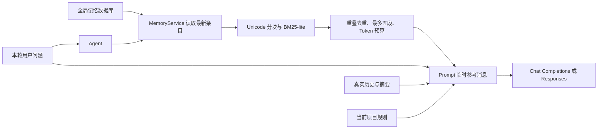

# 记忆与检索：现状、调研和增量实现

调研日期：2026-10-02。项目基线：`607d8ea`。落地变更：[add-active-memory-recall](../../openspec/changes/add-active-memory-recall/proposal.md)。本文区分原有行为、本次实现和后续建议。

## 1. 原有链路

| 层次 | 入口与流向 | 生命周期与局限 |
| --- | --- | --- |
| 项目规则 | `ProjectInstructions` → `SessionManager::refresh_instructions` → Prompt 系统提示 | 仅 workspace 根规则；每条消息刷新；不进检查点和压缩 |
| 工作上下文 | `Prompt` 的真实历史 + 结构化摘要 → 两种 Provider | 压缩保留近期消息、关键事实和工具配对；原始事件独立保存 |
| 长期事实 | UI 公共命令 / `memory_write` → `MemoryService` → `MemoryStore` | 全局独立表/集合，跨 workspace/会话，UUID 与创建/更新时间；与会话删除无关 |
| 手动读取 | `memory_search` / 管理搜索 → `search_entries` | 空白拆词、大小写无关子串、命中词数排序、最多十条全文；模型工具输出另有 2000 字符限制 |
| 请求前处理 | Agent 刷新规则，再读取 memory 列表 | 原先只更新可用状态和条数，没有把相关记忆送给模型 |

核心实现见 [memory](../../src/memory/mod.rs)、[Agent](../../src/agent/mod.rs)、[Prompt](../../src/prompt/conversation.rs)、[DAO](../../src/dao/mod.rs)、[公共记忆命令](../../src/interaction/memory.rs)。Agent 和 Tools 共享同一单线程 `Rc` 服务；列表每次从数据库取，不将缓存重新覆盖回库。SQL 与 MongoDB 适配共享 Rust 搜索规则。重复正文不重复添加，编辑保留标识；删除和清空有用户确认，UI 不调用模型。

现有设计已经将规则、工作历史、长期事实分开。缺少的是主动检索：存下来的事实不一定在需要时进入上下文；中文自然问句不能靠空白拆词稳定命中；长记忆全文返回容易让尾部结论被工具输出上限截掉。

## 2. 教程方案

[Day13](https://geektutu.com/en/post/geekagent-day13.html) 保留整条记忆存储，查询时按 320 字符窗口、80 重叠分块。主动召回对中文做相邻双字拆分，英文和数字保留词形，再用 BM25-lite 衡量词频、稀有度和长度，选最多五段供本轮参考。工具查询仍可使用模型自行组织的关键词。它解决“模型忘记搜索”，不解决同义词或事实可信度。

[Day14](https://geektutu.com/en/post/geekagent-day14.html) 将外部资料与个人/项目记忆分库：采集文件或网页，清理后按 800/80 分块，保存标题、来源、时间、片段；采集仅返回摘要，搜索最多返回四段证据。沿用 Day13 的算法和本地存储，不依赖 embedding。采集和查询分离使长资料不会在导入时灌满对话；采集有确认，查询只读。

本项目已有数据库和四种 UI，适合复用现有存储与交互契约。教程的字符窗口在 Rust 中需要显式转换 Unicode 字符位置和 UTF-8 字节边界；不能直接照搬字符串下标。教程逐段评分时反复计算全库统计，Rust 版先算频次和平均长度，再统一评分。

## 3. pi 与 Codex：值得借鉴什么

### pi：工作上下文与可回溯的原始记录

核对官方仓库 `earendil-works/pi`，提交 `b271b0a524b29e13c0c9e748aea0d34e1597f2db`（原 `badlogic/pi-mono` 已重定向）。[压缩文档](https://github.com/earendil-works/pi/blob/b271b0a524b29e13c0c9e748aea0d34e1597f2db/packages/coding-agent/docs/compaction.md) 描述两类摘要：上下文临近阈值时压缩，以及切换会话树分支时摘要。摘要记录目标、约束、进展、决定、下一步，并累计已读/修改文件；原始会话仍保留，模型只接收摘要与选定的近期消息。

它的启发是“原始证据、压缩投影、当前任务”分层，以及保证工具结果不脱离调用。扩展可通过压缩前钩子替换摘要。以上是官方核心已核对的机制，不把第三方记忆插件或名为 in-memory 的存储测试当作内置长期 RAG。当前调查未发现其核心提供教程式的持久语义知识库；该结论限于本次版本与检查范围。

本项目已有结构化摘要、原始事件和工具配对，不需要复制 pi 的会话树。此次沿用“检索结果是临时上下文投影”的原则，让召回不混入永久历史。

### Codex：记忆生成与读取分开，保留证据和时效性

[官方记忆文档](https://learn.chatgpt.com/docs/customization/memories) 将本地 Codex 记忆与 ChatGPT 网页记忆分开，提供使用/生成的控制；本地记忆在符合条件的历史聊天上后台生成，避开仍活跃的会话，并对生成字段做秘密信息脱敏。必须持续执行的团队规则仍放在项目指令或受版本管理的文档中。

核对官方开源提交 `14a477ea89712071944244022e8a10142845456e` 的实际源码：[启动调度](https://github.com/openai/codex/blob/14a477ea89712071944244022e8a10142845456e/codex-rs/memories/write/src/start.rs) 先运行逐会话提取，再运行全局整理；[整理流程](https://github.com/openai/codex/blob/14a477ea89712071944244022e8a10142845456e/codex-rs/memories/write/src/phase2.rs) 限制输入数量，以任务租约协调写入，并在受限环境运行整理 Agent。仓库 README 的旧模块路径与当前树存在差异，因此以此提交源码为准。

[读取提示模板 v2](https://github.com/openai/codex/blob/14a477ea89712071944244022e8a10142845456e/codex-rs/ext/memories/templates/memories/read_path_v2.md) 把摘要作为历史背景，需要额外证据时再读对应记录，要求重要且会变化的事实回到当前来源核验，并用实际来源定位引用。[本地搜索](https://github.com/openai/codex/blob/14a477ea89712071944244022e8a10142845456e/codex-rs/ext/memories/src/local/search.rs) 提供路径范围、匹配行、上下文与分页，说明可追溯读取并不要求向量数据库。这是所检视实现的行为，不能据此声称所有客户端、所有记忆后端都采用同一算法。

可立即借鉴的是：按需提供少量相关材料、保留来源、承认过期可能、读写开关分开。后台模型提取、去重整理、使用频率淘汰需要额外模型预算和任务调度，当前学习切片不引入。

## 4. 本次实现

`retrieval` 只处理借用字符串，返回来源下标、段号、字符范围和分数，不依赖数据库、模型或 UI。当前 memory 使用 320/80；查询限制为前 4096 字符和 64 个不同有效词。BM25-lite 使用子串频次、字符长度归一化，参数 k1=1.2、b=0.75。词频饱和防止重复词线性抬分；文档频率降低常见词权重；固定排序保证复现。

MemoryService 将最佳片段连同完整 UUID、更新时间和位置编码成 JSON 数据行。跳过同一条目相交片段，最多五段；消息整体按已有字节/2 估算计费，受 `min(窗口 / 8, 2048)` Token 限制，完整结果放不下就略过。不会把分数包装成可信度。

Prompt 把结果置于独立的 user-role 参考消息中，system/instructions 只包含固定解释与现有规则。普通请求、工具续轮和最终收敛共享本轮召回；下一条消息、恢复和上下文替换清除旧值。该字段不序列化到会话检查点，也不产生真实聊天事件或进入压缩请求，但计入上下文估算。模型自己的回答和手动工具结果仍可保存；Trace 仍记录实际模型请求，所以删除记忆不等于擦除既有历史或 Trace。

`GEER_AGENT_MEMORY_RECALL=off` 单独关闭自动召回；`GEER_AGENT_MEMORY=off` 关闭长期记忆；`GEER_AGENT_TOOLS=off` 不关闭自动读取。数据库故障明确报告且不复用旧结果，之后每轮真实读取可恢复。全局作用域与四 UI 的关键词管理保持原契约，无新增依赖和迁移。

## 5. Day14 的后续切片建议（尚未实现）

优先增加 `knowledge-rag`，复用本次检索函数，独立维护资料元数据与片段；不要把整篇教程写进用户偏好表。每份资料需要稳定标识、标题、规范化来源、内容指纹和采集时间，同来源重新导入替换旧版本，删除可移除所有片段。

入口应复用当前授权与有界文件/HTTP 读取：限定 workspace 路径、大小、重定向及超时，导入仅返回状态与来源；搜索输出标题、路径/URL、范围和片段，让模型引用原始证据。先做小规模本地文本，再扩展已授权的静态网页。直接从文件读取足够的任务无需导入知识库。

评估采用固定问题与期望来源：中文问句、英文标识符、跨段结论、相同资料更新、删除后无命中、无关问题。记录前几名是否包含期望来源、注入字符/Token 和检索耗时。只有真实样本证明同义改写显著漏召回时，再考虑 embedding 与 BM25 混合检索；当前版本不能理解同义词、自动判断事实冲突或保证片段适用于所有 workspace。

## 6. 验收入口

`make test TEST=recall` 覆盖算法、来源、预算、数据库与 Prompt 生命周期；双 API 本机模拟服务验证实际请求。完整质量门为 `make check`，由项目安全入口核对 cgroup 限制和独立临时目录。不使用真实模型、外部数据库或用户记忆作为测试数据。

2026-10-02 验证：11 项召回相关测试通过；默认 feature 的 `make check` 完成 fmt、test-safety、全量测试（262 通过、1 项既有真实网页访问手动测试忽略）和 Clippy，无新警告。隔离探针覆盖成功、失败、SIGKILL、超时、组内有限 OOM 与启动器终止后的资源回收。OpenSpec 严格校验通过；无新增依赖、数据库迁移或前端协议修改。尚未用真实模型评估回答质量，也未运行 GUI/Web feature 的额外构建验收。
